# NLP RAG for Psychiatric Symptoms

- loads 5 documents, saves as embeddings in chromaDB (good for clinical embeddings - pubmedBERT and industry standard, supports up to 512 tokens)
- uses Mistral, LlaMa and GEMMA
- evaluates using BLEU/ROUGE + BERT (precision, recall, F1) + Precision@K, Recall@K


# Set-Up and Mounting


```python
#mounting google drive for sources

from google.colab import drive
drive.mount('/content/drive')
```

    Mounted at /content/drive


```python
import zipfile

# Path to the zip folder
zip_path = "/content/Sources.zip"
# Directory where you want to extract the files
extract_path = "/s"

with zipfile.ZipFile(zip_path, 'r') as zip_ref:
    zip_ref.extractall(extract_path)

```


```python
  #libraries for RAG implementation (langchain, chromaDB, langchain-text-splitters, langchain-community)
!pip install -U langchain langchain-community langchain-text-splitters langchain-chroma langchain-huggingface langchain-classic \
                chromadb sentence-transformers pymupdf bitsandbytes accelerate huggingface_hub evaluate rouge_score sacrebleu
```

    Requirement already satisfied: langchain in /usr/local/lib/python3.12/dist-packages (1.2.15)
    Collecting langchain-community
      Downloading langchain_community-0.4.1-py3-none-any.whl.metadata (3.0 kB)
    Collecting langchain-text-splitters
      Downloading langchain_text_splitters-1.1.2-py3-none-any.whl.metadata (3.3 kB)
    Collecting langchain-chroma
      Downloading langchain_chroma-1.1.0-py3-none-any.whl.metadata (1.9 kB)
    Collecting langchain-huggingface
      Downloading langchain_huggingface-1.2.2-py3-none-any.whl.metadata (4.0 kB)
    Collecting langchain-classic
      Downloading langchain_classic-1.0.4-py3-none-any.whl.metadata (4.8 kB)
    Collecting chromadb
      Downloading chromadb-1.5.8-cp39-abi3-manylinux_2_17_x86_64.manylinux2014_x86_64.whl.metadata (5.0 kB)
    Requirement already satisfied: sentence-transformers in /usr/local/lib/python3.12/dist-packages (5.4.0)
    Collecting sentence-transformers
      Downloading sentence_transformers-5.4.1-py3-none-any.whl.metadata (17 kB)
    Collecting pymupdf
      Downloading pymupdf-1.27.2.3-cp310-abi3-manylinux_2_28_x86_64.whl.metadata (24 kB)
    Collecting bitsandbytes
      Downloading bitsandbytes-0.49.2-py3-none-manylinux_2_24_x86_64.whl.metadata (10 kB)
    Requirement already satisfied: accelerate in /usr/local/lib/python3.12/dist-packages (1.13.0)
    Requirement already satisfied: huggingface_hub in /usr/local/lib/python3.12/dist-packages (1.10.1)
    Collecting huggingface_hub
      Downloading huggingface_hub-1.12.0-py3-none-any.whl.metadata (14 kB)
    Collecting evaluate
      Downloading evaluate-0.4.6-py3-none-any.whl.metadata (9.5 kB)
    Collecting rouge_score
      Downloading rouge_score-0.1.2.tar.gz (17 kB)
      Preparing metadata (setup.py) ... [?25l[?25hdone
    Collecting sacrebleu
      Downloading sacrebleu-2.6.0-py3-none-any.whl.metadata (39 kB)
    Requirement already satisfied: langchain-core<2.0.0,>=1.2.10 in /usr/local/lib/python3.12/dist-packages (from langchain) (1.2.28)
    Requirement already satisfied: langgraph<1.2.0,>=1.1.5 in /usr/local/lib/python3.12/dist-packages (from langchain) (1.1.6)
    Requirement already satisfied: pydantic<3.0.0,>=2.7.4 in /usr/local/lib/python3.12/dist-packages (from langchain) (2.12.3)
    Requirement already satisfied: SQLAlchemy<3.0.0,>=1.4.0 in /usr/local/lib/python3.12/dist-packages (from langchain-community) (2.0.49)
    Collecting requests<3.0.0,>=2.32.5 (from langchain-community)
      Downloading requests-2.33.1-py3-none-any.whl.metadata (4.8 kB)
    Requirement already satisfied: PyYAML<7.0.0,>=5.3.0 in /usr/local/lib/python3.12/dist-packages (from langchain-community) (6.0.3)
    Requirement already satisfied: aiohttp<4.0.0,>=3.8.3 in /usr/local/lib/python3.12/dist-packages (from langchain-community) (3.13.5)
    Requirement already satisfied: tenacity!=8.4.0,<10.0.0,>=8.1.0 in /usr/local/lib/python3.12/dist-packages (from langchain-community) (9.1.4)
    Collecting dataclasses-json<0.7.0,>=0.6.7 (from langchain-community)
      Downloading dataclasses_json-0.6.7-py3-none-any.whl.metadata (25 kB)
    Requirement already satisfied: pydantic-settings<3.0.0,>=2.10.1 in /usr/local/lib/python3.12/dist-packages (from langchain-community) (2.13.1)
    Requirement already satisfied: langsmith<1.0.0,>=0.1.125 in /usr/local/lib/python3.12/dist-packages (from langchain-community) (0.7.30)
    Requirement already satisfied: httpx-sse<1.0.0,>=0.4.0 in /usr/local/lib/python3.12/dist-packages (from langchain-community) (0.4.3)
    Requirement already satisfied: numpy>=1.26.2 in /usr/local/lib/python3.12/dist-packages (from langchain-community) (2.0.2)
    Collecting langchain-core<2.0.0,>=1.2.10 (from langchain)
      Downloading langchain_core-1.3.2-py3-none-any.whl.metadata (4.4 kB)
    Requirement already satisfied: tokenizers<1.0.0,>=0.19.1 in /usr/local/lib/python3.12/dist-packages (from langchain-huggingface) (0.22.2)
    Collecting build>=1.0.3 (from chromadb)
      Downloading build-1.4.4-py3-none-any.whl.metadata (5.8 kB)
    Collecting pybase64>=1.4.1 (from chromadb)
      Downloading pybase64-1.4.3-cp312-cp312-manylinux1_x86_64.manylinux2014_x86_64.manylinux_2_17_x86_64.manylinux_2_5_x86_64.whl.metadata (8.7 kB)
    Requirement already satisfied: uvicorn>=0.18.3 in /usr/local/lib/python3.12/dist-packages (from uvicorn[standard]>=0.18.3->chromadb) (0.44.0)
    Requirement already satisfied: typing-extensions>=4.5.0 in /usr/local/lib/python3.12/dist-packages (from chromadb) (4.15.0)
    Collecting onnxruntime>=1.14.1 (from chromadb)
      Downloading onnxruntime-1.25.0-cp312-cp312-manylinux_2_27_x86_64.manylinux_2_28_x86_64.whl.metadata (5.2 kB)
    Requirement already satisfied: opentelemetry-api>=1.2.0 in /usr/local/lib/python3.12/dist-packages (from chromadb) (1.38.0)
    Collecting opentelemetry-exporter-otlp-proto-grpc>=1.2.0 (from chromadb)
      Downloading opentelemetry_exporter_otlp_proto_grpc-1.41.1-py3-none-any.whl.metadata (2.6 kB)
    Requirement already satisfied: opentelemetry-sdk>=1.2.0 in /usr/local/lib/python3.12/dist-packages (from chromadb) (1.38.0)
    Collecting pypika>=0.48.9 (from chromadb)
      Downloading pypika-0.51.1-py2.py3-none-any.whl.metadata (51 kB)
         ━━━━━━━━━━━━━━━━━━━━━━━━━━━━━━━━━━━━━━━━ 52.0/52.0 kB 6.0 MB/s eta 0:00:00
    [?25hRequirement already satisfied: tqdm>=4.65.0 in /usr/local/lib/python3.12/dist-packages (from chromadb) (4.67.3)
    Requirement already satisfied: overrides>=7.3.1 in /usr/local/lib/python3.12/dist-packages (from chromadb) (7.7.0)
    Requirement already satisfied: importlib-resources in /usr/local/lib/python3.12/dist-packages (from chromadb) (6.5.2)
    Requirement already satisfied: grpcio>=1.58.0 in /usr/local/lib/python3.12/dist-packages (from chromadb) (1.80.0)
    Collecting bcrypt>=4.0.1 (from chromadb)
      Downloading bcrypt-5.0.0-cp39-abi3-manylinux_2_34_x86_64.whl.metadata (10 kB)
    Requirement already satisfied: typer>=0.9.0 in /usr/local/lib/python3.12/dist-packages (from chromadb) (0.24.1)
    Collecting kubernetes>=28.1.0 (from chromadb)
      Downloading kubernetes-35.0.0-py2.py3-none-any.whl.metadata (1.7 kB)
    Requirement already satisfied: mmh3>=4.0.1 in /usr/local/lib/python3.12/dist-packages (from chromadb) (5.2.1)
    Requirement already satisfied: orjson>=3.9.12 in /usr/local/lib/python3.12/dist-packages (from chromadb) (3.11.8)
    Requirement already satisfied: httpx>=0.27.0 in /usr/local/lib/python3.12/dist-packages (from chromadb) (0.28.1)
    Requirement already satisfied: rich>=10.11.0 in /usr/local/lib/python3.12/dist-packages (from chromadb) (13.9.4)
    Requirement already satisfied: jsonschema>=4.19.0 in /usr/local/lib/python3.12/dist-packages (from chromadb) (4.26.0)
    Requirement already satisfied: transformers<6.0.0,>=4.41.0 in /usr/local/lib/python3.12/dist-packages (from sentence-transformers) (5.0.0)
    Requirement already satisfied: torch>=1.11.0 in /usr/local/lib/python3.12/dist-packages (from sentence-transformers) (2.10.0+cu128)
    Requirement already satisfied: scikit-learn>=0.22.0 in /usr/local/lib/python3.12/dist-packages (from sentence-transformers) (1.6.1)
    Requirement already satisfied: scipy>=1.0.0 in /usr/local/lib/python3.12/dist-packages (from sentence-transformers) (1.16.3)
    Requirement already satisfied: packaging>=20.9 in /usr/local/lib/python3.12/dist-packages (from bitsandbytes) (26.0)
    Requirement already satisfied: psutil in /usr/local/lib/python3.12/dist-packages (from accelerate) (5.9.5)
    Requirement already satisfied: safetensors>=0.4.3 in /usr/local/lib/python3.12/dist-packages (from accelerate) (0.7.0)
    Requirement already satisfied: filelock>=3.10.0 in /usr/local/lib/python3.12/dist-packages (from huggingface_hub) (3.25.2)
    Requirement already satisfied: fsspec>=2023.5.0 in /usr/local/lib/python3.12/dist-packages (from huggingface_hub) (2025.3.0)
    Requirement already satisfied: hf-xet<2.0.0,>=1.4.3 in /usr/local/lib/python3.12/dist-packages (from huggingface_hub) (1.4.3)
    Requirement already satisfied: datasets>=2.0.0 in /usr/local/lib/python3.12/dist-packages (from evaluate) (4.0.0)
    Requirement already satisfied: dill in /usr/local/lib/python3.12/dist-packages (from evaluate) (0.3.8)
    Requirement already satisfied: pandas in /usr/local/lib/python3.12/dist-packages (from evaluate) (2.2.2)
    Requirement already satisfied: xxhash in /usr/local/lib/python3.12/dist-packages (from evaluate) (3.6.0)
    Requirement already satisfied: multiprocess in /usr/local/lib/python3.12/dist-packages (from evaluate) (0.70.16)
    Requirement already satisfied: absl-py in /usr/local/lib/python3.12/dist-packages (from rouge_score) (1.4.0)
    Requirement already satisfied: nltk in /usr/local/lib/python3.12/dist-packages (from rouge_score) (3.9.1)
    Requirement already satisfied: six>=1.14.0 in /usr/local/lib/python3.12/dist-packages (from rouge_score) (1.17.0)
    Collecting portalocker (from sacrebleu)
      Downloading portalocker-3.2.0-py3-none-any.whl.metadata (8.7 kB)
    Requirement already satisfied: regex in /usr/local/lib/python3.12/dist-packages (from sacrebleu) (2025.11.3)
    Requirement already satisfied: tabulate>=0.8.9 in /usr/local/lib/python3.12/dist-packages (from sacrebleu) (0.9.0)
    Collecting colorama (from sacrebleu)
      Downloading colorama-0.4.6-py2.py3-none-any.whl.metadata (17 kB)
    Requirement already satisfied: lxml in /usr/local/lib/python3.12/dist-packages (from sacrebleu) (6.0.3)
    Requirement already satisfied: aiohappyeyeballs>=2.5.0 in /usr/local/lib/python3.12/dist-packages (from aiohttp<4.0.0,>=3.8.3->langchain-community) (2.6.1)
    Requirement already satisfied: aiosignal>=1.4.0 in /usr/local/lib/python3.12/dist-packages (from aiohttp<4.0.0,>=3.8.3->langchain-community) (1.4.0)
    Requirement already satisfied: attrs>=17.3.0 in /usr/local/lib/python3.12/dist-packages (from aiohttp<4.0.0,>=3.8.3->langchain-community) (26.1.0)
    Requirement already satisfied: frozenlist>=1.1.1 in /usr/local/lib/python3.12/dist-packages (from aiohttp<4.0.0,>=3.8.3->langchain-community) (1.8.0)
    Requirement already satisfied: multidict<7.0,>=4.5 in /usr/local/lib/python3.12/dist-packages (from aiohttp<4.0.0,>=3.8.3->langchain-community) (6.7.1)
    Requirement already satisfied: propcache>=0.2.0 in /usr/local/lib/python3.12/dist-packages (from aiohttp<4.0.0,>=3.8.3->langchain-community) (0.4.1)
    Requirement already satisfied: yarl<2.0,>=1.17.0 in /usr/local/lib/python3.12/dist-packages (from aiohttp<4.0.0,>=3.8.3->langchain-community) (1.23.0)
    Collecting pyproject_hooks (from build>=1.0.3->chromadb)
      Downloading pyproject_hooks-1.2.0-py3-none-any.whl.metadata (1.3 kB)
    Collecting marshmallow<4.0.0,>=3.18.0 (from dataclasses-json<0.7.0,>=0.6.7->langchain-community)
      Downloading marshmallow-3.26.2-py3-none-any.whl.metadata (7.3 kB)
    Collecting typing-inspect<1,>=0.4.0 (from dataclasses-json<0.7.0,>=0.6.7->langchain-community)
      Downloading typing_inspect-0.9.0-py3-none-any.whl.metadata (1.5 kB)
    Requirement already satisfied: pyarrow>=15.0.0 in /usr/local/lib/python3.12/dist-packages (from datasets>=2.0.0->evaluate) (18.1.0)
    Requirement already satisfied: anyio in /usr/local/lib/python3.12/dist-packages (from httpx>=0.27.0->chromadb) (4.13.0)
    Requirement already satisfied: certifi in /usr/local/lib/python3.12/dist-packages (from httpx>=0.27.0->chromadb) (2026.2.25)
    Requirement already satisfied: httpcore==1.* in /usr/local/lib/python3.12/dist-packages (from httpx>=0.27.0->chromadb) (1.0.9)
    Requirement already satisfied: idna in /usr/local/lib/python3.12/dist-packages (from httpx>=0.27.0->chromadb) (3.11)
    Requirement already satisfied: h11>=0.16 in /usr/local/lib/python3.12/dist-packages (from httpcore==1.*->httpx>=0.27.0->chromadb) (0.16.0)
    Requirement already satisfied: jsonschema-specifications>=2023.03.6 in /usr/local/lib/python3.12/dist-packages (from jsonschema>=4.19.0->chromadb) (2025.9.1)
    Requirement already satisfied: referencing>=0.28.4 in /usr/local/lib/python3.12/dist-packages (from jsonschema>=4.19.0->chromadb) (0.37.0)
    Requirement already satisfied: rpds-py>=0.25.0 in /usr/local/lib/python3.12/dist-packages (from jsonschema>=4.19.0->chromadb) (0.30.0)
    Requirement already satisfied: python-dateutil>=2.5.3 in /usr/local/lib/python3.12/dist-packages (from kubernetes>=28.1.0->chromadb) (2.9.0.post0)
    Requirement already satisfied: websocket-client!=0.40.0,!=0.41.*,!=0.42.*,>=0.32.0 in /usr/local/lib/python3.12/dist-packages (from kubernetes>=28.1.0->chromadb) (1.9.0)
    Requirement already satisfied: requests-oauthlib in /usr/local/lib/python3.12/dist-packages (from kubernetes>=28.1.0->chromadb) (2.0.0)
    Requirement already satisfied: urllib3!=2.6.0,>=1.24.2 in /usr/local/lib/python3.12/dist-packages (from kubernetes>=28.1.0->chromadb) (2.5.0)
    Collecting durationpy>=0.7 (from kubernetes>=28.1.0->chromadb)
      Downloading durationpy-0.10-py3-none-any.whl.metadata (340 bytes)
    Requirement already satisfied: jsonpatch<2.0.0,>=1.33.0 in /usr/local/lib/python3.12/dist-packages (from langchain-core<2.0.0,>=1.2.10->langchain) (1.33)
    Collecting langchain-protocol>=0.0.10 (from langchain-core<2.0.0,>=1.2.10->langchain)
      Downloading langchain_protocol-0.0.11-py3-none-any.whl.metadata (1.8 kB)
    Requirement already satisfied: uuid-utils<1.0,>=0.12.0 in /usr/local/lib/python3.12/dist-packages (from langchain-core<2.0.0,>=1.2.10->langchain) (0.14.1)
    Requirement already satisfied: langgraph-checkpoint<5.0.0,>=2.1.0 in /usr/local/lib/python3.12/dist-packages (from langgraph<1.2.0,>=1.1.5->langchain) (4.0.1)
    Requirement already satisfied: langgraph-prebuilt<1.1.0,>=1.0.9 in /usr/local/lib/python3.12/dist-packages (from langgraph<1.2.0,>=1.1.5->langchain) (1.0.9)
    Requirement already satisfied: langgraph-sdk<0.4.0,>=0.3.0 in /usr/local/lib/python3.12/dist-packages (from langgraph<1.2.0,>=1.1.5->langchain) (0.3.13)
    Requirement already satisfied: requests-toolbelt>=1.0.0 in /usr/local/lib/python3.12/dist-packages (from langsmith<1.0.0,>=0.1.125->langchain-community) (1.0.0)
    Requirement already satisfied: zstandard>=0.23.0 in /usr/local/lib/python3.12/dist-packages (from langsmith<1.0.0,>=0.1.125->langchain-community) (0.25.0)
    Requirement already satisfied: flatbuffers in /usr/local/lib/python3.12/dist-packages (from onnxruntime>=1.14.1->chromadb) (25.12.19)
    Requirement already satisfied: protobuf in /usr/local/lib/python3.12/dist-packages (from onnxruntime>=1.14.1->chromadb) (5.29.6)
    Requirement already satisfied: importlib-metadata<8.8.0,>=6.0 in /usr/local/lib/python3.12/dist-packages (from opentelemetry-api>=1.2.0->chromadb) (8.7.1)
    Requirement already satisfied: googleapis-common-protos~=1.57 in /usr/local/lib/python3.12/dist-packages (from opentelemetry-exporter-otlp-proto-grpc>=1.2.0->chromadb) (1.74.0)
    Collecting opentelemetry-exporter-otlp-proto-common==1.41.1 (from opentelemetry-exporter-otlp-proto-grpc>=1.2.0->chromadb)
      Downloading opentelemetry_exporter_otlp_proto_common-1.41.1-py3-none-any.whl.metadata (1.9 kB)
    Collecting opentelemetry-proto==1.41.1 (from opentelemetry-exporter-otlp-proto-grpc>=1.2.0->chromadb)
      Downloading opentelemetry_proto-1.41.1-py3-none-any.whl.metadata (2.4 kB)
    Collecting opentelemetry-sdk>=1.2.0 (from chromadb)
      Downloading opentelemetry_sdk-1.41.1-py3-none-any.whl.metadata (1.7 kB)
    Collecting opentelemetry-api>=1.2.0 (from chromadb)
      Downloading opentelemetry_api-1.41.1-py3-none-any.whl.metadata (1.5 kB)
    Collecting opentelemetry-semantic-conventions==0.62b1 (from opentelemetry-sdk>=1.2.0->chromadb)
      Downloading opentelemetry_semantic_conventions-0.62b1-py3-none-any.whl.metadata (2.5 kB)
    Requirement already satisfied: annotated-types>=0.6.0 in /usr/local/lib/python3.12/dist-packages (from pydantic<3.0.0,>=2.7.4->langchain) (0.7.0)
    Requirement already satisfied: pydantic-core==2.41.4 in /usr/local/lib/python3.12/dist-packages (from pydantic<3.0.0,>=2.7.4->langchain) (2.41.4)
    Requirement already satisfied: typing-inspection>=0.4.2 in /usr/local/lib/python3.12/dist-packages (from pydantic<3.0.0,>=2.7.4->langchain) (0.4.2)
    Requirement already satisfied: python-dotenv>=0.21.0 in /usr/local/lib/python3.12/dist-packages (from pydantic-settings<3.0.0,>=2.10.1->langchain-community) (1.2.2)
    Requirement already satisfied: charset_normalizer<4,>=2 in /usr/local/lib/python3.12/dist-packages (from requests<3.0.0,>=2.32.5->langchain-community) (3.4.7)
    Requirement already satisfied: markdown-it-py>=2.2.0 in /usr/local/lib/python3.12/dist-packages (from rich>=10.11.0->chromadb) (4.0.0)
    Requirement already satisfied: pygments<3.0.0,>=2.13.0 in /usr/local/lib/python3.12/dist-packages (from rich>=10.11.0->chromadb) (2.20.0)
    Requirement already satisfied: joblib>=1.2.0 in /usr/local/lib/python3.12/dist-packages (from scikit-learn>=0.22.0->sentence-transformers) (1.5.3)
    Requirement already satisfied: threadpoolctl>=3.1.0 in /usr/local/lib/python3.12/dist-packages (from scikit-learn>=0.22.0->sentence-transformers) (3.6.0)
    Requirement already satisfied: greenlet>=1 in /usr/local/lib/python3.12/dist-packages (from SQLAlchemy<3.0.0,>=1.4.0->langchain-community) (3.4.0)
    Requirement already satisfied: setuptools in /usr/local/lib/python3.12/dist-packages (from torch>=1.11.0->sentence-transformers) (75.2.0)
    Requirement already satisfied: sympy>=1.13.3 in /usr/local/lib/python3.12/dist-packages (from torch>=1.11.0->sentence-transformers) (1.14.0)
    Requirement already satisfied: networkx>=2.5.1 in /usr/local/lib/python3.12/dist-packages (from torch>=1.11.0->sentence-transformers) (3.6.1)
    Requirement already satisfied: jinja2 in /usr/local/lib/python3.12/dist-packages (from torch>=1.11.0->sentence-transformers) (3.1.6)
    Requirement already satisfied: cuda-bindings==12.9.4 in /usr/local/lib/python3.12/dist-packages (from torch>=1.11.0->sentence-transformers) (12.9.4)
    Requirement already satisfied: nvidia-cuda-nvrtc-cu12==12.8.93 in /usr/local/lib/python3.12/dist-packages (from torch>=1.11.0->sentence-transformers) (12.8.93)
    Requirement already satisfied: nvidia-cuda-runtime-cu12==12.8.90 in /usr/local/lib/python3.12/dist-packages (from torch>=1.11.0->sentence-transformers) (12.8.90)
    Requirement already satisfied: nvidia-cuda-cupti-cu12==12.8.90 in /usr/local/lib/python3.12/dist-packages (from torch>=1.11.0->sentence-transformers) (12.8.90)
    Requirement already satisfied: nvidia-cudnn-cu12==9.10.2.21 in /usr/local/lib/python3.12/dist-packages (from torch>=1.11.0->sentence-transformers) (9.10.2.21)
    Requirement already satisfied: nvidia-cublas-cu12==12.8.4.1 in /usr/local/lib/python3.12/dist-packages (from torch>=1.11.0->sentence-transformers) (12.8.4.1)
    Requirement already satisfied: nvidia-cufft-cu12==11.3.3.83 in /usr/local/lib/python3.12/dist-packages (from torch>=1.11.0->sentence-transformers) (11.3.3.83)
    Requirement already satisfied: nvidia-curand-cu12==10.3.9.90 in /usr/local/lib/python3.12/dist-packages (from torch>=1.11.0->sentence-transformers) (10.3.9.90)
    Requirement already satisfied: nvidia-cusolver-cu12==11.7.3.90 in /usr/local/lib/python3.12/dist-packages (from torch>=1.11.0->sentence-transformers) (11.7.3.90)
    Requirement already satisfied: nvidia-cusparse-cu12==12.5.8.93 in /usr/local/lib/python3.12/dist-packages (from torch>=1.11.0->sentence-transformers) (12.5.8.93)
    Requirement already satisfied: nvidia-cusparselt-cu12==0.7.1 in /usr/local/lib/python3.12/dist-packages (from torch>=1.11.0->sentence-transformers) (0.7.1)
    Requirement already satisfied: nvidia-nccl-cu12==2.27.5 in /usr/local/lib/python3.12/dist-packages (from torch>=1.11.0->sentence-transformers) (2.27.5)
    Requirement already satisfied: nvidia-nvshmem-cu12==3.4.5 in /usr/local/lib/python3.12/dist-packages (from torch>=1.11.0->sentence-transformers) (3.4.5)
    Requirement already satisfied: nvidia-nvtx-cu12==12.8.90 in /usr/local/lib/python3.12/dist-packages (from torch>=1.11.0->sentence-transformers) (12.8.90)
    Requirement already satisfied: nvidia-nvjitlink-cu12==12.8.93 in /usr/local/lib/python3.12/dist-packages (from torch>=1.11.0->sentence-transformers) (12.8.93)
    Requirement already satisfied: nvidia-cufile-cu12==1.13.1.3 in /usr/local/lib/python3.12/dist-packages (from torch>=1.11.0->sentence-transformers) (1.13.1.3)
    Requirement already satisfied: triton==3.6.0 in /usr/local/lib/python3.12/dist-packages (from torch>=1.11.0->sentence-transformers) (3.6.0)
    Requirement already satisfied: cuda-pathfinder~=1.1 in /usr/local/lib/python3.12/dist-packages (from cuda-bindings==12.9.4->torch>=1.11.0->sentence-transformers) (1.5.2)
    Requirement already satisfied: typer-slim in /usr/local/lib/python3.12/dist-packages (from transformers<6.0.0,>=4.41.0->sentence-transformers) (0.24.0)
    Requirement already satisfied: click>=8.2.1 in /usr/local/lib/python3.12/dist-packages (from typer>=0.9.0->chromadb) (8.3.2)
    Requirement already satisfied: shellingham>=1.3.0 in /usr/local/lib/python3.12/dist-packages (from typer>=0.9.0->chromadb) (1.5.4)
    Requirement already satisfied: annotated-doc>=0.0.2 in /usr/local/lib/python3.12/dist-packages (from typer>=0.9.0->chromadb) (0.0.4)
    Requirement already satisfied: httptools>=0.6.3 in /usr/local/lib/python3.12/dist-packages (from uvicorn[standard]>=0.18.3->chromadb) (0.7.1)
    Requirement already satisfied: uvloop>=0.15.1 in /usr/local/lib/python3.12/dist-packages (from uvicorn[standard]>=0.18.3->chromadb) (0.22.1)
    Requirement already satisfied: watchfiles>=0.20 in /usr/local/lib/python3.12/dist-packages (from uvicorn[standard]>=0.18.3->chromadb) (1.1.1)
    Requirement already satisfied: websockets>=10.4 in /usr/local/lib/python3.12/dist-packages (from uvicorn[standard]>=0.18.3->chromadb) (15.0.1)
    Requirement already satisfied: pytz>=2020.1 in /usr/local/lib/python3.12/dist-packages (from pandas->evaluate) (2025.2)
    Requirement already satisfied: tzdata>=2022.7 in /usr/local/lib/python3.12/dist-packages (from pandas->evaluate) (2026.1)
    Requirement already satisfied: zipp>=3.20 in /usr/local/lib/python3.12/dist-packages (from importlib-metadata<8.8.0,>=6.0->opentelemetry-api>=1.2.0->chromadb) (3.23.0)
    Requirement already satisfied: jsonpointer>=1.9 in /usr/local/lib/python3.12/dist-packages (from jsonpatch<2.0.0,>=1.33.0->langchain-core<2.0.0,>=1.2.10->langchain) (3.1.1)
    Requirement already satisfied: ormsgpack>=1.12.0 in /usr/local/lib/python3.12/dist-packages (from langgraph-checkpoint<5.0.0,>=2.1.0->langgraph<1.2.0,>=1.1.5->langchain) (1.12.2)
    Requirement already satisfied: mdurl~=0.1 in /usr/local/lib/python3.12/dist-packages (from markdown-it-py>=2.2.0->rich>=10.11.0->chromadb) (0.1.2)
    Requirement already satisfied: mpmath<1.4,>=1.1.0 in /usr/local/lib/python3.12/dist-packages (from sympy>=1.13.3->torch>=1.11.0->sentence-transformers) (1.3.0)
    Collecting mypy-extensions>=0.3.0 (from typing-inspect<1,>=0.4.0->dataclasses-json<0.7.0,>=0.6.7->langchain-community)
      Downloading mypy_extensions-1.1.0-py3-none-any.whl.metadata (1.1 kB)
    Requirement already satisfied: MarkupSafe>=2.0 in /usr/local/lib/python3.12/dist-packages (from jinja2->torch>=1.11.0->sentence-transformers) (3.0.3)
    Requirement already satisfied: oauthlib>=3.0.0 in /usr/local/lib/python3.12/dist-packages (from requests-oauthlib->kubernetes>=28.1.0->chromadb) (3.3.1)
    Downloading langchain_community-0.4.1-py3-none-any.whl (2.5 MB)
       ━━━━━━━━━━━━━━━━━━━━━━━━━━━━━━━━━━━━━━━━ 2.5/2.5 MB 31.2 MB/s eta 0:00:00
    [?25hDownloading langchain_text_splitters-1.1.2-py3-none-any.whl (35 kB)
    Downloading langchain_chroma-1.1.0-py3-none-any.whl (12 kB)
    Downloading langchain_huggingface-1.2.2-py3-none-any.whl (31 kB)
    Downloading langchain_classic-1.0.4-py3-none-any.whl (1.0 MB)
       ━━━━━━━━━━━━━━━━━━━━━━━━━━━━━━━━━━━━━━━━ 1.0/1.0 MB 73.0 MB/s eta 0:00:00
    [?25hDownloading chromadb-1.5.8-cp39-abi3-manylinux_2_17_x86_64.manylinux2014_x86_64.whl (23.2 MB)
       ━━━━━━━━━━━━━━━━━━━━━━━━━━━━━━━━━━━━━━━━ 23.2/23.2 MB 90.2 MB/s eta 0:00:00
    [?25hDownloading sentence_transformers-5.4.1-py3-none-any.whl (571 kB)
       ━━━━━━━━━━━━━━━━━━━━━━━━━━━━━━━━━━━━━━━━ 571.3/571.3 kB 49.2 MB/s eta 0:00:00
    [?25hDownloading pymupdf-1.27.2.3-cp310-abi3-manylinux_2_28_x86_64.whl (25.0 MB)
       ━━━━━━━━━━━━━━━━━━━━━━━━━━━━━━━━━━━━━━━━ 25.0/25.0 MB 51.0 MB/s eta 0:00:00
    [?25hDownloading bitsandbytes-0.49.2-py3-none-manylinux_2_24_x86_64.whl (60.7 MB)
       ━━━━━━━━━━━━━━━━━━━━━━━━━━━━━━━━━━━━━━━━ 60.7/60.7 MB 11.6 MB/s eta 0:00:00
    [?25hDownloading huggingface_hub-1.12.0-py3-none-any.whl (646 kB)
       ━━━━━━━━━━━━━━━━━━━━━━━━━━━━━━━━━━━━━━━━ 646.8/646.8 kB 54.8 MB/s eta 0:00:00
    [?25hDownloading evaluate-0.4.6-py3-none-any.whl (84 kB)
       ━━━━━━━━━━━━━━━━━━━━━━━━━━━━━━━━━━━━━━━━ 84.1/84.1 kB 9.8 MB/s eta 0:00:00
    [?25hDownloading sacrebleu-2.6.0-py3-none-any.whl (100 kB)
       ━━━━━━━━━━━━━━━━━━━━━━━━━━━━━━━━━━━━━━━━ 100.8/100.8 kB 12.9 MB/s eta 0:00:00
    [?25hDownloading bcrypt-5.0.0-cp39-abi3-manylinux_2_34_x86_64.whl (278 kB)
       ━━━━━━━━━━━━━━━━━━━━━━━━━━━━━━━━━━━━━━━━ 278.2/278.2 kB 31.4 MB/s eta 0:00:00
    [?25hDownloading build-1.4.4-py3-none-any.whl (25 kB)
    Downloading dataclasses_json-0.6.7-py3-none-any.whl (28 kB)
    Downloading kubernetes-35.0.0-py2.py3-none-any.whl (2.0 MB)
       ━━━━━━━━━━━━━━━━━━━━━━━━━━━━━━━━━━━━━━━━ 2.0/2.0 MB 99.5 MB/s eta 0:00:00
    [?25hDownloading langchain_core-1.3.2-py3-none-any.whl (542 kB)
       ━━━━━━━━━━━━━━━━━━━━━━━━━━━━━━━━━━━━━━━━ 542.4/542.4 kB 34.7 MB/s eta 0:00:00
    [?25hDownloading onnxruntime-1.25.0-cp312-cp312-manylinux_2_27_x86_64.manylinux_2_28_x86_64.whl (18.0 MB)
       ━━━━━━━━━━━━━━━━━━━━━━━━━━━━━━━━━━━━━━━━ 18.0/18.0 MB 91.2 MB/s eta 0:00:00
    [?25hDownloading opentelemetry_exporter_otlp_proto_grpc-1.41.1-py3-none-any.whl (20 kB)
    Downloading opentelemetry_exporter_otlp_proto_common-1.41.1-py3-none-any.whl (18 kB)
    Downloading opentelemetry_proto-1.41.1-py3-none-any.whl (72 kB)
       ━━━━━━━━━━━━━━━━━━━━━━━━━━━━━━━━━━━━━━━━ 72.1/72.1 kB 8.1 MB/s eta 0:00:00
    [?25hDownloading opentelemetry_sdk-1.41.1-py3-none-any.whl (180 kB)
       ━━━━━━━━━━━━━━━━━━━━━━━━━━━━━━━━━━━━━━━━ 180.2/180.2 kB 20.8 MB/s eta 0:00:00
    [?25hDownloading opentelemetry_api-1.41.1-py3-none-any.whl (69 kB)
       ━━━━━━━━━━━━━━━━━━━━━━━━━━━━━━━━━━━━━━━━ 69.0/69.0 kB 7.6 MB/s eta 0:00:00
    [?25hDownloading opentelemetry_semantic_conventions-0.62b1-py3-none-any.whl (231 kB)
       ━━━━━━━━━━━━━━━━━━━━━━━━━━━━━━━━━━━━━━━━ 231.6/231.6 kB 27.2 MB/s eta 0:00:00
    [?25hDownloading pybase64-1.4.3-cp312-cp312-manylinux1_x86_64.manylinux2014_x86_64.manylinux_2_17_x86_64.manylinux_2_5_x86_64.whl (71 kB)
       ━━━━━━━━━━━━━━━━━━━━━━━━━━━━━━━━━━━━━━━━ 71.6/71.6 kB 8.5 MB/s eta 0:00:00
    [?25hDownloading pypika-0.51.1-py2.py3-none-any.whl (60 kB)
       ━━━━━━━━━━━━━━━━━━━━━━━━━━━━━━━━━━━━━━━━ 60.6/60.6 kB 6.8 MB/s eta 0:00:00
    [?25hDownloading requests-2.33.1-py3-none-any.whl (64 kB)
       ━━━━━━━━━━━━━━━━━━━━━━━━━━━━━━━━━━━━━━━━ 64.9/64.9 kB 7.5 MB/s eta 0:00:00
    [?25hDownloading colorama-0.4.6-py2.py3-none-any.whl (25 kB)
    Downloading portalocker-3.2.0-py3-none-any.whl (22 kB)
    Downloading durationpy-0.10-py3-none-any.whl (3.9 kB)
    Downloading langchain_protocol-0.0.11-py3-none-any.whl (6.8 kB)
    Downloading marshmallow-3.26.2-py3-none-any.whl (50 kB)
       ━━━━━━━━━━━━━━━━━━━━━━━━━━━━━━━━━━━━━━━━ 51.0/51.0 kB 5.8 MB/s eta 0:00:00
    [?25hDownloading typing_inspect-0.9.0-py3-none-any.whl (8.8 kB)
    Downloading pyproject_hooks-1.2.0-py3-none-any.whl (10 kB)
    Downloading mypy_extensions-1.1.0-py3-none-any.whl (5.0 kB)
    Building wheels for collected packages: rouge_score
      Building wheel for rouge_score (setup.py) ... [?25l[?25hdone
      Created wheel for rouge_score: filename=rouge_score-0.1.2-py3-none-any.whl size=24934 sha256=8b2d5aaf8e29c4c730206502e250f6ea51a577fa94ef94fdb74781473afe92ff
      Stored in directory: /root/.cache/pip/wheels/85/9d/af/01feefbe7d55ef5468796f0c68225b6788e85d9d0a281e7a70
    Successfully built rouge_score
    Installing collected packages: pypika, durationpy, requests, pyproject_hooks, pymupdf, pybase64, portalocker, opentelemetry-proto, onnxruntime, mypy-extensions, marshmallow, langchain-protocol, colorama, bcrypt, typing-inspect, sacrebleu, rouge_score, opentelemetry-exporter-otlp-proto-common, opentelemetry-api, build, opentelemetry-semantic-conventions, kubernetes, dataclasses-json, opentelemetry-sdk, langchain-core, huggingface_hub, bitsandbytes, opentelemetry-exporter-otlp-proto-grpc, langchain-text-splitters, langchain-huggingface, langchain-classic, evaluate, chromadb, sentence-transformers, langchain-community, langchain-chroma
      Attempting uninstall: requests
        Found existing installation: requests 2.32.4
        Uninstalling requests-2.32.4:
          Successfully uninstalled requests-2.32.4
      Attempting uninstall: opentelemetry-proto
        Found existing installation: opentelemetry-proto 1.38.0
        Uninstalling opentelemetry-proto-1.38.0:
          Successfully uninstalled opentelemetry-proto-1.38.0
      Attempting uninstall: opentelemetry-exporter-otlp-proto-common
        Found existing installation: opentelemetry-exporter-otlp-proto-common 1.38.0
        Uninstalling opentelemetry-exporter-otlp-proto-common-1.38.0:
          Successfully uninstalled opentelemetry-exporter-otlp-proto-common-1.38.0
      Attempting uninstall: opentelemetry-api
        Found existing installation: opentelemetry-api 1.38.0
        Uninstalling opentelemetry-api-1.38.0:
          Successfully uninstalled opentelemetry-api-1.38.0
      Attempting uninstall: opentelemetry-semantic-conventions
        Found existing installation: opentelemetry-semantic-conventions 0.59b0
        Uninstalling opentelemetry-semantic-conventions-0.59b0:
          Successfully uninstalled opentelemetry-semantic-conventions-0.59b0
      Attempting uninstall: opentelemetry-sdk
        Found existing installation: opentelemetry-sdk 1.38.0
        Uninstalling opentelemetry-sdk-1.38.0:
          Successfully uninstalled opentelemetry-sdk-1.38.0
      Attempting uninstall: langchain-core
        Found existing installation: langchain-core 1.2.28
        Uninstalling langchain-core-1.2.28:
          Successfully uninstalled langchain-core-1.2.28
      Attempting uninstall: huggingface_hub
        Found existing installation: huggingface_hub 1.10.1
        Uninstalling huggingface_hub-1.10.1:
          Successfully uninstalled huggingface_hub-1.10.1
      Attempting uninstall: sentence-transformers
        Found existing installation: sentence-transformers 5.4.0
        Uninstalling sentence-transformers-5.4.0:
          Successfully uninstalled sentence-transformers-5.4.0
    ERROR: pip's dependency resolver does not currently take into account all the packages that are installed. This behaviour is the source of the following dependency conflicts.
    google-colab 1.0.0 requires requests==2.32.4, but you have requests 2.33.1 which is incompatible.
    opentelemetry-exporter-otlp-proto-http 1.38.0 requires opentelemetry-exporter-otlp-proto-common==1.38.0, but you have opentelemetry-exporter-otlp-proto-common 1.41.1 which is incompatible.
    opentelemetry-exporter-otlp-proto-http 1.38.0 requires opentelemetry-proto==1.38.0, but you have opentelemetry-proto 1.41.1 which is incompatible.
    opentelemetry-exporter-otlp-proto-http 1.38.0 requires opentelemetry-sdk~=1.38.0, but you have opentelemetry-sdk 1.41.1 which is incompatible.
    google-adk 1.29.0 requires opentelemetry-api<1.39.0,>=1.36.0, but you have opentelemetry-api 1.41.1 which is incompatible.
    google-adk 1.29.0 requires opentelemetry-sdk<1.39.0,>=1.36.0, but you have opentelemetry-sdk 1.41.1 which is incompatible.
    opentelemetry-exporter-gcp-logging 1.11.0a0 requires opentelemetry-sdk<1.39.0,>=1.35.0, but you have opentelemetry-sdk 1.41.1 which is incompatible.
    Successfully installed bcrypt-5.0.0 bitsandbytes-0.49.2 build-1.4.4 chromadb-1.5.8 colorama-0.4.6 dataclasses-json-0.6.7 durationpy-0.10 evaluate-0.4.6 huggingface_hub-1.12.0 kubernetes-35.0.0 langchain-chroma-1.1.0 langchain-classic-1.0.4 langchain-community-0.4.1 langchain-core-1.3.2 langchain-huggingface-1.2.2 langchain-protocol-0.0.11 langchain-text-splitters-1.1.2 marshmallow-3.26.2 mypy-extensions-1.1.0 onnxruntime-1.25.0 opentelemetry-api-1.41.1 opentelemetry-exporter-otlp-proto-common-1.41.1 opentelemetry-exporter-otlp-proto-grpc-1.41.1 opentelemetry-proto-1.41.1 opentelemetry-sdk-1.41.1 opentelemetry-semantic-conventions-0.62b1 portalocker-3.2.0 pybase64-1.4.3 pymupdf-1.27.2.3 pypika-0.51.1 pyproject_hooks-1.2.0 requests-2.33.1 rouge_score-0.1.2 sacrebleu-2.6.0 sentence-transformers-5.4.1 typing-inspect-0.9.0


```python

from langchain_community.document_loaders import PyPDFLoader
from langchain_text_splitters import RecursiveCharacterTextSplitter
from langchain_community.document_loaders import PyMuPDFLoader
from langchain_community.vectorstores import Chroma
from langchain_huggingface import HuggingFaceEmbeddings
from huggingface_hub import login
from google.colab import userdata
import torch
from transformers import AutoTokenizer, AutoModelForCausalLM, BitsAndBytesConfig, pipeline, AutoConfig
from langchain_huggingface import HuggingFacePipeline
from langchain_classic.chains import RetrievalQA
import pandas as pd
import seaborn as sns
import evaluate
import matplotlib.pyplot as plt
import re
import os
from langchain_core.prompts import PromptTemplate
import gc


```

### Ingesting Source Documents using LangChain PDF (Doesn't need to be run again once saved to cloud storage)

- knowledge base is built from five authoritative psychiatric documents including the DSM-5-TR (gold standard), APA treatment guidelines, and the WHO mhGAP programme
- Documents are chunked into 1,000-token segments with a 100-token overlap using LangChain's RecursiveCharacterTextSplitter


```python


#file paths on google drive
file_paths = [
    "/s/sources/DSM 5 TR.pdf", #DSM 5 full book
    "/s/sources/apa_treatment_depression.pdf", #APA guide treating depression
    "/s/sources/fundamentals_of_psych_disorders.pdf", #open source textbook on psych disorders
    "/s/sources/personality_disorders_dsm.pdf", #dsm guide to personality disorders
    "/s/sources/who_mental_health_gap.pdf" #WHO mental health treatment
]

docs = []
for path in file_paths: #loading loop
    loader = PyMuPDFLoader(path)
    docs.extend(loader.load())

#chunking into chunks of 1000
text_splitter = RecursiveCharacterTextSplitter(chunk_size=1000, chunk_overlap=100)
chunks = text_splitter.split_documents(docs)
```


```python
from google.colab import drive
drive.mount('/content/drive')
```

    Drive already mounted at /content/drive; to attempt to forcibly remount, call drive.mount("/content/drive", force_remount=True).


### Saving as Embeddings in ChromaDB in Google Drive (Doesn't need to be run again)
- avoids having to re-ingest everytime
- embedded using NeuML/pubmedbert-base-embeddings - which is a domain-specific BERT model pretrained on PubMed abstracts


```python

persist_directory = '/content/drive/My Drive/NLP RAG Project/embeddings/psychiatry_vector_db' #saving to gdrive so we don't have to keep loading the 5 docs

#embeddings
embeddings = HuggingFaceEmbeddings(
    model_name="NeuML/pubmedbert-base-embeddings", #PubmedBERT (bioBERT)
    model_kwargs={'device': 'cpu'}
)

#creating and saving (only needs to be run once)
vector_db = Chroma.from_documents(
    documents=chunks,
    embedding=embeddings,
    persist_directory=persist_directory
)

```


    Loading weights:   0%|          | 0/199 [00:00<?, ?it/s]


    ---------------------------------------------------------------------------

    KeyboardInterrupt                         Traceback (most recent call last)

    /tmp/ipykernel_920/1361817132.py in <cell line: 0>()
          8 
          9 #creating and saving (only needs to be run once)
    ---> 10 vector_db = Chroma.from_documents(
         11     documents=chunks,
         12     embedding=embeddings,


    /usr/local/lib/python3.12/dist-packages/langchain_community/vectorstores/chroma.py in from_documents(cls, documents, embedding, ids, collection_name, persist_directory, client_settings, client, collection_metadata, **kwargs)
        885         texts = [doc.page_content for doc in documents]
        886         metadatas = [doc.metadata for doc in documents]
    --> 887         return cls.from_texts(
        888             texts=texts,
        889             embedding=embedding,


    /usr/local/lib/python3.12/dist-packages/langchain_community/vectorstores/chroma.py in from_texts(cls, texts, embedding, metadatas, ids, collection_name, persist_directory, client_settings, client, collection_metadata, **kwargs)
        841                 documents=texts,
        842             ):
    --> 843                 chroma_collection.add_texts(
        844                     texts=batch[3] if batch[3] else [],
        845                     metadatas=batch[2] if batch[2] else None,


    /usr/local/lib/python3.12/dist-packages/langchain_community/vectorstores/chroma.py in add_texts(self, texts, metadatas, ids, **kwargs)
        275         texts = list(texts)
        276         if self._embedding_function is not None:
    --> 277             embeddings = self._embedding_function.embed_documents(texts)
        278         if metadatas:
        279             # fill metadatas with empty dicts if somebody


    /usr/local/lib/python3.12/dist-packages/langchain_huggingface/embeddings/huggingface.py in embed_documents(self, texts)
        153 
        154         """
    --> 155         return self._embed(texts, self.encode_kwargs)
        156 
        157     def embed_query(self, text: str) -> list[float]:


    /usr/local/lib/python3.12/dist-packages/langchain_huggingface/embeddings/huggingface.py in _embed(self, texts, encode_kwargs)
        128             sentence_transformers.SentenceTransformer.stop_multi_process_pool(pool)
        129         else:
    --> 130             embeddings = self._client.encode(
        131                 texts,
        132                 show_progress_bar=self.show_progress,


    /usr/local/lib/python3.12/dist-packages/torch/utils/_contextlib.py in decorate_context(*args, **kwargs)
        122         # pyrefly: ignore [bad-context-manager]
        123         with ctx_factory():
    --> 124             return func(*args, **kwargs)
        125 
        126     return decorate_context


    /usr/local/lib/python3.12/dist-packages/sentence_transformers/util/decorators.py in wrapper(*args, **kwargs)
         39                     else:
         40                         kwargs.pop(old_name)
    ---> 41             return func(*args, **kwargs)
         42 
         43         return wrapper


    /usr/local/lib/python3.12/dist-packages/sentence_transformers/sentence_transformer/model.py in encode(self, inputs, prompt_name, prompt, batch_size, show_progress_bar, output_value, precision, convert_to_numpy, convert_to_tensor, device, normalize_embeddings, truncate_dim, pool, chunk_size, **kwargs)
        649             features = batch_to_device(features, device)
        650 
    --> 651             out_features = self.forward(features, **kwargs)
        652             if is_hpu:
        653                 out_features = copy.deepcopy(out_features)


    /usr/local/lib/python3.12/dist-packages/sentence_transformers/base/model.py in forward(self, input, **kwargs)
        484                     if key in module_kwarg_keys or (hasattr(module, "forward_kwargs") and key in module.forward_kwargs)
        485                 }
    --> 486             input = module(input, **module_kwargs)
        487         return input
        488 


    /usr/local/lib/python3.12/dist-packages/torch/nn/modules/module.py in _wrapped_call_impl(self, *args, **kwargs)
       1774             return self._compiled_call_impl(*args, **kwargs)  # type: ignore[misc]
       1775         else:
    -> 1776             return self._call_impl(*args, **kwargs)
       1777 
       1778     # torchrec tests the code consistency with the following code


    /usr/local/lib/python3.12/dist-packages/torch/nn/modules/module.py in _call_impl(self, *args, **kwargs)
       1785                 or _global_backward_pre_hooks or _global_backward_hooks
       1786                 or _global_forward_hooks or _global_forward_pre_hooks):
    -> 1787             return forward_call(*args, **kwargs)
       1788 
       1789         result = None


    /usr/local/lib/python3.12/dist-packages/sentence_transformers/base/modules/transformer.py in forward(self, features, **kwargs)
       1044             filtered_kwargs["output_hidden_states"] = True
       1045 
    -> 1046         model_output = model_method(**filtered_kwargs)
       1047 
       1048         embedding = model_output


    /usr/local/lib/python3.12/dist-packages/transformers/utils/generic.py in wrapper(self, *args, **kwargs)
       1000                         outputs = func(self, *args, **kwargs)
       1001                 else:
    -> 1002                     outputs = func(self, *args, **kwargs)
       1003             except TypeError as original_exception:
       1004                 # If we get a TypeError, it's possible that the model is not receiving the recordable kwargs correctly.


    /usr/local/lib/python3.12/dist-packages/transformers/models/bert/modeling_bert.py in forward(self, input_ids, attention_mask, token_type_ids, position_ids, inputs_embeds, encoder_hidden_states, encoder_attention_mask, past_key_values, use_cache, cache_position, **kwargs)
        694         )
        695 
    --> 696         encoder_outputs = self.encoder(
        697             embedding_output,
        698             attention_mask=attention_mask,


    /usr/local/lib/python3.12/dist-packages/torch/nn/modules/module.py in _wrapped_call_impl(self, *args, **kwargs)
       1774             return self._compiled_call_impl(*args, **kwargs)  # type: ignore[misc]
       1775         else:
    -> 1776             return self._call_impl(*args, **kwargs)
       1777 
       1778     # torchrec tests the code consistency with the following code


    /usr/local/lib/python3.12/dist-packages/torch/nn/modules/module.py in _call_impl(self, *args, **kwargs)
       1785                 or _global_backward_pre_hooks or _global_backward_hooks
       1786                 or _global_forward_hooks or _global_forward_pre_hooks):
    -> 1787             return forward_call(*args, **kwargs)
       1788 
       1789         result = None


    /usr/local/lib/python3.12/dist-packages/transformers/models/bert/modeling_bert.py in forward(self, hidden_states, attention_mask, encoder_hidden_states, encoder_attention_mask, past_key_values, use_cache, cache_position, **kwargs)
        450     ) -> tuple[torch.Tensor] | BaseModelOutputWithPastAndCrossAttentions:
        451         for i, layer_module in enumerate(self.layer):
    --> 452             hidden_states = layer_module(
        453                 hidden_states,
        454                 attention_mask,


    /usr/local/lib/python3.12/dist-packages/transformers/modeling_layers.py in __call__(self, *args, **kwargs)
         91 
         92             return self._gradient_checkpointing_func(partial(super().__call__, **kwargs), *args)
    ---> 93         return super().__call__(*args, **kwargs)
         94 
         95 


    /usr/local/lib/python3.12/dist-packages/torch/nn/modules/module.py in _wrapped_call_impl(self, *args, **kwargs)
       1774             return self._compiled_call_impl(*args, **kwargs)  # type: ignore[misc]
       1775         else:
    -> 1776             return self._call_impl(*args, **kwargs)
       1777 
       1778     # torchrec tests the code consistency with the following code


    /usr/local/lib/python3.12/dist-packages/torch/nn/modules/module.py in _call_impl(self, *args, **kwargs)
       1785                 or _global_backward_pre_hooks or _global_backward_hooks
       1786                 or _global_forward_hooks or _global_forward_pre_hooks):
    -> 1787             return forward_call(*args, **kwargs)
       1788 
       1789         result = None


    /usr/local/lib/python3.12/dist-packages/transformers/models/bert/modeling_bert.py in forward(self, hidden_states, attention_mask, encoder_hidden_states, encoder_attention_mask, past_key_values, cache_position, **kwargs)
        395         **kwargs: Unpack[TransformersKwargs],
        396     ) -> tuple[torch.Tensor]:
    --> 397         self_attention_output, _ = self.attention(
        398             hidden_states,
        399             attention_mask,


    /usr/local/lib/python3.12/dist-packages/torch/nn/modules/module.py in _wrapped_call_impl(self, *args, **kwargs)
       1774             return self._compiled_call_impl(*args, **kwargs)  # type: ignore[misc]
       1775         else:
    -> 1776             return self._call_impl(*args, **kwargs)
       1777 
       1778     # torchrec tests the code consistency with the following code


    /usr/local/lib/python3.12/dist-packages/torch/nn/modules/module.py in _call_impl(self, *args, **kwargs)
       1785                 or _global_backward_pre_hooks or _global_backward_hooks
       1786                 or _global_forward_hooks or _global_forward_pre_hooks):
    -> 1787             return forward_call(*args, **kwargs)
       1788 
       1789         result = None


    /usr/local/lib/python3.12/dist-packages/transformers/models/bert/modeling_bert.py in forward(self, hidden_states, attention_mask, encoder_hidden_states, encoder_attention_mask, past_key_values, cache_position, **kwargs)
        324     ) -> tuple[torch.Tensor]:
        325         attention_mask = attention_mask if not self.is_cross_attention else encoder_attention_mask
    --> 326         attention_output, attn_weights = self.self(
        327             hidden_states,
        328             encoder_hidden_states=encoder_hidden_states,


    /usr/local/lib/python3.12/dist-packages/torch/nn/modules/module.py in _wrapped_call_impl(self, *args, **kwargs)
       1774             return self._compiled_call_impl(*args, **kwargs)  # type: ignore[misc]
       1775         else:
    -> 1776             return self._call_impl(*args, **kwargs)
       1777 
       1778     # torchrec tests the code consistency with the following code


    /usr/local/lib/python3.12/dist-packages/torch/nn/modules/module.py in _call_impl(self, *args, **kwargs)
       1785                 or _global_backward_pre_hooks or _global_backward_hooks
       1786                 or _global_forward_hooks or _global_forward_pre_hooks):
    -> 1787             return forward_call(*args, **kwargs)
       1788 
       1789         result = None


    /usr/local/lib/python3.12/dist-packages/transformers/models/bert/modeling_bert.py in forward(self, hidden_states, attention_mask, past_key_values, cache_position, **kwargs)
        178 
        179         # get all proj
    --> 180         query_layer = self.query(hidden_states).view(*hidden_shape).transpose(1, 2)
        181         key_layer = self.key(hidden_states).view(*hidden_shape).transpose(1, 2)
        182         value_layer = self.value(hidden_states).view(*hidden_shape).transpose(1, 2)


    /usr/local/lib/python3.12/dist-packages/torch/nn/modules/module.py in _wrapped_call_impl(self, *args, **kwargs)
       1774             return self._compiled_call_impl(*args, **kwargs)  # type: ignore[misc]
       1775         else:
    -> 1776             return self._call_impl(*args, **kwargs)
       1777 
       1778     # torchrec tests the code consistency with the following code


    /usr/local/lib/python3.12/dist-packages/torch/nn/modules/module.py in _call_impl(self, *args, **kwargs)
       1785                 or _global_backward_pre_hooks or _global_backward_hooks
       1786                 or _global_forward_hooks or _global_forward_pre_hooks):
    -> 1787             return forward_call(*args, **kwargs)
       1788 
       1789         result = None


    /usr/local/lib/python3.12/dist-packages/torch/nn/modules/linear.py in forward(self, input)
        132         Runs the forward pass.
        133         """
    --> 134         return F.linear(input, self.weight, self.bias)
        135 
        136     def extra_repr(self) -> str:


    KeyboardInterrupt: 


```python
#hugging face authentification


#secret token from hugging face
hf_token = userdata.get('HF_TOKEN')

if hf_token:
    login(token=hf_token)
    print("Successfully logged in to Hugging Face!")
else:
    print("HF_TOKEN not found in Colab Secrets.")
```

    Successfully logged in to Hugging Face!


# RAG Implementation
- Mistral
- LLama
- Gemma

## MISTRAL (doesn't need to be run again after saving)

- All three models are loaded under 4-bit NF4 quantization using BitsAndBytes with double quantization enabled (compute dtype float16 instead of float32). This reduces VRAM requirements substantially while preserving generation quality for inference.
- All three models also use a prompt template to make the output more helpful for this specific task.
- Each model is wrapped in a LangChain RetrievalQA chain using the 'stuff' strategy. This means that retrieved chunks are concatenated directly into the prompt context. The prompt template instructs the model to cite source filenames and terminate with a SOURCES USED: section, which feeds into our retrieval evaluation and helps with transparency which is particularly important for psychiatric domains.


```python


#getting mistral model
model_id = "mistralai/Mistral-7B-Instruct-v0.3" #mistral

bnb_config = BitsAndBytesConfig(
    load_in_4bit=True, #4 bit quantizing for storage
    bnb_4bit_quant_type="nf4",
    bnb_4bit_compute_dtype=torch.float16,
    bnb_4bit_use_double_quant=True,
)

#loading tokenizer and model
tokenizer = AutoTokenizer.from_pretrained(model_id)
model = AutoModelForCausalLM.from_pretrained(
    model_id,
    quantization_config=bnb_config,
    device_map="auto"
)

#RAG pipeline
#including mistral stop tokens
terminators = [tokenizer.eos_token_id, tokenizer.convert_tokens_to_ids("<|eot_id|>")]

pipe = pipeline(
    "text-generation",
    model=model,
    tokenizer=tokenizer,
    max_new_tokens=512,
    eos_token_id=terminators,
    pad_token_id=tokenizer.eos_token_id,
    temperature=0.1 #keeping this low to prioritize accuracry
)

llm = HuggingFacePipeline(pipeline=pipe)
```


    config.json:   0%|          | 0.00/601 [00:00<?, ?B/s]


    tokenizer_config.json: 0.00B [00:00, ?B/s]


    tokenizer.json: 0.00B [00:00, ?B/s]


    tokenizer.model:   0%|          | 0.00/587k [00:00<?, ?B/s]


    special_tokens_map.json:   0%|          | 0.00/414 [00:00<?, ?B/s]


    model.safetensors.index.json: 0.00B [00:00, ?B/s]


    Downloading (incomplete total...): 0.00B [00:00, ?B/s]


    Fetching 3 files:   0%|          | 0/3 [00:00<?, ?it/s]


    ---------------------------------------------------------------------------

    KeyboardInterrupt                         Traceback (most recent call last)

    /usr/local/lib/python3.12/dist-packages/tqdm/contrib/concurrent.py in _executor_map(PoolExecutor, fn, *iterables, **tqdm_kwargs)
         50                           initargs=(lk,)) as ex:
    ---> 51             return list(tqdm_class(ex.map(fn, *iterables, chunksize=chunksize), **kwargs))
         52 


    /usr/local/lib/python3.12/dist-packages/tqdm/notebook.py in __iter__(self)
        249             it = super().__iter__()
    --> 250             yield from it
        251         # NB: except ... [ as ...] breaks IPython async KeyboardInterrupt


    /usr/local/lib/python3.12/dist-packages/tqdm/std.py in __iter__(self)
       1180         try:
    -> 1181             for obj in iterable:
       1182                 yield obj


    /usr/lib/python3.12/concurrent/futures/_base.py in result_iterator()
        618                     if timeout is None:
    --> 619                         yield _result_or_cancel(fs.pop())
        620                     else:


    /usr/lib/python3.12/concurrent/futures/_base.py in _result_or_cancel(***failed resolving arguments***)
        316         try:
    --> 317             return fut.result(timeout)
        318         finally:


    /usr/lib/python3.12/concurrent/futures/_base.py in result(self, timeout)
        450 
    --> 451                 self._condition.wait(timeout)
        452 


    /usr/lib/python3.12/threading.py in wait(self, timeout)
        354             if timeout is None:
    --> 355                 waiter.acquire()
        356                 gotit = True


    KeyboardInterrupt: 

    
    During handling of the above exception, another exception occurred:


    KeyboardInterrupt                         Traceback (most recent call last)

    /tmp/ipykernel_8658/2159143126.py in <cell line: 0>()
         11 #loading tokenizer and model
         12 tokenizer = AutoTokenizer.from_pretrained(model_id)
    ---> 13 model = AutoModelForCausalLM.from_pretrained(
         14     model_id,
         15     quantization_config=bnb_config,


    /usr/local/lib/python3.12/dist-packages/transformers/models/auto/auto_factory.py in from_pretrained(cls, pretrained_model_name_or_path, *model_args, **kwargs)
        370             if model_class.config_class == config.sub_configs.get("text_config", None):
        371                 config = config.get_text_config()
    --> 372             return model_class.from_pretrained(
        373                 pretrained_model_name_or_path, *model_args, config=config, **hub_kwargs, **kwargs
        374             )


    /usr/local/lib/python3.12/dist-packages/transformers/modeling_utils.py in from_pretrained(cls, pretrained_model_name_or_path, config, cache_dir, ignore_mismatched_sizes, force_download, local_files_only, token, revision, use_safetensors, weights_only, *model_args, **kwargs)
       4036             use_kernels = True
       4037 
    -> 4038         checkpoint_files, sharded_metadata = _get_resolved_checkpoint_files(
       4039             pretrained_model_name_or_path=pretrained_model_name_or_path,
       4040             variant=variant,


    /usr/local/lib/python3.12/dist-packages/transformers/modeling_utils.py in _get_resolved_checkpoint_files(pretrained_model_name_or_path, variant, gguf_file, use_safetensors, user_agent, is_remote_code, transformers_explicit_filename, download_kwargs)
        758     sharded_metadata = None
        759     if is_sharded:
    --> 760         checkpoint_files, sharded_metadata = get_checkpoint_shard_files(
        761             pretrained_model_name_or_path,
        762             resolved_archive_file,


    /usr/local/lib/python3.12/dist-packages/transformers/utils/hub.py in get_checkpoint_shard_files(pretrained_model_name_or_path, index_filename, cache_dir, force_download, proxies, local_files_only, token, user_agent, revision, subfolder, _commit_hash, **deprecated_kwargs)
        867     # At this stage pretrained_model_name_or_path is a model identifier on the Hub. Try to get everything from cache,
        868     # or download the files
    --> 869     cached_filenames = cached_files(
        870         pretrained_model_name_or_path,
        871         shard_filenames,


    /usr/local/lib/python3.12/dist-packages/transformers/utils/hub.py in cached_files(path_or_repo_id, filenames, cache_dir, force_download, proxies, token, revision, local_files_only, subfolder, repo_type, user_agent, _raise_exceptions_for_gated_repo, _raise_exceptions_for_missing_entries, _raise_exceptions_for_connection_errors, _commit_hash, **deprecated_kwargs)
        431             )
        432         else:
    --> 433             snapshot_download(
        434                 path_or_repo_id,
        435                 allow_patterns=full_filenames,


    /usr/local/lib/python3.12/dist-packages/huggingface_hub/utils/_validators.py in _inner_fn(*args, **kwargs)
         86         kwargs = smoothly_deprecate_legacy_arguments(fn_name=fn.__name__, kwargs=kwargs)
         87 
    ---> 88         return fn(*args, **kwargs)
         89 
         90     return _inner_fn  # type: ignore


    /usr/local/lib/python3.12/dist-packages/huggingface_hub/_snapshot_download.py in snapshot_download(repo_id, repo_type, revision, cache_dir, local_dir, library_name, library_version, user_agent, etag_timeout, force_download, token, local_files_only, allow_patterns, ignore_patterns, max_workers, tqdm_class, headers, endpoint, dry_run)
        453         )
        454 
    --> 455     thread_map(
        456         _inner_hf_hub_download,
        457         filtered_repo_files,


    /usr/local/lib/python3.12/dist-packages/tqdm/contrib/concurrent.py in thread_map(fn, *iterables, **tqdm_kwargs)
         67     """
         68     from concurrent.futures import ThreadPoolExecutor
    ---> 69     return _executor_map(ThreadPoolExecutor, fn, *iterables, **tqdm_kwargs)
         70 
         71 


    /usr/local/lib/python3.12/dist-packages/tqdm/contrib/concurrent.py in _executor_map(PoolExecutor, fn, *iterables, **tqdm_kwargs)
         47     with ensure_lock(tqdm_class, lock_name=lock_name) as lk:
         48         # share lock in case workers are already using `tqdm`
    ---> 49         with PoolExecutor(max_workers=max_workers, initializer=tqdm_class.set_lock,
         50                           initargs=(lk,)) as ex:
         51             return list(tqdm_class(ex.map(fn, *iterables, chunksize=chunksize), **kwargs))


    /usr/lib/python3.12/concurrent/futures/_base.py in __exit__(self, exc_type, exc_val, exc_tb)
        645 
        646     def __exit__(self, exc_type, exc_val, exc_tb):
    --> 647         self.shutdown(wait=True)
        648         return False
        649 


    /usr/lib/python3.12/concurrent/futures/thread.py in shutdown(self, wait, cancel_futures)
        237         if wait:
        238             for t in self._threads:
    --> 239                 t.join()
        240     shutdown.__doc__ = _base.Executor.shutdown.__doc__


    /usr/lib/python3.12/threading.py in join(self, timeout)
       1147 
       1148         if timeout is None:
    -> 1149             self._wait_for_tstate_lock()
       1150         else:
       1151             # the behavior of a negative timeout isn't documented, but


    /usr/lib/python3.12/threading.py in _wait_for_tstate_lock(self, block, timeout)
       1167 
       1168         try:
    -> 1169             if lock.acquire(block, timeout):
       1170                 lock.release()
       1171                 self._stop()


    KeyboardInterrupt: 


```python
#saving model to google drive


save_directory = "/content/drive/My Drive/NLP RAG Project/models/Mistral-7B-4bit"
os.makedirs(save_directory, exist_ok=True)

#save model and tokenizer
model.save_pretrained(save_directory)
tokenizer.save_pretrained(save_directory)
```


    ---------------------------------------------------------------------------

    NameError                                 Traceback (most recent call last)

    /tmp/ipykernel_8658/2118613364.py in <cell line: 0>()
          6 
          7 #save model and tokenizer
    ----> 8 model.save_pretrained(save_directory)
          9 tokenizer.save_pretrained(save_directory)


    NameError: name 'model' is not defined


## Loading Embeddings and MISTRAL Model (load from here)


```python
persist_directory = '/content/drive/My Drive/NLP RAG Project/embeddings/psychiatry_vector_db' #directory containing saved vectorized data

embeddings = HuggingFaceEmbeddings(
    model_name="NeuML/pubmedbert-base-embeddings", #PubmedBERT (bioBERT)
    model_kwargs={'device': 'cpu'}
)
vector_db = Chroma(
    persist_directory=persist_directory,
    embedding_function=embeddings
)
```


    modules.json:   0%|          | 0.00/229 [00:00<?, ?B/s]


    config_sentence_transformers.json:   0%|          | 0.00/123 [00:00<?, ?B/s]


    README.md: 0.00B [00:00, ?B/s]


    sentence_bert_config.json:   0%|          | 0.00/53.0 [00:00<?, ?B/s]


    config.json:   0%|          | 0.00/667 [00:00<?, ?B/s]


    model.safetensors:   0%|          | 0.00/438M [00:00<?, ?B/s]


    Loading weights:   0%|          | 0/199 [00:00<?, ?it/s]


    tokenizer_config.json: 0.00B [00:00, ?B/s]


    vocab.txt: 0.00B [00:00, ?B/s]


    tokenizer.json: 0.00B [00:00, ?B/s]


    added_tokens.json:   0%|          | 0.00/74.0 [00:00<?, ?B/s]


    special_tokens_map.json:   0%|          | 0.00/125 [00:00<?, ?B/s]


    config.json:   0%|          | 0.00/190 [00:00<?, ?B/s]


    /tmp/ipykernel_17220/546319122.py:7: LangChainDeprecationWarning: The class `Chroma` was deprecated in LangChain 0.2.9 and will be removed in 1.0. An updated version of the class exists in the `langchain-chroma package and should be used instead. To use it run `pip install -U `langchain-chroma` and import as `from `langchain_chroma import Chroma``.
      vector_db = Chroma(


```python
print(vector_db)
```

    <langchain_community.vectorstores.chroma.Chroma object at 0x7d0ac5b5f1d0>


```python
#Loading mistral from drive

save_directory = "/content/drive/My Drive/NLP RAG Project/models/Mistral-7B-4bit"


#config (4 bit)
bnb_config = BitsAndBytesConfig(
    load_in_4bit=True,
    bnb_4bit_quant_type="nf4",
    bnb_4bit_compute_dtype=torch.float16,
    bnb_4bit_use_double_quant=True,
)

model = AutoModelForCausalLM.from_pretrained(
save_directory,
quantization_config=bnb_config,
device_map="auto",
local_files_only=True
)
tokenizer = AutoTokenizer.from_pretrained(save_directory)

```

    /usr/local/lib/python3.12/dist-packages/transformers/quantizers/auto.py:246: UserWarning: You passed `quantization_config` or equivalent parameters to `from_pretrained` but the model you're loading already has a `quantization_config` attribute. The `quantization_config` from the model will be used.
      warnings.warn(warning_msg)


    Loading weights:   0%|          | 0/291 [00:00<?, ?it/s]


```python
import os

path = "/content/drive/My Drive/NLP RAG Project/models/Mistral-7B-4bit"

print("Directory exists:", os.path.exists(path))
print("Files found:")
for f in os.listdir(path):
    print(" -", f)
```

    Directory exists: False
    Files found:


    ---------------------------------------------------------------------------

    FileNotFoundError                         Traceback (most recent call last)

    /tmp/ipykernel_8658/4069705324.py in <cell line: 0>()
          5 print("Directory exists:", os.path.exists(path))
          6 print("Files found:")
    ----> 7 for f in os.listdir(path):
          8     print(" -", f)


    FileNotFoundError: [Errno 2] No such file or directory: '/drive/My Drive/NLP RAG Project/models/Mistral-7B-4bit'


### Loading Questions
 1.⁠ ⁠What are the core diagnostic criteria for Major Depressive Disorder, and how many symptoms are required for a formal diagnosis?

2.⁠ ⁠How does Persistent Depressive Disorder differ from Major Depressive Disorder in terms of symptom duration and severity?

3.⁠ ⁠What key features distinguish Generalized Anxiety Disorder from Panic Disorder?

4.⁠ ⁠What are the essential impairments required for diagnosing a personality disorder?

5.⁠ ⁠A patient reports persistent sadness, fatigue, and sleep disturbances lasting over two years. What is the most likely diagnosis, and what criteria support this conclusion?

6.⁠ ⁠How can clinicians differentiate between depressive episodes in bipolar disorder and those in unipolar depression?

7.⁠ ⁠A patient demonstrates impulsivity, lack of empathy, and manipulative behavior. What diagnosis should be considered, and what characteristics support it?

8.⁠ ⁠What are the most effective psychological treatments for depression across different age groups?

9.⁠ ⁠How do psychotherapy and pharmacological treatments compare in effectiveness for treating depressive disorders?

10.⁠ ⁠What treatment strategies are recommended for managing depression in low-resource or non-specialized healthcare settings?

11.⁠ ⁠How should treatment plans be individualized based on patient-specific factors such as culture, comorbidities, and personal preferences?

12.⁠ ⁠How do diagnostic frameworks and treatment guidelines work together in clinical decision-making for psychiatric disorders?

13.⁠ ⁠What are the limitations of symptom-based diagnostic approaches in psychiatry?

14.⁠ ⁠How does comorbidity affect the accuracy of diagnosis and the effectiveness of treatment planning?

15.⁠ ⁠Given a patient presenting with overlapping symptoms of anxiety and depression, how should a clinician determine the primary diagnosis and appropriate treatment approach?

16.⁠ ⁠What challenges arise in accurately diagnosing psychiatric disorders, and how can clinicians address these challenges?

17.⁠ ⁠How can AI-based systems assist in improving access to psychiatric diagnosis and treatment recommendations?


```python
questions = [
    "What are the core diagnostic criteria for Major Depressive Disorder, and how many symptoms are required for a formal diagnosis?",
    "How does Persistent Depressive Disorder differ from Major Depressive Disorder in terms of symptom duration and severity?",
    "What key features distinguish Generalized Anxiety Disorder from Panic Disorder?",
    "What are the essential impairments required for diagnosing a personality disorder?",
    "A patient reports persistent sadness, fatigue, and sleep disturbances lasting over two years. What is the most likely diagnosis, and what criteria support this conclusion?",
    "How can clinicians differentiate between depressive episodes in bipolar disorder and those in unipolar depression?",
    "A patient demonstrates impulsivity, lack of empathy, and manipulative behavior. What diagnosis should be considered, and what characteristics support it?",
    "What are the most effective psychological treatments for depression across different age groups?",
    "How do psychotherapy and pharmacological treatments compare in effectiveness for treating depressive disorders?",
    "What treatment strategies are recommended for managing depression in low-resource or non-specialized healthcare settings?",
    "How should treatment plans be individualized based on patient-specific factors such as culture, comorbidities, and personal preferences?",
    "How do diagnostic frameworks and treatment guidelines work together in clinical decision-making for psychiatric disorders?",
    "What are the limitations of symptom-based diagnostic approaches in psychiatry?",
    "How does comorbidity affect the accuracy of diagnosis and the effectiveness of treatment planning?",
    "Given a patient presenting with overlapping symptoms of anxiety and depression, how should a clinician determine the primary diagnosis and appropriate treatment approach?",
    "What challenges arise in accurately diagnosing psychiatric disorders, and how can clinicians address these challenges?",
    "How can AI-based systems assist in improving access to psychiatric diagnosis and treatment recommendations?"
]
```

firfddeee### Testing MISTRAL performance on 1 Question


```python
#huggingface pipeline
pipe = pipeline(
    "text-generation",
    model=model,
    tokenizer=tokenizer,
    max_new_tokens=512,
    temperature=0.1,
    do_sample=True,
    pad_token_id=tokenizer.eos_token_id,
)

llm = HuggingFacePipeline(pipeline=pipe)

#RAG and embedding link
qa_chain = RetrievalQA.from_chain_type(
    llm=llm,
    chain_type="stuff",
    retriever=vector_db.as_retriever(search_kwargs={"k": 3}),
    return_source_documents=True
)

#test question 1
query = "What are three key distinctions between major depressive disorder and generalized anxiety disorder?"

#run query
result = qa_chain.invoke(query)

#print answer
print("MISTRAL RESPONSE:")
print(result["result"])

print("Sources:")
for doc in result["source_documents"]:
    print(f"Source: {doc.metadata.get('source', 'Unknown')}")
    print(f"Excerpt: {doc.page_content[:200]}...\n")
```

    Passing `generation_config` together with generation-related arguments=({'do_sample', 'max_new_tokens', 'temperature', 'pad_token_id'}) is deprecated and will be removed in future versions. Please pass either a `generation_config` object OR all generation parameters explicitly, but not both.
    Both `max_new_tokens` (=512) and `max_length`(=20) seem to have been set. `max_new_tokens` will take precedence. Please refer to the documentation for more information. (https://huggingface.co/docs/transformers/main/en/main_classes/text_generation)


    MISTRAL RESPONSE:
    Use the following pieces of context to answer the question at the end. If you don't know the answer, just say that you don't know, don't try to make up an answer.
    
    Fundamentals of Psychological Disorders
    103
    Identify and describe the two types of depressive disorders.
    Classify symptoms of depression.
    Describe premenstrual dysphoric disorder.
     
    4.1.1. Distinguishing Mood Disorders
    Within mood disorders are two distinct groups—individuals with depressive disorders and individuals
    with bipolar disorders. The key difference between the two mood disorder groups is episodes of
    mania/hypomania. More specifically, in bipolar I disorder, the individual experiences a manic episode
    that “may have been preceded by and may be followed by hypomanic or major depressive episodes”
    (APA, 2022, pg. 139) whereas for bipolar II disorder, the individual has experienced in the past or is
    currently experiencing a hypomanic episode and has experienced in the past or is currently
    experiencing a major depressive episode. In contrast, individuals presenting with a depressive disorder
    have never experienced a manic or hypomanic episode.
    
    Fundamentals of Psychological Disorders
    103
    Identify and describe the two types of depressive disorders.
    Classify symptoms of depression.
    Describe premenstrual dysphoric disorder.
     
    4.1.1. Distinguishing Mood Disorders
    Within mood disorders are two distinct groups—individuals with depressive disorders and individuals
    with bipolar disorders. The key difference between the two mood disorder groups is episodes of
    mania/hypomania. More specifically, in bipolar I disorder, the individual experiences a manic episode
    that “may have been preceded by and may be followed by hypomanic or major depressive episodes”
    (APA, 2022, pg. 139) whereas for bipolar II disorder, the individual has experienced in the past or is
    currently experiencing a hypomanic episode and has experienced in the past or is currently
    experiencing a major depressive episode. In contrast, individuals presenting with a depressive disorder
    have never experienced a manic or hypomanic episode.
    
    Fundamentals of Psychological Disorders
    103
    Identify and describe the two types of depressive disorders.
    Classify symptoms of depression.
    Describe premenstrual dysphoric disorder.
     
    4.1.1. Distinguishing Mood Disorders
    Within mood disorders are two distinct groups—individuals with depressive disorders and individuals
    with bipolar disorders. The key difference between the two mood disorder groups is episodes of
    mania/hypomania. More specifically, in bipolar I disorder, the individual experiences a manic episode
    that “may have been preceded by and may be followed by hypomanic or major depressive episodes”
    (APA, 2022, pg. 139) whereas for bipolar II disorder, the individual has experienced in the past or is
    currently experiencing a hypomanic episode and has experienced in the past or is currently
    experiencing a major depressive episode. In contrast, individuals presenting with a depressive disorder
    have never experienced a manic or hypomanic episode.
    
    Question: What are three key distinctions between major depressive disorder and generalized anxiety disorder?
    Helpful Answer:
    
    1. Major Depressive Disorder (MDD) is a mood disorder characterized by persistent feelings of sadness, hopelessness, and a lack of interest or pleasure in activities, whereas Generalized Anxiety Disorder (GAD) is an anxiety disorder characterized by excessive and uncontrollable worry about everyday life events.
    
    2. MDD is primarily focused on mood disturbances, with symptoms such as depressed mood, loss of interest or pleasure, feelings of guilt or worthlessness, fatigue or loss of energy, and thoughts of death or suicide. In contrast, GAD is primarily focused on excessive anxiety and worry, with symptoms such as restlessness, feeling on edge, difficulty concentrating, and muscle tension.
    
    3. MDD is not necessarily accompanied by physical symptoms, although some individuals may experience changes in appetite, sleep disturbances, and decreased energy levels. In contrast, GAD often presents with physical symptoms such as fatigue, restlessness, and difficulty sleeping.
    Sources:
    Source: /s/sources/fundamentals_of_psych_disorders.pdf
    Excerpt: Fundamentals of Psychological Disorders
    103
    Identify and describe the two types of depressive disorders.
    Classify symptoms of depression.
    Describe premenstrual dysphoric disorder.
     
    4.1.1. Distinguish...
    
    Source: /s/sources/fundamentals_of_psych_disorders.pdf
    Excerpt: Fundamentals of Psychological Disorders
    103
    Identify and describe the two types of depressive disorders.
    Classify symptoms of depression.
    Describe premenstrual dysphoric disorder.
     
    4.1.1. Distinguish...
    
    Source: /s/sources/fundamentals_of_psych_disorders.pdf
    Excerpt: Fundamentals of Psychological Disorders
    103
    Identify and describe the two types of depressive disorders.
    Classify symptoms of depression.
    Describe premenstrual dysphoric disorder.
     
    4.1.1. Distinguish...
    


### Prompt Template for all 3 models.


```python
#code to provide clean output rather than long mistral output


template = """Use the following pieces of context to answer the question at the end.
For each piece of context, the source filename is provided.
When you answer, try to mention which document the information came from.
At the very end of your answer, provide a section labeled 'SOURCES USED:' and list the filenames.

Context:
{context}

Question: {question}

Helpful Answer:"""

QA_CHAIN_PROMPT = PromptTemplate(
    input_variables=["context", "question"],
    template=template,
)
```


```python
#loop to test all 17 questions at once

import pandas as pd
import re
import os

#huggingface pipeline
pipe = pipeline(
    "text-generation",
    model=model,
    tokenizer=tokenizer,
    max_new_tokens=512,
    temperature=0.1,
    do_sample=True,
    pad_token_id=tokenizer.eos_token_id,
)

llm = HuggingFacePipeline(pipeline=pipe)

#RAG chain
qa_chain = RetrievalQA.from_chain_type(
    llm=llm,
    chain_type="stuff",
    retriever=vector_db.as_retriever(search_kwargs={"k": 3}),
    return_source_documents=True,
    chain_type_kwargs={"prompt": QA_CHAIN_PROMPT}
)


evaluation_data = []

for i, query in enumerate(questions):
    result = qa_chain.invoke(query)
    full_output = result["result"]

    #splitting helpful answer sections and sources sections for storage df
    if "Helpful Answer:" in full_output:
        useful_text = full_output.split("Helpful Answer:")[-1].strip()
    else:
        useful_text = full_output.strip()

    #using regexp
    split_pattern = r"(?i)sources\s*used:|sources:"

    parts = re.split(split_pattern, useful_text)

    if len(parts) > 1:
        final_answer = parts[0].strip()
        mistral_sources = parts[1].strip()
    else:
        final_answer = useful_text
        mistral_sources = "No sources cited by model"

    reference_text = " ".join([doc.page_content for doc in result["source_documents"]])

    evaluation_data.append({
        "Question": query,
        "Mistral Answer": final_answer,
        "Mistral Sources": mistral_sources,
        "Retrieved Reference": reference_text
    })

df_results = pd.DataFrame(evaluation_data)
display(df_results.head())


```


    ---------------------------------------------------------------------------

    NameError                                 Traceback (most recent call last)

    /tmp/ipykernel_4223/1071902990.py in <cell line: 0>()
          8 pipe = pipeline(
          9     "text-generation",
    ---> 10     model=model,
         11     tokenizer=tokenizer,
         12     max_new_tokens=512,


    NameError: name 'model' is not defined


```python
#save to gdrive for report
df_results.to_csv("/content/drive/My Drive/NLP RAG Project/Mistral_Evaluation_Results.csv", index=True)
```

### BLEU/ROUGE Evaluatoin
- BLEU and ROUGE-L were computed against the retrieved reference chunks to see how different and similar the returned answers were to the actual context they were retrieved from
- The key finding is the consistent gap between ROUGE and BLEU across all three models.
- This pattern is actually good: it indicates the models are successfully recalling the correct clinical concepts and ideas, but expressing them in natural language rather than reproducing source text (which is not necessarily useful)


```python
#!pip install evaluate rouge_score sacrebleu

#bleu and rouge metrics
bleu = evaluate.load("bleu")
rouge = evaluate.load("rouge")

#metrics for each row
def compute_metrics(row):
    #BLEU
    b = bleu.compute(predictions=[row["Mistral Answer"]],
                     references=[row["Retrieved Reference"]])
    #ROUGE
    r = rouge.compute(predictions=[row["Mistral Answer"]],
                     references=[row["Retrieved Reference"]])

    return pd.Series([round(b['bleu'], 4), round(r['rougeL'], 4)])

#add to DF
df_results[['BLEU', 'ROUGE-L']] = df_results.apply(compute_metrics, axis=1)


```


    Downloading builder script: 0.00B [00:00, ?B/s]


    Downloading extra modules:   0%|          | 0.00/1.55k [00:00<?, ?B/s]


    Downloading extra modules: 0.00B [00:00, ?B/s]


    Downloading builder script: 0.00B [00:00, ?B/s]


```python
df_results = pd.read_csv("/content/drive/My Drive/NLP RAG Project/Mistral_Evaluation_Results.csv")
```


```python
#Sort by Rouge to see most accurate
display(df_results.sort_values(by="ROUGE-L", ascending=False))
```


  <div id="df-283c9599-340f-435d-be15-810318a5cab7" class="colab-df-container">
    <div>
<style scoped>
    .dataframe tbody tr th:only-of-type {
        vertical-align: middle;
    }

    .dataframe tbody tr th {
        vertical-align: top;
    }

    .dataframe thead th {
        text-align: right;
    }
</style>
<table border="1" class="dataframe">
  <thead>
    <tr style="text-align: right;">
      <th></th>
      <th>Question</th>
      <th>Mistral Answer</th>
      <th>Mistral Sources</th>
      <th>Retrieved Reference</th>
      <th>BLEU</th>
      <th>ROUGE-L</th>
    </tr>
  </thead>
  <tbody>
    <tr>
      <th>15</th>
      <td>What challenges arise in accurately diagnosing...</td>
      <td>Accurately diagnosing psychiatric disorders ca...</td>
      <td>APA. (2022). Diagnostic and Statistical Manual...</td>
      <td>not show all symptoms indicative of a diagnosi...</td>
      <td>0.3792</td>
      <td>0.5136</td>
    </tr>
    <tr>
      <th>10</th>
      <td>How should treatment plans be individualized b...</td>
      <td>Treatment plans should be individualized based...</td>
      <td>1. individualizing_treatment.txt\n2. treatment...</td>
      <td>literature about treatments as well as limitat...</td>
      <td>0.1956</td>
      <td>0.4969</td>
    </tr>
    <tr>
      <th>7</th>
      <td>What are the most effective psychological trea...</td>
      <td>The most effective psychological treatments fo...</td>
      <td>- depression_treatment.txt</td>
      <td>depression in general (i.e. not specific to de...</td>
      <td>0.1291</td>
      <td>0.3902</td>
    </tr>
    <tr>
      <th>13</th>
      <td>How does comorbidity affect the accuracy of di...</td>
      <td>Comorbidity, or the presence of multiple menta...</td>
      <td>1. depression_and_treatment_recommendations.tx...</td>
      <td>As noted earlier, depression is frequently fou...</td>
      <td>0.0891</td>
      <td>0.3889</td>
    </tr>
    <tr>
      <th>3</th>
      <td>What are the essential impairments required fo...</td>
      <td>To diagnose a personality disorder, there must...</td>
      <td>1. personality_disorders.txt\n2. personality_d...</td>
      <td>personality disorder, the following criteria m...</td>
      <td>0.0633</td>
      <td>0.3415</td>
    </tr>
    <tr>
      <th>12</th>
      <td>What are the limitations of symptom-based diag...</td>
      <td>The limitations of symptom-based diagnostic ap...</td>
      <td>1. abnormal_psychology.txt\n2. psychopathology...</td>
      <td>1.\nlimitations?\nCan we adequately define nor...</td>
      <td>0.0322</td>
      <td>0.3223</td>
    </tr>
    <tr>
      <th>14</th>
      <td>Given a patient presenting with overlapping sy...</td>
      <td>To determine the primary diagnosis and appropr...</td>
      <td>1. elements_of_a_diagnosis.txt\n2. diagnostic_...</td>
      <td>individual’s signs and symptoms and their cont...</td>
      <td>0.1181</td>
      <td>0.2645</td>
    </tr>
    <tr>
      <th>8</th>
      <td>How do psychotherapy and pharmacological treat...</td>
      <td>Psychotherapy and pharmacological treatments h...</td>
      <td>1. mood_disorders.txt</td>
      <td>Discuss the effectiveness of the different pha...</td>
      <td>0.0111</td>
      <td>0.2613</td>
    </tr>
    <tr>
      <th>9</th>
      <td>What treatment strategies are recommended for ...</td>
      <td>In low-resource or non-specialized healthcare ...</td>
      <td>1. depression_management_in_low_resource_setti...</td>
      <td>clotting (e.g. non-steroidal anti-inflammatory...</td>
      <td>0.0052</td>
      <td>0.2415</td>
    </tr>
    <tr>
      <th>16</th>
      <td>How can AI-based systems assist in improving a...</td>
      <td>AI-based systems can assist in improving acces...</td>
      <td>1. brief_interventions_in_primary_care.txt\n2....</td>
      <td>increase detection of substance use disorders ...</td>
      <td>0.0182</td>
      <td>0.2375</td>
    </tr>
    <tr>
      <th>11</th>
      <td>How do diagnostic frameworks and treatment gui...</td>
      <td>Diagnostic frameworks and treatment guidelines...</td>
      <td>1. psychotherapies.txt\n2. taxonomy_of_psychot...</td>
      <td>psychotherapies (interpersonal psychotherapy a...</td>
      <td>0.0781</td>
      <td>0.1931</td>
    </tr>
    <tr>
      <th>5</th>
      <td>How can clinicians differentiate between depre...</td>
      <td>Clinicians can differentiate between depressiv...</td>
      <td>Fundamentals of Psychological Disorders.pdf\n\...</td>
      <td>Fundamentals of Psychological Disorders\n103\n...</td>
      <td>0.0349</td>
      <td>0.1909</td>
    </tr>
    <tr>
      <th>2</th>
      <td>What key features distinguish Generalized Anxi...</td>
      <td>Generalized Anxiety Disorder is characterized ...</td>
      <td>- Fundamentals_of_Psychological_Disorders.pdf</td>
      <td>symptoms, with some panic attacks presenting w...</td>
      <td>0.0002</td>
      <td>0.1538</td>
    </tr>
    <tr>
      <th>1</th>
      <td>How does Persistent Depressive Disorder differ...</td>
      <td>Persistent Depressive Disorder, unlike Major D...</td>
      <td>1. persistent_depressive_disorder.txt\n2. pers...</td>
      <td>The perceived abnormality or tolerance of chro...</td>
      <td>0.0006</td>
      <td>0.1500</td>
    </tr>
    <tr>
      <th>6</th>
      <td>A patient demonstrates impulsivity, lack of em...</td>
      <td>The patient's symptoms of impulsivity, lack of...</td>
      <td>1. DSM-5-Personality-Disorders.pdf\n2. DSM-5-M...</td>
      <td>schizophrenia, personality disorder). This cat...</td>
      <td>0.0002</td>
      <td>0.1307</td>
    </tr>
    <tr>
      <th>4</th>
      <td>A patient reports persistent sadness, fatigue,...</td>
      <td>The most likely diagnosis for the patient's sy...</td>
      <td>APA_DSM5.txt</td>
      <td>either subjective account or observation by ot...</td>
      <td>0.0050</td>
      <td>0.1306</td>
    </tr>
    <tr>
      <th>0</th>
      <td>What are the core diagnostic criteria for Majo...</td>
      <td>The core diagnostic criteria for Major Depress...</td>
      <td>1. DSM-5-TR.pdf\n2. DSM-5-TR_Section_3.2_Revie...</td>
      <td>episode are present but full criteria are not ...</td>
      <td>0.0029</td>
      <td>0.1118</td>
    </tr>
  </tbody>
</table>
</div>
    <div class="colab-df-buttons">

  <div class="colab-df-container">
    <button class="colab-df-convert" onclick="convertToInteractive('df-283c9599-340f-435d-be15-810318a5cab7')"
            title="Convert this dataframe to an interactive table."
            style="display:none;">

  <svg xmlns="http://www.w3.org/2000/svg" height="24px" viewBox="0 -960 960 960">
    <path d="M120-120v-720h720v720H120Zm60-500h600v-160H180v160Zm220 220h160v-160H400v160Zm0 220h160v-160H400v160ZM180-400h160v-160H180v160Zm440 0h160v-160H620v160ZM180-180h160v-160H180v160Zm440 0h160v-160H620v160Z"/>
  </svg>
    </button>

  <style>
    .colab-df-container {
      display:flex;
      gap: 12px;
    }

    .colab-df-convert {
      background-color: #E8F0FE;
      border: none;
      border-radius: 50%;
      cursor: pointer;
      display: none;
      fill: #1967D2;
      height: 32px;
      padding: 0 0 0 0;
      width: 32px;
    }

    .colab-df-convert:hover {
      background-color: #E2EBFA;
      box-shadow: 0px 1px 2px rgba(60, 64, 67, 0.3), 0px 1px 3px 1px rgba(60, 64, 67, 0.15);
      fill: #174EA6;
    }

    .colab-df-buttons div {
      margin-bottom: 4px;
    }

    [theme=dark] .colab-df-convert {
      background-color: #3B4455;
      fill: #D2E3FC;
    }

    [theme=dark] .colab-df-convert:hover {
      background-color: #434B5C;
      box-shadow: 0px 1px 3px 1px rgba(0, 0, 0, 0.15);
      filter: drop-shadow(0px 1px 2px rgba(0, 0, 0, 0.3));
      fill: #FFFFFF;
    }
  </style>

    <script>
      const buttonEl =
        document.querySelector('#df-283c9599-340f-435d-be15-810318a5cab7 button.colab-df-convert');
      buttonEl.style.display =
        google.colab.kernel.accessAllowed ? 'block' : 'none';

      async function convertToInteractive(key) {
        const element = document.querySelector('#df-283c9599-340f-435d-be15-810318a5cab7');
        const dataTable =
          await google.colab.kernel.invokeFunction('convertToInteractive',
                                                    [key], {});
        if (!dataTable) return;

        const docLinkHtml = 'Like what you see? Visit the ' +
          '<a target="_blank" href=https://colab.research.google.com/notebooks/data_table.ipynb>data table notebook</a>'
          + ' to learn more about interactive tables.';
        element.innerHTML = '';
        dataTable['output_type'] = 'display_data';
        await google.colab.output.renderOutput(dataTable, element);
        const docLink = document.createElement('div');
        docLink.innerHTML = docLinkHtml;
        element.appendChild(docLink);
      }
    </script>
  </div>


    </div>
  </div>


```python


#sorting by rouge
df_sorted = df_results.sort_values(by='ROUGE-L', ascending=False)

#grouped bar chart
ax = df_sorted.plot(
    kind='bar',
    y=['BLEU', 'ROUGE-L'],
    figsize=(14, 7),
    color=['#3498db', '#2ecc71'],  #blue for BLEU, green for ROUGE
    edgecolor='black',
    width=0.8
)

plt.title('Mistral-7B Performance: $BLEU$ vs. $ROUGE-L$ across 17 Questions', fontsize=16)
plt.xlabel('Question Index (Ordered by Recall Accuracy)', fontsize=12)
plt.ylabel('Score ($0.0$ to $1.0$)', fontsize=12)
plt.legend(["$BLEU$ (Exact Match Precision)", "$ROUGE-L$ (Clinical Information Recall)"])

#Formatting
plt.xticks(rotation=0)
plt.grid(axis='y', linestyle='--', alpha=0.5)
plt.tight_layout()

#save plot
plt.savefig('/content/drive/My Drive/NLP RAG Project/mistral_evaluation_bar_chart.png')
```


    
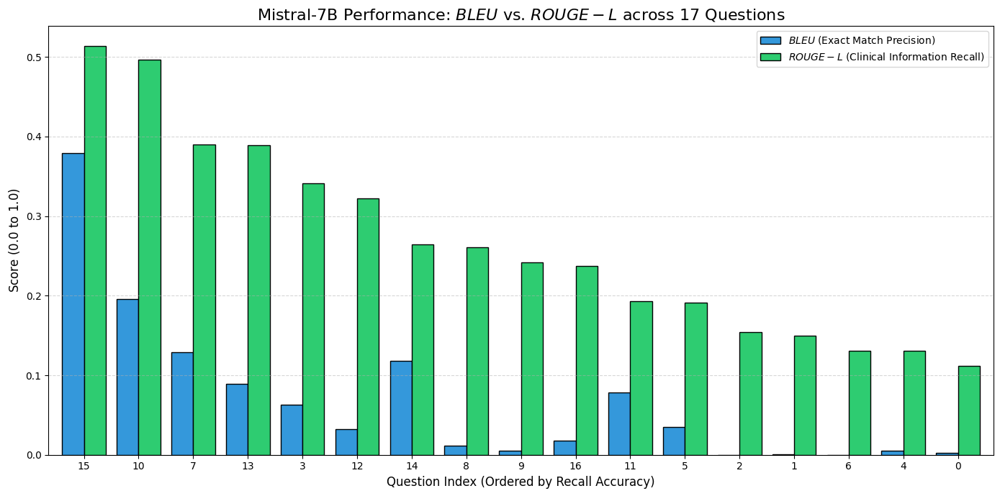
    


### Interpretation

- if ROUGE is high, but BLEU is low, it suggests that the RAG is is capturing psychiatric facts, but not using the same terminology as the reference material

- if ROUGE and BLEU are both high, it suggests that the RAG is capturing both psychiatric facts, and also closely matching the exact phrasing used in the reference material


```python
print("Question 15: ", df_results.Question[15])
print("Answer 15: ", df_results["Mistral Answer"][15])
print("Reference 15: ", df_results["Retrieved Reference"][15])

```

    Question 15:  What challenges arise in accurately diagnosing psychiatric disorders, and how can clinicians address these challenges?
    Answer 15:  Accurately diagnosing psychiatric disorders can be challenging due to several factors. First, symptoms that are indicative of a diagnosis should not be used to limit access to appropriate care (APA, 2022). This means that not all symptoms should be considered when making a diagnosis.
    
    Second, symptoms that cluster together regularly are called a syndrome, and if they follow a predictable course, they are characteristic of a specific disorder. However, the classification systems used by mental health professionals to make diagnoses are based on distinct disorders with clear descriptions and criteria. People suffering from delusions, hallucinations, disorganized thinking, grossly disorganized or abnormal motor behavior, and/or negative symptoms are different from those presenting with a primary clinical deficit in cognitive functioning that is not developmental but acquired.
    
    Third, assessments must be conducted carefully to avoid misdiagnosis. For example, if the assessment is conducted in a language that is different from the individual’s primary language, alogia (poverty of speech) may be related to linguistic barriers. In certain cultures, distress may take the form of hallucinations or pseudo-hallucinations and overvalued ideas that may present clinically similar to true psychosis but are normative to the individual’s subgroup. Misdiagnosis of schizophrenia in individuals with mood disorders with psychotic features or with other psychiatric disorders is more likely to occur in members of underserved ethnic and racialized groups, potentially due to clinical bias, racism, or discrimination leading to limited quality of information and potential misinterpretation of symptoms.
    
    To address these challenges, clinicians should be aware of the limitations of using symptoms to make a diagnosis and the potential for cultural differences in symptom expression. They should also ensure that assessments are conducted in the individual’s primary language and take into account the cultural context of the individual’s symptoms. Furthermore, clinicians should be aware of potential biases and strive to provide high-quality care to all individuals, regardless of their ethnicity or race.
    Reference 15:  not show all symptoms indicative of a diagnosis should not be used to justify limiting their access to
    appropriate care” (APA, 2022).
    Symptoms that cluster together regularly are called a syndrome. If they also follow the same,
    predictable course, we say that they are characteristic of a specific disorder.  Classification systems
    provide mental health professionals with an agreed-upon list of disorders falling into distinct categories
    for which there are clear descriptions and criteria for making a diagnosis. Distinct is the keyword here.
    People suffering from delusions, hallucinations, disorganized thinking (speech), grossly disorganized or
    abnormal motor behavior, and/or negative symptoms are different from people presenting with a
    primary clinical deficit in cognitive functioning that is not developmental but acquired (i.e., they have
    shown a decline in cognitive functioning over time). The former suffers from a schizophrenia spectrum not show all symptoms indicative of a diagnosis should not be used to justify limiting their access to
    appropriate care” (APA, 2022).
    Symptoms that cluster together regularly are called a syndrome. If they also follow the same,
    predictable course, we say that they are characteristic of a specific disorder.  Classification systems
    provide mental health professionals with an agreed-upon list of disorders falling into distinct categories
    for which there are clear descriptions and criteria for making a diagnosis. Distinct is the keyword here.
    People suffering from delusions, hallucinations, disorganized thinking (speech), grossly disorganized or
    abnormal motor behavior, and/or negative symptoms are different from people presenting with a
    primary clinical deficit in cognitive functioning that is not developmental but acquired (i.e., they have
    shown a decline in cognitive functioning over time). The former suffers from a schizophrenia spectrum expression, eye contact, and body language, which vary across cultures. If the assessment is
    conducted in a language that is different from the individual’s primary language, care must be
    taken to ensure that alogia is not related to linguistic barriers. In certain cultures, distress may
    take the form of hallucinations or pseudo-hallucinations and overvalued ideas that may present
    clinically similar to true psychosis but are normative to the individual’s subgroup. Misdiagnosis
    of schizophrenia in individuals with mood disorders with psychotic features or with other
    psychiatric disorders is more likely to occur in members of underserved ethnic and racialized
    groups (in the United States, especially among African Americans). This may be attributable to
    clinical bias, racism, or discrimination leading to limited quality of information and potential
    misinterpretation of symptoms.
    Sex- and Gender-Related Diagnostic Issues


- looking at question 15 (with the highest ROUGE and BLEU score) we can see that this answered the question very well, listing 5 highly relevant reasons for diagnosis challenges and referencing appropriate material (APA guidelines)


```python
print("Question 0: ", df_results.Question[0])
print("Question 0: ", df_results["Mistral Answer"][0])
print("Reference 0: ", df_results["Retrieved Reference"][0])


```

    Question 0:  What are the core diagnostic criteria for Major Depressive Disorder, and how many symptoms are required for a formal diagnosis?
    Question 0:  The core diagnostic criteria for Major Depressive Disorder, as outlined in the DSM-5-TR, include at least five of the following symptoms: depressed mood, loss of interest or pleasure, significant weight loss or gain, insomnia or hypersomnia, psychomotor agitation or retardation, fatigue or loss of energy, feelings of worthlessness or excessive or inappropriate guilt, diminished ability to think or concentrate, or recurrent thoughts of death or suicide. For a formal diagnosis, at least five of these symptoms must be present nearly every day for a period of at least two weeks.
    Reference 0:  episode are present but full criteria are not met, or there is a period lasting less
    than 2 months without any significant symptoms of a major depressive episode
    following the end of such an episode.
    In full remission: During the past 2 months, no significant signs or symptoms of
    the disturbance were present.
    Specify current severity:
    Severity is based on the number of criterion symptoms, the severity of those
    symptoms, and the degree of functional disability.
    Mild: Few, if any, symptoms in excess of those required to make the diagnosis
    are present, the intensity of the symptoms is distressing but manageable, and
    the symptoms result in minor impairment in social or occupational functioning.
    Moderate: The number of symptoms, intensity of symptoms, and/or functional
    impairment are between those specified for “mild” and “severe.”
    Severe: The number of symptoms is substantially in excess of that required to
    make the diagnosis, the intensity of the symptoms is seriously distressing and episode are present but full criteria are not met, or there is a period lasting less
    than 2 months without any significant symptoms of a major depressive episode
    following the end of such an episode.
    In full remission: During the past 2 months, no significant signs or symptoms of
    the disturbance were present.
    Specify current severity:
    Severity is based on the number of criterion symptoms, the severity of those
    symptoms, and the degree of functional disability.
    Mild: Few, if any, symptoms in excess of those required to make the diagnosis
    are present, the intensity of the symptoms is distressing but manageable, and
    the symptoms result in minor impairment in social or occupational functioning.
    Moderate: The number of symptoms, intensity of symptoms, and/or functional
    impairment are between those specified for “mild” and “severe.”
    Severe: The number of symptoms is substantially in excess of that required to
    make the diagnosis, the intensity of the symptoms is seriously distressing and falling into distinct categories for which there are clear descriptions and criteria for making a
    diagnosis.
    Elements of a diagnosis in the DSM include the diagnostic criteria and descriptors, subtypes and
    specifiers, the principle diagnosis, and a provisional diagnosis.
     
    Section 3.2 Review Questions
    What is clinical diagnosis?
    1.
    What is a classification system and what are the two main ones used today?
    2.
    Outline the diagnostic categories used in the DSM-5-TR.
    3.


- for question 0, the RAG did not perform well in terms of retrieving relevant documents and addressing severity, leading to a low ROUGE score, even though the question is actually answered.
- Just in not much detail, with no mention about severity. But this is a medically accurate answer. Meeting at least 5 symptoms for a period of two weeks.  


```python
print("Question 3: ", df_results.Question[3])
print("Question 3: ", df_results["Mistral Answer"][3])
print("Reference 3: ", df_results["Retrieved Reference"][3])

```

    Question 3:  What are the essential impairments required for diagnosing a personality disorder?
    Question 3:  To diagnose a personality disorder, there must be significant impairments in personality functioning,
    which can be seen in either impairments in self functioning or impairments in interpersonal functioning.
    Within self functioning, the impairments can be in identity or in self-direction. Identity impairments
    occur when an individual's sense of self is derived predominantly from work or productivity, and
    their experience and expression of personality is constricted.
    Reference 3:  personality disorder, the following criteria must be met: 
     
    A. Significant impairments in personality functioning manifest by: 
    1. Impairments in self functioning (a or b): 
    a. Identity: Sense of self derived predominantly from work or 
    productivity; constricted experience and expression of personality disorder, the following criteria must be met: 
     
    A. Significant impairments in personality functioning manifest by: 
    1. Impairments in self functioning (a or b): 
    a. Identity: Sense of self derived predominantly from work or 
    productivity; constricted experience and expression of Individuals who have a pattern of impairment in personality functioning and maladaptive traits
    that matches one of the six defined personality disorders should be diagnosed with that
    personality disorder. If an individual also has one or even several prominent traits that may have
    clinical relevance in addition to those required for the diagnosis (e.g., see narcissistic personality


- question 3 shows high ROUGE but low BLUE performance, indicating that the answer is clinically accurate, but uses very different language from the reference material to explain the answer

### Human Evaluation (Relevance + Accuracy)


```python

file_name = '/content/drive/My Drive/Mistral_Evaluation_Results_Relevance.xlsx'

df_human_eval = pd.read_excel(file_name)
df_results = df_results.merge(
    df_human_eval[['Question', 'Reference Relevance', 'Clinical Accuracy']],
    on='Question',
    how='left'
)

display(df_results.head())

```


  <div id="df-612eedb1-63e8-4ac5-a5ab-080a75dda046" class="colab-df-container">
    <div>
<style scoped>
    .dataframe tbody tr th:only-of-type {
        vertical-align: middle;
    }

    .dataframe tbody tr th {
        vertical-align: top;
    }

    .dataframe thead th {
        text-align: right;
    }
</style>
<table border="1" class="dataframe">
  <thead>
    <tr style="text-align: right;">
      <th></th>
      <th>Question</th>
      <th>Mistral Answer</th>
      <th>Mistral Sources</th>
      <th>Retrieved Reference</th>
      <th>Reference Relevance</th>
      <th>Clinical Accuracy</th>
    </tr>
  </thead>
  <tbody>
    <tr>
      <th>0</th>
      <td>What are the core diagnostic criteria for Majo...</td>
      <td>The core diagnostic criteria for Major Depress...</td>
      <td>1. DSM-5: Diagnostic and Statistical Manual of...</td>
      <td>episode are present but full criteria are not ...</td>
      <td>1</td>
      <td>2</td>
    </tr>
    <tr>
      <th>1</th>
      <td>How does Persistent Depressive Disorder differ...</td>
      <td>Persistent Depressive Disorder, unlike Major D...</td>
      <td>1. persistent_depressive_disorder.txt\n2. majo...</td>
      <td>The perceived abnormality or tolerance of chro...</td>
      <td>2</td>
      <td>2</td>
    </tr>
    <tr>
      <th>2</th>
      <td>What key features distinguish Generalized Anxi...</td>
      <td>Generalized Anxiety Disorder (GAD) and Panic D...</td>
      <td>- APA_2022.pdf</td>
      <td>symptoms, with some panic attacks presenting w...</td>
      <td>2</td>
      <td>2</td>
    </tr>
    <tr>
      <th>3</th>
      <td>What are the essential impairments required fo...</td>
      <td>To diagnose a personality disorder, significan...</td>
      <td>1. personality_disorder_criteria.txt\n2. perso...</td>
      <td>personality disorder, the following criteria m...</td>
      <td>2</td>
      <td>2</td>
    </tr>
    <tr>
      <th>4</th>
      <td>A patient reports persistent sadness, fatigue,...</td>
      <td>The most likely diagnosis for this patient is ...</td>
      <td>1. major_depressive_disorder.txt\n2. depressio...</td>
      <td>either subjective account or observation by ot...</td>
      <td>2</td>
      <td>2</td>
    </tr>
  </tbody>
</table>
</div>
    <div class="colab-df-buttons">

  <div class="colab-df-container">
    <button class="colab-df-convert" onclick="convertToInteractive('df-612eedb1-63e8-4ac5-a5ab-080a75dda046')"
            title="Convert this dataframe to an interactive table."
            style="display:none;">

  <svg xmlns="http://www.w3.org/2000/svg" height="24px" viewBox="0 -960 960 960">
    <path d="M120-120v-720h720v720H120Zm60-500h600v-160H180v160Zm220 220h160v-160H400v160Zm0 220h160v-160H400v160ZM180-400h160v-160H180v160Zm440 0h160v-160H620v160ZM180-180h160v-160H180v160Zm440 0h160v-160H620v160Z"/>
  </svg>
    </button>

  <style>
    .colab-df-container {
      display:flex;
      gap: 12px;
    }

    .colab-df-convert {
      background-color: #E8F0FE;
      border: none;
      border-radius: 50%;
      cursor: pointer;
      display: none;
      fill: #1967D2;
      height: 32px;
      padding: 0 0 0 0;
      width: 32px;
    }

    .colab-df-convert:hover {
      background-color: #E2EBFA;
      box-shadow: 0px 1px 2px rgba(60, 64, 67, 0.3), 0px 1px 3px 1px rgba(60, 64, 67, 0.15);
      fill: #174EA6;
    }

    .colab-df-buttons div {
      margin-bottom: 4px;
    }

    [theme=dark] .colab-df-convert {
      background-color: #3B4455;
      fill: #D2E3FC;
    }

    [theme=dark] .colab-df-convert:hover {
      background-color: #434B5C;
      box-shadow: 0px 1px 3px 1px rgba(0, 0, 0, 0.15);
      filter: drop-shadow(0px 1px 2px rgba(0, 0, 0, 0.3));
      fill: #FFFFFF;
    }
  </style>

    <script>
      const buttonEl =
        document.querySelector('#df-612eedb1-63e8-4ac5-a5ab-080a75dda046 button.colab-df-convert');
      buttonEl.style.display =
        google.colab.kernel.accessAllowed ? 'block' : 'none';

      async function convertToInteractive(key) {
        const element = document.querySelector('#df-612eedb1-63e8-4ac5-a5ab-080a75dda046');
        const dataTable =
          await google.colab.kernel.invokeFunction('convertToInteractive',
                                                    [key], {});
        if (!dataTable) return;

        const docLinkHtml = 'Like what you see? Visit the ' +
          '<a target="_blank" href=https://colab.research.google.com/notebooks/data_table.ipynb>data table notebook</a>'
          + ' to learn more about interactive tables.';
        element.innerHTML = '';
        dataTable['output_type'] = 'display_data';
        await google.colab.output.renderOutput(dataTable, element);
        const docLink = document.createElement('div');
        docLink.innerHTML = docLinkHtml;
        element.appendChild(docLink);
      }
    </script>
  </div>


    </div>
  </div>


```python
print("Mean Reference Relevance =", df_results['Reference Relevance'].mean()) #out of 2
print("Mean Clinical Accuracy =", df_results['Clinical Accuracy'].mean()) #out of 2
```

    Mean Reference Relevance = 1.3529411764705883
    Mean Clinical Accuracy = 2.0


```python
file_name = '/content/drive/My Drive/Mistral_Evaluation_Results_Relevance.xlsx'
df_human_eval = pd.read_excel(file_name)

print("Mean BLEU Mistral =", df_human_eval['BLEU'].mean())
print("SD BLEU Mistral =", df_human_eval['BLEU'].std())

print("Mean ROUGE Mistral =", df_human_eval['ROUGE-L'].mean())
print("SD ROUGE Mistral =", df_human_eval['ROUGE-L'].std())

```

    Mean BLEU Mistral = 0.08500588235294117
    SD BLEU Mistral = 0.10582000325191497
    Mean ROUGE Mistral = 0.24438823529411766
    SD ROUGE Mistral = 0.12654491733349538


- Mean BLEU Mistral = 0.0850 (sd = 0.106)
- Mean ROUGE Mistral = 0.244 (sd = 0.127)

- Mean reference relevance is 1.35/2
- But answers are clinically accurate - there were no glaring errors/misinformation given

# LLAMA

- this needs to be run once then can be loaded from google drive after saving.


```python

#del model
#del tokenizer
gc.collect()
torch.cuda.empty_cache() #clearing mistral memory

model_id = "meta-llama/Meta-Llama-3.1-8B-Instruct"

bnb_config = BitsAndBytesConfig(
    load_in_4bit=True,
    bnb_4bit_quant_type="nf4",
    bnb_4bit_compute_dtype=torch.float16,
    bnb_4bit_use_double_quant=True,
)

tokenizer = AutoTokenizer.from_pretrained(model_id)
model = AutoModelForCausalLM.from_pretrained(
    model_id,
    quantization_config=bnb_config,
    device_map="auto"
)

#specific to llama
terminators = [
    tokenizer.eos_token_id,
    tokenizer.convert_tokens_to_ids("<|eot_id|>")
]

pipe = pipeline(
    "text-generation",
    model=model,
    tokenizer=tokenizer,
    max_new_tokens=512,
    eos_token_id=terminators,
    pad_token_id=tokenizer.eos_token_id,
    temperature=0.1, #low for accuracy
    do_sample=True,
)

llm = HuggingFacePipeline(pipeline=pipe)
```


    config.json:   0%|          | 0.00/855 [00:00<?, ?B/s]


    tokenizer_config.json: 0.00B [00:00, ?B/s]


    tokenizer.json: 0.00B [00:00, ?B/s]


    special_tokens_map.json:   0%|          | 0.00/296 [00:00<?, ?B/s]


    model.safetensors.index.json: 0.00B [00:00, ?B/s]


    Downloading (incomplete total...): 0.00B [00:00, ?B/s]


    Fetching 4 files:   0%|          | 0/4 [00:00<?, ?it/s]


    Loading weights:   0%|          | 0/291 [00:00<?, ?it/s]


    ---------------------------------------------------------------------------

    OutOfMemoryError                          Traceback (most recent call last)

    /tmp/ipykernel_24653/3380503647.py in <cell line: 0>()
         14 
         15 tokenizer = AutoTokenizer.from_pretrained(model_id)
    ---> 16 model = AutoModelForCausalLM.from_pretrained(
         17     model_id,
         18     quantization_config=bnb_config,


    /usr/local/lib/python3.12/dist-packages/transformers/models/auto/auto_factory.py in from_pretrained(cls, pretrained_model_name_or_path, *model_args, **kwargs)
        370             if model_class.config_class == config.sub_configs.get("text_config", None):
        371                 config = config.get_text_config()
    --> 372             return model_class.from_pretrained(
        373                 pretrained_model_name_or_path, *model_args, config=config, **hub_kwargs, **kwargs
        374             )


    /usr/local/lib/python3.12/dist-packages/transformers/modeling_utils.py in from_pretrained(cls, pretrained_model_name_or_path, config, cache_dir, ignore_mismatched_sizes, force_download, local_files_only, token, revision, use_safetensors, weights_only, *model_args, **kwargs)
       4107             download_kwargs=download_kwargs,
       4108         )
    -> 4109         load_info = cls._load_pretrained_model(model, state_dict, checkpoint_files, load_config)
       4110         load_info = cls._finalize_load_state_dict(model, load_config, load_info)
       4111         model.eval()  # Set model in evaluation mode to deactivate Dropout modules by default


    /usr/local/lib/python3.12/dist-packages/transformers/modeling_utils.py in _load_pretrained_model(cls, model, state_dict, checkpoint_files, load_config)
       4229 
       4230             missing_keys, unexpected_keys, mismatched_keys, disk_offload_index, conversion_errors = (
    -> 4231                 convert_and_load_state_dict_in_model(
       4232                     model=model,
       4233                     state_dict=merged_state_dict,


    /usr/local/lib/python3.12/dist-packages/transformers/core_model_loading.py in convert_and_load_state_dict_in_model(model, state_dict, load_config, tp_plan, dtype_plan, disk_offload_index)
       1215                 pbar.refresh()
       1216                 try:
    -> 1217                     realized_value, conversion_errors = mapping.convert(
       1218                         first_param_name,
       1219                         model=model,


    /usr/local/lib/python3.12/dist-packages/transformers/core_model_loading.py in convert(self, layer_name, model, config, hf_quantizer, missing_keys, conversion_errors)
        694         # Collect the tensors here - we use a new dictionary to avoid keeping them in memory in the internal
        695         # attribute during the whole process
    --> 696         collected_tensors = self.materialize_tensors()
        697 
        698         # Perform renaming op (for a simple WeightRenaming, `self.source_patterns` and `self.target_patterns` can


    /usr/local/lib/python3.12/dist-packages/transformers/core_model_loading.py in materialize_tensors(self)
        669             # Async loading
        670             if isinstance(tensors[0], Future):
    --> 671                 tensors = [future.result() for future in tensors]
        672             # Sync loading
        673             elif callable(tensors[0]):


    /usr/lib/python3.12/concurrent/futures/_base.py in result(self, timeout)
        447                     raise CancelledError()
        448                 elif self._state == FINISHED:
    --> 449                     return self.__get_result()
        450 
        451                 self._condition.wait(timeout)


    /usr/lib/python3.12/concurrent/futures/_base.py in __get_result(self)
        399         if self._exception:
        400             try:
    --> 401                 raise self._exception
        402             finally:
        403                 # Break a reference cycle with the exception in self._exception


    /usr/lib/python3.12/concurrent/futures/thread.py in run(self)
         57 
         58         try:
    ---> 59             result = self.fn(*self.args, **self.kwargs)
         60         except BaseException as exc:
         61             self.future.set_exception(exc)


    /usr/local/lib/python3.12/dist-packages/transformers/core_model_loading.py in _job()
        816 
        817     def _job():
    --> 818         return _materialize_copy(tensor, device, dtype)
        819 
        820     if thread_pool is not None:


    /usr/local/lib/python3.12/dist-packages/transformers/core_model_loading.py in _materialize_copy(tensor, device, dtype)
        805     tensor = tensor[...]
        806     if dtype is not None or device is not None:
    --> 807         tensor = tensor.to(device=device, dtype=dtype)
        808     return tensor
        809 


    OutOfMemoryError: CUDA out of memory. Tried to allocate 112.00 MiB. GPU 0 has a total capacity of 14.56 GiB of which 87.81 MiB is free. Including non-PyTorch memory, this process has 14.47 GiB memory in use. Of the allocated memory 14.29 GiB is allocated by PyTorch, and 53.81 MiB is reserved by PyTorch but unallocated. If reserved but unallocated memory is large try setting PYTORCH_ALLOC_CONF=expandable_segments:True to avoid fragmentation.  See documentation for Memory Management  (https://pytorch.org/docs/stable/notes/cuda.html#environment-variables)


```python
import torch
import pandas as pd
import re
import os
import evaluate
from transformers import AutoModelForCausalLM, AutoTokenizer, BitsAndBytesConfig, pipeline
from transformers import HuggingFacePipeline
from langchain.chains import RetrievalQA
from langchain.prompts import PromptTemplate
from langchain_community.vectorstores import Chroma
from langchain_community.embeddings import HuggingFaceEmbeddings
```


    ---------------------------------------------------------------------------

    ModuleNotFoundError                       Traceback (most recent call last)

    /tmp/ipykernel_4223/1263548073.py in <cell line: 0>()
          3 import re
          4 import os
    ----> 5 import evaluate
          6 from transformers import AutoModelForCausalLM, AutoTokenizer, BitsAndBytesConfig, pipeline
          7 from transformers import HuggingFacePipeline


    ModuleNotFoundError: No module named 'evaluate'

    

    ---------------------------------------------------------------------------
    NOTE: If your import is failing due to a missing package, you can
    manually install dependencies using either !pip or !apt.
    
    To view examples of installing some common dependencies, click the
    "Open Examples" button below.
    ---------------------------------------------------------------------------


```python
save_directory = "/content/drive/My Drive/NLP RAG Project/models/Llama-3.1-8B-4bit"

os.makedirs(save_directory, exist_ok=True)

#save model and tokenizer
model.save_pretrained(save_directory)
tokenizer.save_pretrained(save_directory)

```


    ---------------------------------------------------------------------------

    NameError                                 Traceback (most recent call last)

    /tmp/ipykernel_4223/2527277813.py in <cell line: 0>()
          4 
          5 #save model and tokenizer
    ----> 6 model.save_pretrained(save_directory)
          7 tokenizer.save_pretrained(save_directory)


    NameError: name 'model' is not defined


### Loading LLaMA from drive (run from here)


```python


save_directory = "/content/drive/My Drive/NLP RAG Project/models/Llama-3.1-8B-4bit"

bnb_config = BitsAndBytesConfig(
    load_in_4bit=True,
    bnb_4bit_quant_type="nf4",
    bnb_4bit_compute_dtype=torch.float16,
    bnb_4bit_use_double_quant=True,
)

model = AutoModelForCausalLM.from_pretrained(
    save_directory,
    quantization_config=bnb_config,
    device_map="auto"
)
tokenizer = AutoTokenizer.from_pretrained(save_directory)

```


    ---------------------------------------------------------------------------

    ValueError                                Traceback (most recent call last)

    /tmp/ipykernel_4223/455899402.py in <cell line: 0>()
          8 )
          9 
    ---> 10 model = AutoModelForCausalLM.from_pretrained(
         11     save_directory,
         12     quantization_config=bnb_config,


    /usr/local/lib/python3.12/dist-packages/transformers/models/auto/auto_factory.py in from_pretrained(cls, pretrained_model_name_or_path, *model_args, **kwargs)
        373                 pretrained_model_name_or_path, *model_args, config=config, **hub_kwargs, **kwargs
        374             )
    --> 375         raise ValueError(
        376             f"Unrecognized configuration class {config.__class__} for this kind of AutoModel: {cls.__name__}.\n"
        377             f"Model type should be one of {', '.join(c.__name__ for c in cls._model_mapping)}."


    ValueError: Unrecognized configuration class <class 'transformers.models.bit.configuration_bit.BitConfig'> for this kind of AutoModel: AutoModelForCausalLM.
    Model type should be one of AfmoeConfig, ApertusConfig, ArceeConfig, AriaTextConfig, BambaConfig, BartConfig, BertConfig, BertGenerationConfig, BigBirdConfig, BigBirdPegasusConfig, BioGptConfig, BitNetConfig, BlenderbotConfig, BlenderbotSmallConfig, BloomConfig, BltConfig, CamembertConfig, LlamaConfig, CodeGenConfig, CohereConfig, Cohere2Config, CpmAntConfig, CTRLConfig, CwmConfig, Data2VecTextConfig, DbrxConfig, DeepseekV2Config, DeepseekV3Config, DiffLlamaConfig, DogeConfig, Dots1Config, ElectraConfig, Emu3Config, ErnieConfig, Ernie4_5Config, Ernie4_5_MoeConfig, Exaone4Config, FalconConfig, FalconH1Config, FalconMambaConfig, FlexOlmoConfig, FuyuConfig, GemmaConfig, Gemma2Config, Gemma3Config, Gemma3TextConfig, Gemma3nConfig, Gemma3nTextConfig, GitConfig, GlmConfig, Glm4Config, Glm4MoeConfig, Glm4MoeLiteConfig, GotOcr2Config, GPT2Config, GPT2Config, GPTBigCodeConfig, GPTNeoConfig, GPTNeoXConfig, GPTNeoXJapaneseConfig, GptOssConfig, GPTJConfig, GraniteConfig, GraniteMoeConfig, GraniteMoeHybridConfig, GraniteMoeSharedConfig, HeliumConfig, HunYuanDenseV1Config, HunYuanMoEV1Config, Jais2Config, JambaConfig, JetMoeConfig, Lfm2Config, Lfm2MoeConfig, LlamaConfig, Llama4Config, Llama4TextConfig, LongcatFlashConfig, MambaConfig, Mamba2Config, MarianConfig, MBartConfig, MegatronBertConfig, MiniMaxConfig, MiniMaxM2Config, MinistralConfig, Ministral3Config, MistralConfig, MixtralConfig, MllamaConfig, ModernBertDecoderConfig, MoshiConfig, MptConfig, MusicgenConfig, MusicgenMelodyConfi...


```python

template = """Use the following pieces of context to answer the question at the end.
For each piece of context, the source filename is provided.
When you answer, try to mention which document the information came from.
At the very end of your answer, provide a section labeled 'SOURCES USED:' and list the filenames.

Context:
{context}

Question: {question}

Helpful Answer:"""

QA_CHAIN_PROMPT = PromptTemplate(
    input_variables=["context", "question"],
    template=template,
)
```


```python
#loop to test all 17 questions at once


#huggingface pipeline
pipe = pipeline(
    "text-generation",
    model=model,
    tokenizer=tokenizer,
    max_new_tokens=512,
    temperature=0.1,
    do_sample=True,
    pad_token_id=tokenizer.eos_token_id,
)

llm = HuggingFacePipeline(pipeline=pipe)

#RAG chain
qa_chain = RetrievalQA.from_chain_type(
    llm=llm,
    chain_type="stuff",
    retriever=vector_db.as_retriever(search_kwargs={"k": 3}),
    return_source_documents=True,
    chain_type_kwargs={"prompt": QA_CHAIN_PROMPT}
)


evaluation_data = []

for i, query in enumerate(questions):
    result = qa_chain.invoke(query)
    full_output = result["result"]

    if "Helpful Answer:" in full_output:
        useful_text = full_output.split("Helpful Answer:")[-1].strip()
    else:
        useful_text = full_output.strip()

    split_pattern = r"(?i)sources\s*used:|sources:"

    parts = re.split(split_pattern, useful_text)

    if len(parts) > 1:
        final_answer = parts[0].strip()
        llama_sources = parts[1].strip()
    else:
        final_answer = useful_text
        llama_sources = "No sources cited by model"

    reference_text = " ".join([doc.page_content for doc in result["source_documents"]])

    evaluation_data.append({
        "Question": query,
        "LLaMa Answer": final_answer,
        "LLaMa Sources": llama_sources,
        "Retrieved Reference": reference_text
    })

df_results = pd.DataFrame(evaluation_data)
display(df_results.head())
```

    Passing `generation_config` together with generation-related arguments=({'pad_token_id', 'do_sample', 'max_new_tokens', 'temperature'}) is deprecated and will be removed in future versions. Please pass either a `generation_config` object OR all generation parameters explicitly, but not both.
    Both `max_new_tokens` (=512) and `max_length`(=20) seem to have been set. `max_new_tokens` will take precedence. Please refer to the documentation for more information. (https://huggingface.co/docs/transformers/main/en/main_classes/text_generation)
    Both `max_new_tokens` (=512) and `max_length`(=20) seem to have been set. `max_new_tokens` will take precedence. Please refer to the documentation for more information. (https://huggingface.co/docs/transformers/main/en/main_classes/text_generation)
    Both `max_new_tokens` (=512) and `max_length`(=20) seem to have been set. `max_new_tokens` will take precedence. Please refer to the documentation for more information. (https://huggingface.co/docs/transformers/main/en/main_classes/text_generation)
    Both `max_new_tokens` (=512) and `max_length`(=20) seem to have been set. `max_new_tokens` will take precedence. Please refer to the documentation for more information. (https://huggingface.co/docs/transformers/main/en/main_classes/text_generation)
    Both `max_new_tokens` (=512) and `max_length`(=20) seem to have been set. `max_new_tokens` will take precedence. Please refer to the documentation for more information. (https://huggingface.co/docs/transformers/main/en/main_classes/text_generation)
    Both `max_new_tokens` (=512) and `max_length`(=20) seem to have been set. `max_new_tokens` will take precedence. Please refer to the documentation for more information. (https://huggingface.co/docs/transformers/main/en/main_classes/text_generation)
    Both `max_new_tokens` (=512) and `max_length`(=20) seem to have been set. `max_new_tokens` will take precedence. Please refer to the documentation for more information. (https://huggingface.co/docs/transformers/main/en/main_classes/text_generation)
    Both `max_new_tokens` (=512) and `max_length`(=20) seem to have been set. `max_new_tokens` will take precedence. Please refer to the documentation for more information. (https://huggingface.co/docs/transformers/main/en/main_classes/text_generation)
    Both `max_new_tokens` (=512) and `max_length`(=20) seem to have been set. `max_new_tokens` will take precedence. Please refer to the documentation for more information. (https://huggingface.co/docs/transformers/main/en/main_classes/text_generation)
    Both `max_new_tokens` (=512) and `max_length`(=20) seem to have been set. `max_new_tokens` will take precedence. Please refer to the documentation for more information. (https://huggingface.co/docs/transformers/main/en/main_classes/text_generation)
    Both `max_new_tokens` (=512) and `max_length`(=20) seem to have been set. `max_new_tokens` will take precedence. Please refer to the documentation for more information. (https://huggingface.co/docs/transformers/main/en/main_classes/text_generation)
    Both `max_new_tokens` (=512) and `max_length`(=20) seem to have been set. `max_new_tokens` will take precedence. Please refer to the documentation for more information. (https://huggingface.co/docs/transformers/main/en/main_classes/text_generation)
    Both `max_new_tokens` (=512) and `max_length`(=20) seem to have been set. `max_new_tokens` will take precedence. Please refer to the documentation for more information. (https://huggingface.co/docs/transformers/main/en/main_classes/text_generation)
    Both `max_new_tokens` (=512) and `max_length`(=20) seem to have been set. `max_new_tokens` will take precedence. Please refer to the documentation for more information. (https://huggingface.co/docs/transformers/main/en/main_classes/text_generation)
    Both `max_new_tokens` (=512) and `max_length`(=20) seem to have been set. `max_new_tokens` will take precedence. Please refer to the documentation for more information. (https://huggingface.co/docs/transformers/main/en/main_classes/text_generation)
    Both `max_new_tokens` (=512) and `max_length`(=20) seem to have been set. `max_new_tokens` will take precedence. Please refer to the documentation for more information. (https://huggingface.co/docs/transformers/main/en/main_classes/text_generation)
    Both `max_new_tokens` (=512) and `max_length`(=20) seem to have been set. `max_new_tokens` will take precedence. Please refer to the documentation for more information. (https://huggingface.co/docs/transformers/main/en/main_classes/text_generation)


  <div id="df-e635240e-1cd2-4fd5-bae1-e38b3e9d8741" class="colab-df-container">
    <div>
<style scoped>
    .dataframe tbody tr th:only-of-type {
        vertical-align: middle;
    }

    .dataframe tbody tr th {
        vertical-align: top;
    }

    .dataframe thead th {
        text-align: right;
    }
</style>
<table border="1" class="dataframe">
  <thead>
    <tr style="text-align: right;">
      <th></th>
      <th>Question</th>
      <th>LLaMa Answer</th>
      <th>LLaMa Sources</th>
      <th>Retrieved Reference</th>
    </tr>
  </thead>
  <tbody>
    <tr>
      <th>0</th>
      <td>What are the core diagnostic criteria for Majo...</td>
      <td>The core diagnostic criteria for Major Depress...</td>
      <td>DSM-5-TR (Section 3.2 Review Questions)\nDSM-5...</td>
      <td>episode are present but full criteria are not ...</td>
    </tr>
    <tr>
      <th>1</th>
      <td>How does Persistent Depressive Disorder differ...</td>
      <td>Persistent Depressive Disorder (PDD) is charac...</td>
      <td>1. persistent_depressive_disorder.pdf\n2. pers...</td>
      <td>The perceived abnormality or tolerance of chro...</td>
    </tr>
    <tr>
      <th>2</th>
      <td>What key features distinguish Generalized Anxi...</td>
      <td>Panic disorder is characterized by recurrent u...</td>
      <td>1. Fundamentals of Psychological Disorders\n2....</td>
      <td>symptoms, with some panic attacks presenting w...</td>
    </tr>
    <tr>
      <th>3</th>
      <td>What are the essential impairments required fo...</td>
      <td>According to the DSM-5, the essential impairme...</td>
      <td>DSM-5.pdf\nDSM-5.pdf\nDSM-5.pdf\nDSM-5.pdf\nDS...</td>
      <td>personality disorder, the following criteria m...</td>
    </tr>
    <tr>
      <th>4</th>
      <td>A patient reports persistent sadness, fatigue,...</td>
      <td>The most likely diagnosis is Persistent Depres...</td>
      <td>1. apa_2022.txt\n2. apa_2022.txt\n3. apa_2022....</td>
      <td>either subjective account or observation by ot...</td>
    </tr>
  </tbody>
</table>
</div>
    <div class="colab-df-buttons">

  <div class="colab-df-container">
    <button class="colab-df-convert" onclick="convertToInteractive('df-e635240e-1cd2-4fd5-bae1-e38b3e9d8741')"
            title="Convert this dataframe to an interactive table."
            style="display:none;">

  <svg xmlns="http://www.w3.org/2000/svg" height="24px" viewBox="0 -960 960 960">
    <path d="M120-120v-720h720v720H120Zm60-500h600v-160H180v160Zm220 220h160v-160H400v160Zm0 220h160v-160H400v160ZM180-400h160v-160H180v160Zm440 0h160v-160H620v160ZM180-180h160v-160H180v160Zm440 0h160v-160H620v160Z"/>
  </svg>
    </button>

  <style>
    .colab-df-container {
      display:flex;
      gap: 12px;
    }

    .colab-df-convert {
      background-color: #E8F0FE;
      border: none;
      border-radius: 50%;
      cursor: pointer;
      display: none;
      fill: #1967D2;
      height: 32px;
      padding: 0 0 0 0;
      width: 32px;
    }

    .colab-df-convert:hover {
      background-color: #E2EBFA;
      box-shadow: 0px 1px 2px rgba(60, 64, 67, 0.3), 0px 1px 3px 1px rgba(60, 64, 67, 0.15);
      fill: #174EA6;
    }

    .colab-df-buttons div {
      margin-bottom: 4px;
    }

    [theme=dark] .colab-df-convert {
      background-color: #3B4455;
      fill: #D2E3FC;
    }

    [theme=dark] .colab-df-convert:hover {
      background-color: #434B5C;
      box-shadow: 0px 1px 3px 1px rgba(0, 0, 0, 0.15);
      filter: drop-shadow(0px 1px 2px rgba(0, 0, 0, 0.3));
      fill: #FFFFFF;
    }
  </style>

    <script>
      const buttonEl =
        document.querySelector('#df-e635240e-1cd2-4fd5-bae1-e38b3e9d8741 button.colab-df-convert');
      buttonEl.style.display =
        google.colab.kernel.accessAllowed ? 'block' : 'none';

      async function convertToInteractive(key) {
        const element = document.querySelector('#df-e635240e-1cd2-4fd5-bae1-e38b3e9d8741');
        const dataTable =
          await google.colab.kernel.invokeFunction('convertToInteractive',
                                                    [key], {});
        if (!dataTable) return;

        const docLinkHtml = 'Like what you see? Visit the ' +
          '<a target="_blank" href=https://colab.research.google.com/notebooks/data_table.ipynb>data table notebook</a>'
          + ' to learn more about interactive tables.';
        element.innerHTML = '';
        dataTable['output_type'] = 'display_data';
        await google.colab.output.renderOutput(dataTable, element);
        const docLink = document.createElement('div');
        docLink.innerHTML = docLinkHtml;
        element.appendChild(docLink);
      }
    </script>
  </div>


    </div>
  </div>


```python
df_results.to_csv("/content/drive/My Drive/NLP RAG Project/LLAMA_Evaluation_Results.csv", index=True)
```


```python
#!pip install evaluate rouge_score sacrebleu


#bleu and rouge metrics
bleu = evaluate.load("bleu")
rouge = evaluate.load("rouge")

#metrics for each row
def compute_metrics(row):
    #BLEU
    b = bleu.compute(predictions=[row["LLaMa Answer"]],
                     references=[row["Retrieved Reference"]])
    #ROUGE
    r = rouge.compute(predictions=[row["LLaMa Answer"]],
                     references=[row["Retrieved Reference"]])

    return pd.Series([round(b['bleu'], 4), round(r['rougeL'], 4)])

#add to DF
df_results[['BLEU', 'ROUGE-L']] = df_results.apply(compute_metrics, axis=1)
```


    Downloading builder script: 0.00B [00:00, ?B/s]


    Downloading extra modules: 0.00B [00:00, ?B/s]


    Downloading builder script: 0.00B [00:00, ?B/s]


```python


#sorting by rouge
df_sorted = df_results.sort_values(by='ROUGE-L', ascending=False)

#grouped bar chart
ax = df_sorted.plot(
    kind='bar',
    y=['BLEU', 'ROUGE-L'],
    figsize=(14, 7),
    color=['#3498db', '#2ecc71'],  #blue for BLEU, green for ROUGE
    edgecolor='black',
    width=0.8
)

plt.title('LLaMa Performance: $BLEU$ vs. $ROUGE-L$ across 17 Questions', fontsize=16)
plt.xlabel('Question Index (Ordered by Recall Accuracy)', fontsize=12)
plt.ylabel('Score ($0.0$ to $1.0$)', fontsize=12)
plt.legend(["$BLEU$ (Exact Match Precision)", "$ROUGE-L$ (Clinical Information Recall)"])

#Formatting
plt.xticks(rotation=0)
plt.grid(axis='y', linestyle='--', alpha=0.5)
plt.tight_layout()

#save plot
plt.savefig('/content/drive/My Drive/NLP RAG Project/llama_evaluation_bar_chart.png')
```


    
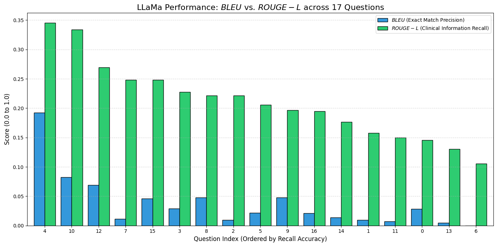
    


```python
print("Question 4: ", df_results.Question[4])
print("Question 4: ", df_results["LLaMa Answer"][4])
print("Reference 4: ", df_results["Retrieved Reference"][4])

```

    Question 4:  A patient reports persistent sadness, fatigue, and sleep disturbances lasting over two years. What is the most likely diagnosis, and what criteria support this conclusion?
    Question 4:  The most likely diagnosis is Persistent Depressive Disorder (PDD), as the patient reports symptoms of depressed mood, fatigue, and sleep disturbances lasting over two years. The criteria supporting this conclusion include:
    
    *   The patient's symptoms of depressed mood, fatigue, and sleep disturbances lasting over two years meet the diagnostic criteria for PDD, which requires a depressed mood for most of the day, for more days than not, for at least two years (APA, 2022).
    *   The patient's symptoms also include two or more additional symptoms, such as changes in appetite, low energy or fatigue, low self-esteem, feelings of hopelessness, and poor concentration or difficulty with decision making, which are also required for a diagnosis of PDD (APA, 2022).
    Reference 4:  either subjective account or observation by others, for at least 2 years.
    Note: In children and adolescents, mood can be irritable and duration must be at
    least 1 year.
    B. Presence, while depressed, of two (or more) of the following: be the normal response to such a loss. Though the individual’s response resembles a major depressive
    episode, clinical judgment should be utilized in making any diagnosis and be based on the clinician’s
    understanding of the individual’s personal history and cultural norms related to how members should
    express distress in the context of loss.
         4.1.4.2. Persistent depressive disorder (PDD). For a diagnosis of persistent depressive disorder,
    an individual must experience a depressed mood for most of the day, for more days than not, for at least
    two years. (APA, 2022). This feeling of a depressed mood is also accompanied by two or more additional
    symptoms, to include changes in appetite, insomnia or hypersomnia, low energy or fatigue, low self-
    esteem, feelings of hopelessness, and poor concentration or difficulty with decision making. The
    symptoms taken together cause clinically significant distress or impairment in important areas of immediately after the code for insomnia disorder in order to indicate the
    association.
    Specify if:
    Episodic: Symptoms last at least 1 month but less than 3 months.


- question with the highest ROUGE score was question 4 - about likely diagnosis of PDD


```python
print("Question 6: ", df_results.Question[6])
print("Question 6: ", df_results["LLaMa Answer"][6])
print("Reference 6: ", df_results["Retrieved Reference"][6])
```

    Question 6:  A patient demonstrates impulsivity, lack of empathy, and manipulative behavior. What diagnosis should be considered, and what characteristics support it?
    Question 6:  The diagnosis that should be considered is Antisocial Personality Disorder (301.7). The characteristics that support this diagnosis include impulsivity (Criterion 1), lack of empathy (Criterion 2), and manipulative behavior (Criterion 3). These behaviors are often seen in individuals with Antisocial Personality Disorder, who tend to disregard the rights of others, engage in deceitful behavior, and exhibit a lack of concern for the feelings or rights of others.
    Reference 6:  schizophrenia, personality disorder). This category may be used only when the problem is
    sufficiently severe to warrant independent clinical attention and does not meet diagnostic criteria
    for psychological factors affecting other medical conditions.
    E66.9
    Overweight or Obesity
    This category may be used when overweight or obesity is a focus of clinical attention.
    Z76.5
    Malingering
    The essential feature of malingering is the intentional production of false or grossly exaggerated
    physical or psychological symptoms, motivated by external incentives such as avoiding military
    duty, avoiding work, obtaining financial compensation, evading criminal prosecution, or
    obtaining drugs. Under some circumstances, malingering may represent adaptive behavior—for
    example, feigning illness while a captive of the enemy during wartime. Malingering should be
    strongly considered if any combination of the following is noted:
    1. (Criterion 7). They tend to have some degree of cognitive empathy
    762
    (understanding another person’s perspective on an intellectual level) but lack emotional
    empathy (directly feeling the emotions that another person is feeling). These individuals may be
    oblivious to the hurt their remarks may inflict (e.g., exuberantly telling a former lover that “I am
    now in the relationship of a lifetime!”; boasting of health in front of someone who is sick). When
    recognized, the needs, desires, or feelings of others are likely to be viewed disparagingly as signs
    of weakness or vulnerability. Those who relate to individuals with narcissistic personality
    disorder typically find an emotional coldness and lack of reciprocal interest.
    These individuals are often envious of others or believe that others are envious of them
    (Criterion 8). They may begrudge others their successes or possessions, feeling that they better
    deserve those achievements, admiration, or privileges. They may harshly devalue the a result of the physiological effects of another medical condition (e.g., brain tumor), a diagnosis
    of personality change due to another medical condition should be considered.
    Cluster A Personality Disorders
    Paranoid Personality Disorder
    Diagnostic Criteria
    A. A pervasive distrust and suspiciousness of others such that their motives are
    interpreted as malevolent, beginning by early adulthood and present in a variety
    of contexts, as indicated by four (or more) of the following:
    738
    1. Suspects, without sufficient basis, that others are exploiting, harming, or
    deceiving him or her.


- question with lowest BLEU score was 6 - about diagnosing someone with symptoms of ASPD - language used is completely different from the reference text
- but ROUGE was still okay (around 0.10).  


```python
#loading LLAMA human evaluation ratings

file_name = '/content/drive/My Drive/NLP RAG Project/LLAMA_Evaluation_Results_Relevance.xlsx'

df_human_eval = pd.read_excel(file_name)
df_results = df_results.merge(
    df_human_eval[['Question', 'Reference Relevance LLaMa', 'Clinical Accuracy LLaMa']],
    on='Question',
    how='left'
)

display(df_results.head())
```


    ---------------------------------------------------------------------------

    NameError                                 Traceback (most recent call last)

    /tmp/ipykernel_1157/3525227345.py in <cell line: 0>()
          4 
          5 df_human_eval = pd.read_excel(file_name)
    ----> 6 df_results = df_results.merge(
          7     df_human_eval[['Question', 'Reference Relevance LLaMa', 'Clinical Accuracy LLaMa']],
          8     on='Question',


    NameError: name 'df_results' is not defined


```python
print("Mean Reference Relevance =", df_results['Reference Relevance LLaMa'].mean()) #out of 2
print("Mean Clinical Accuracy =", df_results['Clinical Accuracy LLaMa'].mean()) #out of 2
```

    Mean Reference Relevance = 1.5294117647058822
    Mean Clinical Accuracy = 2.0


- More relevant resources referenced (1.529)
- Still as accurate - there was nothing incorrect about the responses.


```python
print("Mean BLEU LLaMa =", df_results['BLEU'].mean())
print("SD BLEU LLaMa =", df_results['BLEU'].std())

print("Mean ROUGE LLaMa =", df_results['ROUGE-L'].mean())
print("SD ROUGE LLaMa =", df_results['ROUGE-L'].std())
```

    Mean BLEU LLaMa = 0.03781176470588235
    SD BLEU LLaMa = 0.046177482098325555
    Mean ROUGE LLaMa = 0.2105529411764706
    SD ROUGE LLaMa = 0.06617290908716968


- Mean BLEU LLaMa = 0.0301 (sd = 0.0371)
- Mean ROUGE LLaMa = 0.212 (sd = 0.0791)
- Which is worse performance in terms of BLEU and ROUGE compared to Mistral.

# Gemma
- One implementation note worth noting different from LLamA and Mistral: Gemma requires a custom prompt wrapper using its <start_of_turn> / <end_of_turn> chat template and it does not follow the same instruction format as Mistral or LLaMA


```python
import gc
import torch

to_delete = ['model', 'tokenizer', 'pipe', 'llm', 'qa_chain']

for obj in to_delete:
    if obj in locals():
        del locals()[obj]

gc.collect()
torch.cuda.empty_cache()
print(f"VRAM currently in use: {torch.cuda.memory_allocated() / 1024**3:.2f} GB")
```

    VRAM currently in use: 0.00 GB


```python

model_id = "google/gemma-2-9b-it"

bnb_config = BitsAndBytesConfig(
    load_in_4bit=True,
    bnb_4bit_quant_type="nf4",
    bnb_4bit_compute_dtype=torch.float16,
    bnb_4bit_use_double_quant=True,
)

tokenizer = AutoTokenizer.from_pretrained(model_id)
model = AutoModelForCausalLM.from_pretrained(
    model_id,
    quantization_config=bnb_config,
    device_map="auto",
    low_cpu_mem_usage=True,
    torch_dtype=torch.float16
)


terminators = [
    tokenizer.eos_token_id,
    tokenizer.convert_tokens_to_ids("<end_of_turn>")
]

pipe = pipeline(
    "text-generation",
    model=model,
    tokenizer=tokenizer,
    max_new_tokens=512,
    eos_token_id=terminators,
    pad_token_id=tokenizer.eos_token_id,
    temperature=0.1,
    do_sample=True,
)

llm = HuggingFacePipeline(pipeline=pipe)
```

    `torch_dtype` is deprecated! Use `dtype` instead!


    Loading weights:   0%|          | 0/464 [00:00<?, ?it/s]


    generation_config.json:   0%|          | 0.00/173 [00:00<?, ?B/s]


    Passing `generation_config` together with generation-related arguments=({'eos_token_id', 'max_new_tokens', 'pad_token_id', 'do_sample', 'temperature'}) is deprecated and will be removed in future versions. Please pass either a `generation_config` object OR all generation parameters explicitly, but not both.


```python
#saving
model.save_pretrained("/content/drive/My Drive/NLP RAG Project/models/Gemma-2-9b-4bit")
tokenizer.save_pretrained("/content/drive/My Drive/NLP RAG Project/models/Gemma-2-9b-4bit")
```


```python
template = """Use the following pieces of context to answer the question at the end.
For each piece of context, the source filename is provided.
When you answer, try to mention which document the information came from.
At the very end of your answer, provide a section labeled 'SOURCES USED:' and list the filenames.

Context:
{context}

Question: {question}

Helpful Answer:"""


#specific text wrapper for gemma, which is an instruct model.
gemma_template = f"""<start_of_turn>user
{template}<end_of_turn>
<start_of_turn>model
"""


QA_CHAIN_PROMPT = PromptTemplate(
    input_variables=["context", "question"],
    template=gemma_template,
)

qa_chain = RetrievalQA.from_chain_type(
    llm=llm,
    chain_type="stuff",
    retriever=vector_db.as_retriever(search_kwargs={"k": 3}),
    chain_type_kwargs={"prompt": QA_CHAIN_PROMPT},
    return_source_documents=True
)
```


```python
evaluation_data = []

for i, query in enumerate(questions):
    result = qa_chain.invoke(query)
    full_output = result["result"]

    if "Helpful Answer:" in full_output:
        useful_text = full_output.split("Helpful Answer:")[-1].strip()
    else:
        useful_text = full_output.strip()

    split_pattern = r"(?i)sources\s*(?:used)?\s*:"

    parts = re.split(split_pattern, useful_text)

    if len(parts) > 1:
        final_answer = parts[0].strip()
        gemma_sources = parts[1].strip()
    else:
        final_answer = useful_text
        gemma_sources = "No sources cited by model"

    reference_text = " ".join([doc.page_content for doc in result["source_documents"]])

    evaluation_data.append({
        "Question": query,
        "GEMMA Answer": final_answer,
        "GEMMA Sources": gemma_sources,
        "Retrieved Reference": reference_text
    })

df_results = pd.DataFrame(evaluation_data)
display(df_results.head())
```

    Both `max_new_tokens` (=512) and `max_length`(=20) seem to have been set. `max_new_tokens` will take precedence. Please refer to the documentation for more information. (https://huggingface.co/docs/transformers/main/en/main_classes/text_generation)
    Both `max_new_tokens` (=512) and `max_length`(=20) seem to have been set. `max_new_tokens` will take precedence. Please refer to the documentation for more information. (https://huggingface.co/docs/transformers/main/en/main_classes/text_generation)
    Both `max_new_tokens` (=512) and `max_length`(=20) seem to have been set. `max_new_tokens` will take precedence. Please refer to the documentation for more information. (https://huggingface.co/docs/transformers/main/en/main_classes/text_generation)
    Both `max_new_tokens` (=512) and `max_length`(=20) seem to have been set. `max_new_tokens` will take precedence. Please refer to the documentation for more information. (https://huggingface.co/docs/transformers/main/en/main_classes/text_generation)
    Both `max_new_tokens` (=512) and `max_length`(=20) seem to have been set. `max_new_tokens` will take precedence. Please refer to the documentation for more information. (https://huggingface.co/docs/transformers/main/en/main_classes/text_generation)
    Both `max_new_tokens` (=512) and `max_length`(=20) seem to have been set. `max_new_tokens` will take precedence. Please refer to the documentation for more information. (https://huggingface.co/docs/transformers/main/en/main_classes/text_generation)
    Both `max_new_tokens` (=512) and `max_length`(=20) seem to have been set. `max_new_tokens` will take precedence. Please refer to the documentation for more information. (https://huggingface.co/docs/transformers/main/en/main_classes/text_generation)
    Both `max_new_tokens` (=512) and `max_length`(=20) seem to have been set. `max_new_tokens` will take precedence. Please refer to the documentation for more information. (https://huggingface.co/docs/transformers/main/en/main_classes/text_generation)
    Both `max_new_tokens` (=512) and `max_length`(=20) seem to have been set. `max_new_tokens` will take precedence. Please refer to the documentation for more information. (https://huggingface.co/docs/transformers/main/en/main_classes/text_generation)
    You seem to be using the pipelines sequentially on GPU. In order to maximize efficiency please use a dataset
    Both `max_new_tokens` (=512) and `max_length`(=20) seem to have been set. `max_new_tokens` will take precedence. Please refer to the documentation for more information. (https://huggingface.co/docs/transformers/main/en/main_classes/text_generation)
    Both `max_new_tokens` (=512) and `max_length`(=20) seem to have been set. `max_new_tokens` will take precedence. Please refer to the documentation for more information. (https://huggingface.co/docs/transformers/main/en/main_classes/text_generation)
    Both `max_new_tokens` (=512) and `max_length`(=20) seem to have been set. `max_new_tokens` will take precedence. Please refer to the documentation for more information. (https://huggingface.co/docs/transformers/main/en/main_classes/text_generation)
    Both `max_new_tokens` (=512) and `max_length`(=20) seem to have been set. `max_new_tokens` will take precedence. Please refer to the documentation for more information. (https://huggingface.co/docs/transformers/main/en/main_classes/text_generation)
    Both `max_new_tokens` (=512) and `max_length`(=20) seem to have been set. `max_new_tokens` will take precedence. Please refer to the documentation for more information. (https://huggingface.co/docs/transformers/main/en/main_classes/text_generation)
    Both `max_new_tokens` (=512) and `max_length`(=20) seem to have been set. `max_new_tokens` will take precedence. Please refer to the documentation for more information. (https://huggingface.co/docs/transformers/main/en/main_classes/text_generation)
    Both `max_new_tokens` (=512) and `max_length`(=20) seem to have been set. `max_new_tokens` will take precedence. Please refer to the documentation for more information. (https://huggingface.co/docs/transformers/main/en/main_classes/text_generation)
    Both `max_new_tokens` (=512) and `max_length`(=20) seem to have been set. `max_new_tokens` will take precedence. Please refer to the documentation for more information. (https://huggingface.co/docs/transformers/main/en/main_classes/text_generation)


  <div id="df-392ecb92-c2f4-4220-b39d-029dc72692a4" class="colab-df-container">
    <div>
<style scoped>
    .dataframe tbody tr th:only-of-type {
        vertical-align: middle;
    }

    .dataframe tbody tr th {
        vertical-align: top;
    }

    .dataframe thead th {
        text-align: right;
    }
</style>
<table border="1" class="dataframe">
  <thead>
    <tr style="text-align: right;">
      <th></th>
      <th>Question</th>
      <th>GEMMA Answer</th>
      <th>GEMMA Sources</th>
      <th>Retrieved Reference</th>
    </tr>
  </thead>
  <tbody>
    <tr>
      <th>0</th>
      <td>What are the core diagnostic criteria for Majo...</td>
      <td>&lt;end_of_turn&gt;\n&lt;start_of_turn&gt;model\nThe provi...</td>
      <td>**\n\n*  dsm-5-tr.txt</td>
      <td>episode are present but full criteria are not ...</td>
    </tr>
    <tr>
      <th>1</th>
      <td>How does Persistent Depressive Disorder differ...</td>
      <td>&lt;end_of_turn&gt;\n&lt;start_of_turn&gt;model\nPersisten...</td>
      <td>-  "Persistent Depressive Disorder"</td>
      <td>The perceived abnormality or tolerance of chro...</td>
    </tr>
    <tr>
      <th>2</th>
      <td>What key features distinguish Generalized Anxi...</td>
      <td>&lt;end_of_turn&gt;\n&lt;start_of_turn&gt;model\nGeneraliz...</td>
      <td>Fundamentals of Psychological Disorders</td>
      <td>symptoms, with some panic attacks presenting w...</td>
    </tr>
    <tr>
      <th>3</th>
      <td>What are the essential impairments required fo...</td>
      <td>&lt;end_of_turn&gt;\n&lt;start_of_turn&gt;model\nTo be dia...</td>
      <td>-  personality_disorder_criteria.txt</td>
      <td>personality disorder, the following criteria m...</td>
    </tr>
    <tr>
      <th>4</th>
      <td>A patient reports persistent sadness, fatigue,...</td>
      <td>&lt;end_of_turn&gt;\n&lt;start_of_turn&gt;model\nThe most ...</td>
      <td>APA, 2022</td>
      <td>either subjective account or observation by ot...</td>
    </tr>
  </tbody>
</table>
</div>
    <div class="colab-df-buttons">

  <div class="colab-df-container">
    <button class="colab-df-convert" onclick="convertToInteractive('df-392ecb92-c2f4-4220-b39d-029dc72692a4')"
            title="Convert this dataframe to an interactive table."
            style="display:none;">

  <svg xmlns="http://www.w3.org/2000/svg" height="24px" viewBox="0 -960 960 960">
    <path d="M120-120v-720h720v720H120Zm60-500h600v-160H180v160Zm220 220h160v-160H400v160Zm0 220h160v-160H400v160ZM180-400h160v-160H180v160Zm440 0h160v-160H620v160ZM180-180h160v-160H180v160Zm440 0h160v-160H620v160Z"/>
  </svg>
    </button>

  <style>
    .colab-df-container {
      display:flex;
      gap: 12px;
    }

    .colab-df-convert {
      background-color: #E8F0FE;
      border: none;
      border-radius: 50%;
      cursor: pointer;
      display: none;
      fill: #1967D2;
      height: 32px;
      padding: 0 0 0 0;
      width: 32px;
    }

    .colab-df-convert:hover {
      background-color: #E2EBFA;
      box-shadow: 0px 1px 2px rgba(60, 64, 67, 0.3), 0px 1px 3px 1px rgba(60, 64, 67, 0.15);
      fill: #174EA6;
    }

    .colab-df-buttons div {
      margin-bottom: 4px;
    }

    [theme=dark] .colab-df-convert {
      background-color: #3B4455;
      fill: #D2E3FC;
    }

    [theme=dark] .colab-df-convert:hover {
      background-color: #434B5C;
      box-shadow: 0px 1px 3px 1px rgba(0, 0, 0, 0.15);
      filter: drop-shadow(0px 1px 2px rgba(0, 0, 0, 0.3));
      fill: #FFFFFF;
    }
  </style>

    <script>
      const buttonEl =
        document.querySelector('#df-392ecb92-c2f4-4220-b39d-029dc72692a4 button.colab-df-convert');
      buttonEl.style.display =
        google.colab.kernel.accessAllowed ? 'block' : 'none';

      async function convertToInteractive(key) {
        const element = document.querySelector('#df-392ecb92-c2f4-4220-b39d-029dc72692a4');
        const dataTable =
          await google.colab.kernel.invokeFunction('convertToInteractive',
                                                    [key], {});
        if (!dataTable) return;

        const docLinkHtml = 'Like what you see? Visit the ' +
          '<a target="_blank" href=https://colab.research.google.com/notebooks/data_table.ipynb>data table notebook</a>'
          + ' to learn more about interactive tables.';
        element.innerHTML = '';
        dataTable['output_type'] = 'display_data';
        await google.colab.output.renderOutput(dataTable, element);
        const docLink = document.createElement('div');
        docLink.innerHTML = docLinkHtml;
        element.appendChild(docLink);
      }
    </script>
  </div>


    </div>
  </div>


```python
df_results.to_csv("/content/drive/My Drive/NLP RAG Project/GEMMA_Evaluation_Results.csv", index=True)
```


```python
#bleu and rouge metrics
bleu = evaluate.load("bleu")
rouge = evaluate.load("rouge")

#metrics for each row
def compute_metrics(row):
    #BLEU
    b = bleu.compute(predictions=[row["GEMMA Answer"]],
                     references=[row["Retrieved Reference"]])
    #ROUGE
    r = rouge.compute(predictions=[row["GEMMA Answer"]],
                     references=[row["Retrieved Reference"]])

    return pd.Series([round(b['bleu'], 4), round(r['rougeL'], 4)])

#add to DF
df_results[['BLEU', 'ROUGE-L']] = df_results.apply(compute_metrics, axis=1)
```


    Downloading builder script: 0.00B [00:00, ?B/s]


    Downloading extra modules:   0%|          | 0.00/1.55k [00:00<?, ?B/s]


    Downloading extra modules: 0.00B [00:00, ?B/s]


    Downloading builder script: 0.00B [00:00, ?B/s]


```python

#sorting by rouge
df_sorted = df_results.sort_values(by='ROUGE-L', ascending=False)

#grouped bar chart
ax = df_sorted.plot(
    kind='bar',
    y=['BLEU', 'ROUGE-L'],
    figsize=(14, 7),
    color=['#3498db', '#2ecc71'],  #blue for BLEU, green for ROUGE
    edgecolor='black',
    width=0.8
)

plt.title('GEMMA Performance: $BLEU$ vs. $ROUGE-L$ across 17 Questions', fontsize=16)
plt.xlabel('Question Index (Ordered by Recall Accuracy)', fontsize=12)
plt.ylabel('Score ($0.0$ to $1.0$)', fontsize=12)
plt.legend(["$BLEU$ (Exact Match Precision)", "$ROUGE-L$ (Clinical Information Recall)"])

#Formatting
plt.xticks(rotation=0)
plt.grid(axis='y', linestyle='--', alpha=0.5)
plt.tight_layout()

#save plot
plt.savefig('/content/drive/My Drive/NLP RAG Project/GEMMA_evaluation_bar_chart.png')
```


    
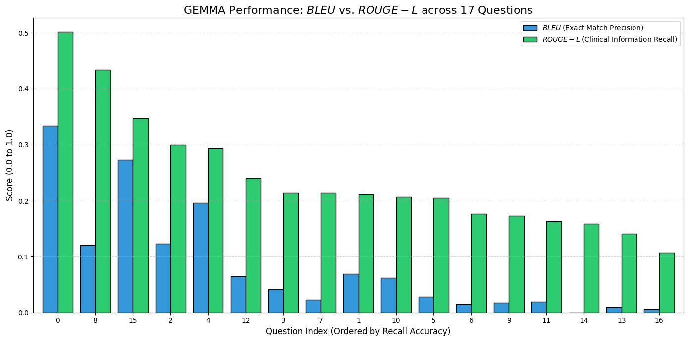
    


```python
#loading GEMMA human evaluation ratings

file_name = '/content/drive/My Drive/NLP RAG Project/GEMMA_Evaluation_Results_Relevance.xlsx'

df_human_eval = pd.read_excel(file_name)
df_results = df_results.merge(
    df_human_eval[['Question', 'Reference Relevance GEMMA', 'Clinical Accuracy GEMMA']],
    on='Question',
    how='left'
)

display(df_results.head())
```


  <div id="df-e3cf36f0-7ff2-4e81-8314-eefcb53071aa" class="colab-df-container">
    <div>
<style scoped>
    .dataframe tbody tr th:only-of-type {
        vertical-align: middle;
    }

    .dataframe tbody tr th {
        vertical-align: top;
    }

    .dataframe thead th {
        text-align: right;
    }
</style>
<table border="1" class="dataframe">
  <thead>
    <tr style="text-align: right;">
      <th></th>
      <th>Question</th>
      <th>GEMMA Answer</th>
      <th>GEMMA Sources</th>
      <th>Retrieved Reference</th>
      <th>BLEU</th>
      <th>ROUGE-L</th>
      <th>Reference Relevance GEMMA</th>
      <th>Clinical Accuracy GEMMA</th>
    </tr>
  </thead>
  <tbody>
    <tr>
      <th>0</th>
      <td>What are the core diagnostic criteria for Majo...</td>
      <td>&lt;end_of_turn&gt;\n&lt;start_of_turn&gt;model\nThe provi...</td>
      <td>**\n\n*  dsm-5-tr.txt</td>
      <td>episode are present but full criteria are not ...</td>
      <td>0.3345</td>
      <td>0.5018</td>
      <td>2</td>
      <td>2</td>
    </tr>
    <tr>
      <th>1</th>
      <td>How does Persistent Depressive Disorder differ...</td>
      <td>&lt;end_of_turn&gt;\n&lt;start_of_turn&gt;model\nPersisten...</td>
      <td>-  "Persistent Depressive Disorder"</td>
      <td>The perceived abnormality or tolerance of chro...</td>
      <td>0.0693</td>
      <td>0.2117</td>
      <td>2</td>
      <td>2</td>
    </tr>
    <tr>
      <th>2</th>
      <td>What key features distinguish Generalized Anxi...</td>
      <td>&lt;end_of_turn&gt;\n&lt;start_of_turn&gt;model\nGeneraliz...</td>
      <td>Fundamentals of Psychological Disorders</td>
      <td>symptoms, with some panic attacks presenting w...</td>
      <td>0.1235</td>
      <td>0.2998</td>
      <td>2</td>
      <td>2</td>
    </tr>
    <tr>
      <th>3</th>
      <td>What are the essential impairments required fo...</td>
      <td>&lt;end_of_turn&gt;\n&lt;start_of_turn&gt;model\nTo be dia...</td>
      <td>-  personality_disorder_criteria.txt</td>
      <td>personality disorder, the following criteria m...</td>
      <td>0.0423</td>
      <td>0.2145</td>
      <td>2</td>
      <td>2</td>
    </tr>
    <tr>
      <th>4</th>
      <td>A patient reports persistent sadness, fatigue,...</td>
      <td>&lt;end_of_turn&gt;\n&lt;start_of_turn&gt;model\nThe most ...</td>
      <td>APA, 2022</td>
      <td>either subjective account or observation by ot...</td>
      <td>0.1964</td>
      <td>0.2933</td>
      <td>2</td>
      <td>2</td>
    </tr>
  </tbody>
</table>
</div>
    <div class="colab-df-buttons">

  <div class="colab-df-container">
    <button class="colab-df-convert" onclick="convertToInteractive('df-e3cf36f0-7ff2-4e81-8314-eefcb53071aa')"
            title="Convert this dataframe to an interactive table."
            style="display:none;">

  <svg xmlns="http://www.w3.org/2000/svg" height="24px" viewBox="0 -960 960 960">
    <path d="M120-120v-720h720v720H120Zm60-500h600v-160H180v160Zm220 220h160v-160H400v160Zm0 220h160v-160H400v160ZM180-400h160v-160H180v160Zm440 0h160v-160H620v160ZM180-180h160v-160H180v160Zm440 0h160v-160H620v160Z"/>
  </svg>
    </button>

  <style>
    .colab-df-container {
      display:flex;
      gap: 12px;
    }

    .colab-df-convert {
      background-color: #E8F0FE;
      border: none;
      border-radius: 50%;
      cursor: pointer;
      display: none;
      fill: #1967D2;
      height: 32px;
      padding: 0 0 0 0;
      width: 32px;
    }

    .colab-df-convert:hover {
      background-color: #E2EBFA;
      box-shadow: 0px 1px 2px rgba(60, 64, 67, 0.3), 0px 1px 3px 1px rgba(60, 64, 67, 0.15);
      fill: #174EA6;
    }

    .colab-df-buttons div {
      margin-bottom: 4px;
    }

    [theme=dark] .colab-df-convert {
      background-color: #3B4455;
      fill: #D2E3FC;
    }

    [theme=dark] .colab-df-convert:hover {
      background-color: #434B5C;
      box-shadow: 0px 1px 3px 1px rgba(0, 0, 0, 0.15);
      filter: drop-shadow(0px 1px 2px rgba(0, 0, 0, 0.3));
      fill: #FFFFFF;
    }
  </style>

    <script>
      const buttonEl =
        document.querySelector('#df-e3cf36f0-7ff2-4e81-8314-eefcb53071aa button.colab-df-convert');
      buttonEl.style.display =
        google.colab.kernel.accessAllowed ? 'block' : 'none';

      async function convertToInteractive(key) {
        const element = document.querySelector('#df-e3cf36f0-7ff2-4e81-8314-eefcb53071aa');
        const dataTable =
          await google.colab.kernel.invokeFunction('convertToInteractive',
                                                    [key], {});
        if (!dataTable) return;

        const docLinkHtml = 'Like what you see? Visit the ' +
          '<a target="_blank" href=https://colab.research.google.com/notebooks/data_table.ipynb>data table notebook</a>'
          + ' to learn more about interactive tables.';
        element.innerHTML = '';
        dataTable['output_type'] = 'display_data';
        await google.colab.output.renderOutput(dataTable, element);
        const docLink = document.createElement('div');
        docLink.innerHTML = docLinkHtml;
        element.appendChild(docLink);
      }
    </script>
  </div>


    </div>
  </div>


```python
print("Mean Reference Relevance =", df_results['Reference Relevance GEMMA'].mean()) #out of 2
print("Mean Clinical Accuracy =", df_results['Clinical Accuracy GEMMA'].mean()) #out of 2
```

    Mean Reference Relevance = 1.588235294117647
    Mean Clinical Accuracy = 1.9411764705882353


```python
print("Mean BLEU GEMMA =", df_results['BLEU'].mean())
print("SD BLEU GEMMA =", df_results['BLEU'].std())

print("Mean ROUGE GEMMA =", df_results['ROUGE-L'].mean())
print("SD ROUGE GEMMA =", df_results['ROUGE-L'].std())
```

    Mean BLEU GEMMA = 0.08275882352941177
    SD BLEU GEMMA = 0.09869109672878
    Mean ROUGE GEMMA = 0.24053529411764707
    SD ROUGE GEMMA = 0.10525454824600497


- better performance than LLaMa in terms of BLEU and GEMMA

### Plot Comparing BLEU and ROUGE across the 3 models

- Mean BLEU GEMMA = 0.08275882352941177
- SD BLEU GEMMA = 0.09869109672878
- Mean ROUGE GEMMA = 0.24053529411764707
- SD ROUGE GEMMA = 0.10525454824600497
- Mean BLEU LLaMa = 0.030094117647058827
- SD BLEU LLaMa = 0.03705403943209558
- Mean ROUGE LLaMa = 0.21198235294117646
- SD ROUGE LLaMa = 0.0790629751787627
- Mean BLEU Mistral = 0.08500588235294117
- SD BLEU Mistral = 0.10582000325191497
- Mean ROUGE Mistral = 0.24438823529411766
- SD ROUGE Mistral = 0.12654491733349538


```python
#manually because i don't want to reload all data
import matplotlib.pyplot as plt
import numpy as np

models = ['LLaMa', 'GEMMA', 'Mistral']
metrics = ['BLEU', 'ROUGE']

means_bleu = [0.0301, 0.0828, 0.0850]
means_rouge = [0.2120, 0.2405, 0.2444]
stds_bleu = [0.0371, 0.0987, 0.1058]
stds_rouge = [0.0791, 0.1053, 0.1265]

x = np.arange(len(metrics))
width = 0.25

fig, ax = plt.subplots(figsize=(10, 6))

colors = ['#e74c3c', '#f1c40f', '#3498db'] #Red (LLaMa), Gold (GEMMA), Blue (Mistral)

for i, model in enumerate(models):
    pos = x + (i - 1) * width
    m_vals = [means_bleu[i], means_rouge[i]]
    s_vals = [stds_bleu[i], stds_rouge[i]]

    ax.bar(pos, m_vals, width, yerr=s_vals, label=model,
           color=colors[i], capsize=7, edgecolor='black', alpha=0.9)

ax.set_ylabel('Score Value ($0.0$ - $1.0$)', fontsize=12)
ax.set_title('Comparative Analysis of Model Performance: $BLEU$ vs. $ROUGE$\n(Means $\pm$ Standard Deviation)', fontsize=14)
ax.set_xticks(x)
ax.set_xticklabels(['$BLEU$', '$ROUGE$'], fontsize=12)
ax.legend(title='Models', fontsize=10)

plt.grid(axis='y', linestyle='--', alpha=0.6)
plt.ylim(0, 0.5)
plt.tight_layout()

plt.savefig('comparative_metrics_plot.png')

```

    <>:29: SyntaxWarning: invalid escape sequence '\p'
    <>:29: SyntaxWarning: invalid escape sequence '\p'
    /tmp/ipykernel_9172/1501071673.py:29: SyntaxWarning: invalid escape sequence '\p'
      ax.set_title('Comparative Analysis of Model Performance: $BLEU$ vs. $ROUGE$\n(Means $\pm$ Standard Deviation)', fontsize=14)


    
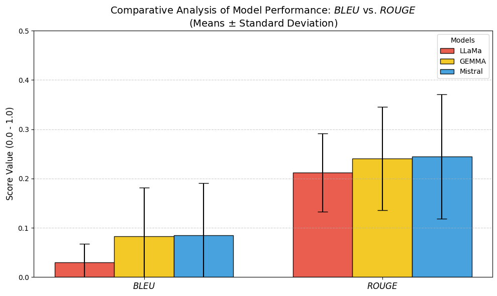
    


- ROUGE being consistently higher suggests that all models are re-weording a lot (not really many exact n matches), but the clinical meaning is being captured decently.


```python
import pandas as pd
from scipy import stats
import statsmodels.api as sm
from statsmodels.formula.api import ols

df_gemma = pd.read_csv('/content/drive/My Drive/NLP RAG Project/GEMMA_Evaluation_Results.csv')
df_llama = pd.read_csv('/content/drive/My Drive/NLP RAG Project/LLAMA_Evaluation_Results.csv')
df_mistral = pd.read_csv('/content/drive/My Drive/NLP RAG Project/Mistral_Evaluation_Results.csv')

df_gemma = df_gemma[['Question', 'BLEU', 'ROUGE-L']].rename(
    columns={'BLEU': 'BLEU_GEMMA', 'ROUGE-L': 'ROUGE_GEMMA'}
)
df_llama = df_llama[['Question', 'BLEU', 'ROUGE-L']].rename(
    columns={'BLEU': 'BLEU_LLAMA', 'ROUGE-L': 'ROUGE_LLAMA'}
)
df_mistral = df_mistral[['Question', 'BLEU', 'ROUGE-L']].rename(
    columns={'BLEU': 'BLEU_Mistral', 'ROUGE-L': 'ROUGE_Mistral'}
)


df_merged = df_llama.merge(df_gemma, on='Question').merge(df_mistral, on='Question')

df_merged.to_csv('All_Models_Merged_Results.csv', index=False)

#One way ANOVA to see if there is any statistical signifiance in difference
f_stat, p_val = stats.f_oneway(
    df_merged['BLEU_LLAMA'],
    df_merged['BLEU_GEMMA'],
    df_merged['BLEU_Mistral']
)

print(f"ANOVA Results for BLEU:")
print(f"F-statistic: {f_stat:.4f}")
print(f"p-value: {p_val:.4f}")

```

    ANOVA Results for BLEU:
    F-statistic: 1.5668
    p-value: 0.2192


- indicates no statistical signifiacne (expected)


```python
from scipy import stats
import pandas as pd
import seaborn as sns
import matplotlib.pyplot as plt

#paired ttest for llama to see if Rouge sig > Bleu
t_stat, p_val = stats.ttest_rel(df_llama['ROUGE_LLAMA'], df_llama['BLEU_LLAMA'])

print(f"Paired T-test for LLaMa (ROUGE vs BLEU):")
print(f"T-statistic: {t_stat:.4f}")
print(f"p-value: {p_val:.8e}")

plt.figure(figsize=(6, 6))
sns.boxplot(data=df_llama[['BLEU_LLAMA', 'ROUGE_LLAMA']], palette="Set2")
plt.title("LLaMa: Distribution of $BLEU$ vs. $ROUGE$ Scores", fontsize=14)
plt.ylabel("Score (0.0 - 1.0)")
plt.show()
```

    Paired T-test for LLaMa (ROUGE vs BLEU):
    T-statistic: 17.4442
    p-value: 7.78876582e-12


    
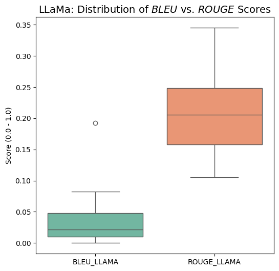
    


```python
#paired ttest for mistral to see if Rouge sig > Bleu
t_stat, p_val = stats.ttest_rel(df_mistral['ROUGE_Mistral'], df_mistral['BLEU_Mistral'])

print(f"Paired T-test for Mistral (ROUGE vs BLEU):")
print(f"T-statistic: {t_stat:.4f}")
print(f"p-value: {p_val:.8e}")

plt.figure(figsize=(6, 6))
sns.boxplot(data=df_mistral[['BLEU_Mistral', 'ROUGE_Mistral']], palette="Set2")
plt.title("Mistral: Distribution of $BLEU$ vs. $ROUGE$ Scores", fontsize=14)
plt.ylabel("Score (0.0 - 1.0)")
plt.show()
```

    Paired T-test for Mistral (ROUGE vs BLEU):
    T-statistic: 8.9708
    p-value: 1.21745697e-07


    
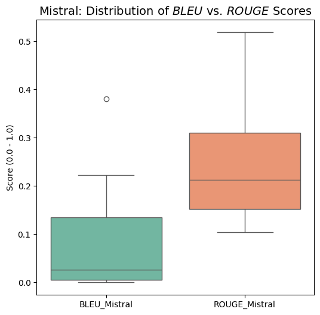
    


```python
#paired ttest for mistral to see if Rouge sig > Bleu
t_stat, p_val = stats.ttest_rel(df_gemma['ROUGE_GEMMA'], df_gemma['BLEU_GEMMA'])

print(f"Paired T-test for GEMMA (ROUGE vs BLEU):")
print(f"T-statistic: {t_stat:.4f}")
print(f"p-value: {p_val:.8e}")

plt.figure(figsize=(6, 6))
sns.boxplot(data=df_gemma[['BLEU_GEMMA', 'ROUGE_GEMMA']], palette="Set2")
plt.title("GEMMA: Distribution of $BLEU$ vs. $ROUGE$ Scores", fontsize=14)
plt.ylabel("Score (0.0 - 1.0)")
plt.show()
```

    Paired T-test for GEMMA (ROUGE vs BLEU):
    T-statistic: 12.7320
    p-value: 8.68483291e-10


    
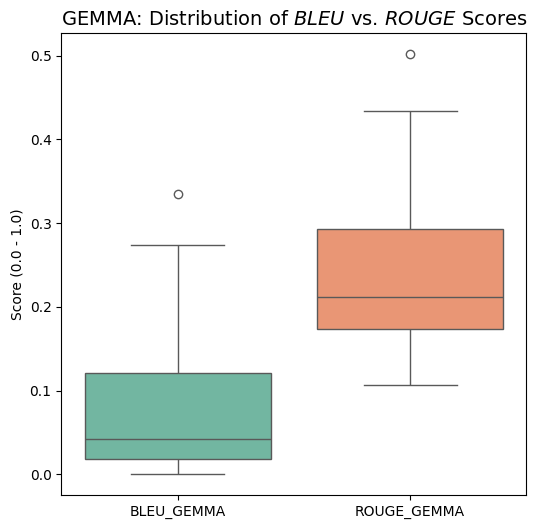
    


- for all three models (Mistral, LLAMA, GEMMA), Rouge was significantly greater than Bleu.
- this means that all models are successfully recalling the correct symptoms and clinical features (with ROUGE 0.2-0.25)
- but they are not just regurgitating eveyrhint back in the same format - particularly LLaMa (with BLUE 0.05-0.1).

### Outliers
- questions 0, 4 and 15 show high BLEU for gemma, llama and mistral respectively
- GEMMA Question 0 - What are the core diagnostic criteria for Major Depressive Disorder, and how many symptoms are required for a formal diagnosis?'
- LLAMA Question 4 - What are the essential impairments required for diagnosing a personality disorder?
- Mistral Question 15 - What challenges arise in accurately diagnosing psychiatric disorders, and how can clinicians address these challenges?


```python
display(questions)
```


    ['What are the core diagnostic criteria for Major Depressive Disorder, and how many symptoms are required for a formal diagnosis?',
     'How does Persistent Depressive Disorder differ from Major Depressive Disorder in terms of symptom duration and severity?',
     'What key features distinguish Generalized Anxiety Disorder from Panic Disorder?',
     'What are the essential impairments required for diagnosing a personality disorder?',
     'A patient reports persistent sadness, fatigue, and sleep disturbances lasting over two years. What is the most likely diagnosis, and what criteria support this conclusion?',
     'How can clinicians differentiate between depressive episodes in bipolar disorder and those in unipolar depression?',
     'A patient demonstrates impulsivity, lack of empathy, and manipulative behavior. What diagnosis should be considered, and what characteristics support it?',
     'What are the most effective psychological treatments for depression across different age groups?',
     'How do psychotherapy and pharmacological treatments compare in effectiveness for treating depressive disorders?',
     'What treatment strategies are recommended for managing depression in low-resource or non-specialized healthcare settings?',
     'How should treatment plans be individualized based on patient-specific factors such as culture, comorbidities, and personal preferences?',
     'How do diagnostic frameworks and treatment guidelines work together in clinical decision-making for psychiatric disorders?',
     'What are the limitations of symptom-based diagnostic approaches in psychiatry?',
     'How does comorbidity affect the accuracy of diagnosis and the effectiveness of treatment planning?',
     'Given a patient presenting with overlapping symptoms of anxiety and depression, how should a clinician determine the primary diagnosis and appropriate treatment approach?',
     'What challenges arise in accurately diagnosing psychiatric disorders, and how can clinicians address these challenges?',
     'How can AI-based systems assist in improving access to psychiatric diagnosis and treatment recommendations?']


# Mistral Model Deployment - ask any psychiatric question!


```python


template = """Use the following pieces of context to answer the question at the end.
For each piece of context, the source filename is provided.
When you answer, try to mention which document the information came from.
At the very end of your answer, provide a section labeled 'SOURCES USED:' and list the filenames.

Context:
{context}

Question: {question}

Helpful Answer:"""

QA_CHAIN_PROMPT = PromptTemplate(
    input_variables=["context", "question"],
    template=template,
)

#huggingface pipeline
pipe = pipeline(
    "text-generation",
    model=model,
    tokenizer=tokenizer,
    max_new_tokens=512,
    temperature=0.1,
    do_sample=True,
    pad_token_id=tokenizer.eos_token_id,
)

llm = HuggingFacePipeline(pipeline=pipe)

#RAG chain
qa_chain = RetrievalQA.from_chain_type(
    llm=llm,
    chain_type="stuff",
    retriever=vector_db.as_retriever(search_kwargs={"k": 3}),
    return_source_documents=True,
    chain_type_kwargs={"prompt": QA_CHAIN_PROMPT}
)

def ask_mistral(question):
    """
    Takes a question string, queries the Mistral RAG chain,
    and prints the formatted clinical answer and sources.
    """
    if 'qa_chain' not in globals():
        return "Error: qa_chain not found. Please re-run your the initialization cells above."

    print(f"Querying Psychiatric Documents for: '{question}'...\n")

    response = qa_chain.invoke(question)

    full_text = response["result"]

    print("-" * 30)
    print(full_text)
    print("-" * 30)

    return response


```

    Passing `generation_config` together with generation-related arguments=({'do_sample', 'pad_token_id', 'max_new_tokens', 'temperature'}) is deprecated and will be removed in future versions. Please pass either a `generation_config` object OR all generation parameters explicitly, but not both.


```python
user_query = "A patient has some symptoms of a manic episode (impulsivity, recklessness, lack of sleep, hyperactivity). It started after taking cannabis to cope with losing their job, and has lasted for about three days. They have never had a history of psychiatric disease before. How should this be diagnosed?"
result = ask_mistral(user_query)
```

    Querying Psychiatric Documents for: 'A patient has some symptoms of a manic episode (impulsivity, recklessness, lack of sleep, hyperactivity). It started after taking cannabis to cope with losing their job, and has lasted for about three days. They have never had a history of psychiatric disease before. How should this be diagnosed?'...
    


    Both `max_new_tokens` (=512) and `max_length`(=20) seem to have been set. `max_new_tokens` will take precedence. Please refer to the documentation for more information. (https://huggingface.co/docs/transformers/main/en/main_classes/text_generation)


    ------------------------------
    Use the following pieces of context to answer the question at the end.
    For each piece of context, the source filename is provided.
    When you answer, try to mention which document the information came from.
    At the very end of your answer, provide a section labeled 'SOURCES USED:' and list the filenames.
    
    Context:
    151
    5. Distractibility (i.e., attention too easily drawn to unimportant or irrelevant
    external stimuli), as reported or observed.
    6. Increase in goal-directed activity (either socially, at work or school, or
    sexually) or psychomotor agitation.
    7. Excessive involvement in activities that have a high potential for painful
    consequences (e.g., engaging in unrestrained buying sprees, sexual
    indiscretions, or foolish business investments).
    C. The episode is associated with an unequivocal change in functioning that is
    uncharacteristic of the individual when not symptomatic.
    D. The disturbance in mood and the change in functioning are observable by
    others.
    E. The episode is not severe enough to cause marked impairment in social or
    occupational functioning or to necessitate hospitalization. If there are psychotic
    features, the episode is, by definition, manic.
    F. The episode is not attributable to the physiological effects of a substance (e.g., a
    
    1. Poor appetite or overeating.
    2. Insomnia or hypersomnia.
    3. Low energy or fatigue.
    4. Low self-esteem.
    5. Poor concentration or difficulty making decisions.
    6. Feelings of hopelessness.
    C. During the 2-year period (1 year for children or adolescents) of the disturbance,
    the individual has never been without the symptoms in Criteria A and B for more
    than 2 months at a time.
    D. Criteria for a major depressive disorder may be continuously present for 2 years.
    E. There has never been a manic episode or a hypomanic episode.
    F. The disturbance is not better explained by a persistent schizoaffective disorder,
    schizophrenia, 
    delusional 
    disorder, 
    or 
    other 
    specified 
    or 
    unspecified
    schizophrenia spectrum and other psychotic disorder.
    G. The symptoms are not attributable to the physiological effects of a substance
    (e.g., a drug of abuse, a medication) or another medical condition (e.g.,
    hypothyroidism).
    H. The symptoms cause clinically significant distress or impairment in social,
    
    during withdrawal). For example, in the case of irritable symptoms occurring during intoxication
    in a man with a severe cocaine use disorder, the diagnosis is F14.24 severe cocaine use disorder
    with cocaine-induced bipolar and related disorder, with onset during intoxication. A separate
    diagnosis of the comorbid severe cocaine use disorder is not given. If the substance-induced
    bipolar and related disorder occurs without a comorbid substance use disorder (e.g., after a one-
    time heavy use of the substance), no accompanying substance use disorder is noted (e.g., F15.94
    amphetamine-induced bipolar and related disorder, with onset during intoxication). When more
    than one substance is judged to play a significant role in the development of bipolar mood
    symptoms, each should be listed separately (e.g., F15.24 severe methylphenidate use disorder
    with methylphenidate-induced bipolar and related disorder, with onset during intoxication;
    
    Question: A patient has some symptoms of a manic episode (impulsivity, recklessness, lack of sleep, hyperactivity). It started after taking cannabis to cope with losing their job, and has lasted for about three days. They have never had a history of psychiatric disease before. How should this be diagnosed?
    
    Helpful Answer:
    
    The patient's symptoms are consistent with a manic episode. However, since these symptoms are directly related to the use of cannabis, this is a substance-induced bipolar and related disorder. In this case, the diagnosis would be F15.94 cannabis-induced bipolar and related disorder, with onset during intoxication. Since the patient has no history of psychiatric disease before, no additional diagnoses related to a persistent psychiatric disorder are necessary.
    
    SOURCES USED:
    1. ICD-10-CM Diagnostic Criteria for Research: Mental and Behavioral Disorders.pdf
    2. ICD-10-CM Diagnostic Criteria for Research: Substance-Related and Addictive Disorders.pdf
    ------------------------------


```python
user_query = "How many days of treatment should a patient with major depression undergo?"
result = ask_mistral(user_query)
```

    Querying Psychiatric Documents for: 'How many days of treatment should a patient with major depression undergo?'...
    


    Both `max_new_tokens` (=512) and `max_length`(=20) seem to have been set. `max_new_tokens` will take precedence. Please refer to the documentation for more information. (https://huggingface.co/docs/transformers/main/en/main_classes/text_generation)


    ------------------------------
    Use the following pieces of context to answer the question at the end.
    For each piece of context, the source filename is provided.
    When you answer, try to mention which document the information came from.
    At the very end of your answer, provide a section labeled 'SOURCES USED:' and list the filenames.
    
    Context:
    differ from typical usual care depending on the setting or place that 
    a treatment is provided. Patients seeking a particular treatment may 
    wish to ask questions, not only about a given treatment, but the 
    extent to which those providing the treatment have been well trained. 
    Within this context, prospective patients seeking treatment for 
    depression should ask related questions to be assured that the treat­
    ment they believe they will be receiving will be provided in a quality 
    fashion. This care would ideally be provided by a qualified mental 
    health specialist though the panel acknowledges that accessibility to 
    these specialists can be a barrier to treatment. Similarly, behavioral 
    health professionals seeking to provide those treatments recom­
    mended in these guidelines need to receive adequate training and 
    experience in the specific treatment approaches prior to offering 
    such services.
    Ability to generalize from a given setting—provider perspective.
    
    the process. Why is that?
    Consider this. First, we need to determine if a treatment is even needed. By having a clear accounting
    of the person’s symptoms and how they affect daily functioning, we can decide to what extent the
    individual is adversely affected. Assuming a treatment is needed, our second reason to engage in
    clinical assessment will be to determine what treatment will work best. As you will see later in this
    module, there are numerous approaches to treatment.  These include Behavior Therapy, Cognitive and
    Cognitive-Behavioral Therapy (CBT), Humanistic-Experiential Therapies, Psychodynamic Therapies,
    Couples and Family Therapy, and biological treatments (psychopharmacology). Of course, for any
    mental disorder, some of the aforementioned therapies will have greater efficacy than others. Even if
    several can work well, it does not mean a particular therapy will work well for that specific client.
    
    12 APA | Guideline for the Treatment of Depression
    PARTIAL or NONRESPONDERS to INITIAL ANTIDEPRESSANT TREATMENT
    For adult patients with depression who have either not responded or 
    only partially responded to initial antidepressant medication treatment 
    the panel recommends the following options:
    1.	 Switch from antidepressant medication alone to cognitive therapy 
    alone or,
    2.	 Switch from antidepressant medication alone to another antidepres­
    sant medication
    Recommendation for use
    Based on the literature reviewed 
    that met the IOM or AMSTAR 
    requirements, the panel equally 
    recommends the listed interventions, 
    there is evidence demonstrating no 
    difference in effect. 
    For adult patients with depression who have either not responded or 
    only partially responded to initial antidepressant medication treatment 
    the panel suggests that clinicians offer one of the following psychother­
    apies/interventions and select between treatments as follows:
    
    Question: How many days of treatment should a patient with major depression undergo?
    
    Helpful Answer: The text does not provide a specific number of days for treatment for a patient with major depression. However, it does suggest that for patients who have not responded or only partially responded to initial antidepressant medication treatment, the panel recommends switching to cognitive therapy alone or another antidepressant medication, or offering one of several psychotherapies/interventions. The choice between treatments should be based on the clinician's assessment of the patient's needs and the available evidence.
    
    SOURCES USED:
    1. APA_Guideline_for_the_Treatment_of_Depression.txt
    2. Ability_to_generalize_from_a_given_setting_provider_perspective.txt
    ------------------------------


```python
def retrieval_precision_recall(qa_chain, questions, ground_truth_chunk_ids, k=3):
    results = []
    for query, relevant_ids in zip(questions, ground_truth_chunk_ids):
        result = qa_chain.invoke(query)
        retrieved_ids = [doc.metadata.get('chunk_id') for doc in result["source_documents"]]

        relevant_retrieved = set(retrieved_ids) & set(relevant_ids)
        precision = len(relevant_retrieved) / len(retrieved_ids) if retrieved_ids else 0
        recall    = len(relevant_retrieved) / len(relevant_ids)  if relevant_ids  else 0

        results.append({"question": query, "precision": precision, "recall": recall})
    return pd.DataFrame(results)
```


```python

```


```python
first_five = chunks[40:55]
print(first_five)
```

    [Document(metadata={'producer': 'calibre 3.48.0 [https://calibre-ebook.com]', 'creator': 'calibre 3.48.0 [https://calibre-ebook.com]', 'creationdate': '2022-03-21T21:09:15+00:00', 'source': '/s/sources/DSM 5 TR.pdf', 'file_path': '/s/sources/DSM 5 TR.pdf', 'total_pages': 1377, 'format': 'PDF 1.4', 'title': 'Diagnostic and Statistical Manual of Mental Disorders : Fifth Edition Text Revision DSM-5-TR™', 'author': 'Unknown', 'subject': '', 'keywords': 'Subjects: MESH: Diagnostic and statistical manual of mental disorders. 5th ed | Mental \u2003Disorders—classification | Mental Disorders—diagnosis', 'moddate': '', 'trapped': '', 'modDate': '', 'creationDate': "D:20220321210915+00'00'", 'page': 34}, page_content='determining a clinical diagnosis.”). “DSM-5” refers to the entire set of currently approved\ncriteria sets, disorders, other conditions, and content officially published in May 2013. “DSM-5-\nTR” refers to approved text in this current volume. Although the scope of the text revision did\nnot include conceptual changes to the criteria sets or to other DSM-5 constructs, the need to\nmake changes in certain diagnostic criteria sets for the purpose of clarification became apparent\nin conjunction with the text updates made across the book. Because the conceptual construct of\ncriteria is unchanged, the criteria sets in DSM-5-TR that had their origins in DSM-5 are still\nreferred to as “DSM-5-criteria.” The new diagnostic entity prolonged grief disorder is referred to'), Document(metadata={'producer': 'calibre 3.48.0 [https://calibre-ebook.com]', 'creator': 'calibre 3.48.0 [https://calibre-ebook.com]', 'creationdate': '2022-03-21T21:09:15+00:00', 'source': '/s/sources/DSM 5 TR.pdf', 'file_path': '/s/sources/DSM 5 TR.pdf', 'total_pages': 1377, 'format': 'PDF 1.4', 'title': 'Diagnostic and Statistical Manual of Mental Disorders : Fifth Edition Text Revision DSM-5-TR™', 'author': 'Unknown', 'subject': '', 'keywords': 'Subjects: MESH: Diagnostic and statistical manual of mental disorders. 5th ed | Mental \u2003Disorders—classification | Mental Disorders—diagnosis', 'moddate': '', 'trapped': '', 'modDate': '', 'creationDate': "D:20220321210915+00'00'", 'page': 35}, page_content='as a DSM-5-TR disorder, because of its addition in this volume.\nThe development of DSM-5-TR was a tremendous team effort. We are especially indebted to\nthe tireless efforts of Wilson M. Compton, M.D., M.P.E., and Daniel S. Pine, M.D., as DSM-5\nText Revision Subcommittee Vice Chairs, as well as the more than 200 experts from across our\nfield who did the lion’s share of the work in the preparation of the text revision. We would also\nlike to thank Paul Appelbaum, M.D., Chair of the DSM Steering\nxxii\nCommittee, along with the entire DSM Steering Committee, for their careful review of the\ntext and criteria clarifications, and for making other helpful suggestions. Special gratitude goes to\nAnn M. Eng, DSM Managing Editor, for her timely shepherding of the DSM-5-TR development\nprocess from planning to completion and for her meticulous attention to detail, all critical to the\nsuccess of this revision. We are grateful for the valuable contributions and help of Nitin Gogtay,'), Document(metadata={'producer': 'calibre 3.48.0 [https://calibre-ebook.com]', 'creator': 'calibre 3.48.0 [https://calibre-ebook.com]', 'creationdate': '2022-03-21T21:09:15+00:00', 'source': '/s/sources/DSM 5 TR.pdf', 'file_path': '/s/sources/DSM 5 TR.pdf', 'total_pages': 1377, 'format': 'PDF 1.4', 'title': 'Diagnostic and Statistical Manual of Mental Disorders : Fifth Edition Text Revision DSM-5-TR™', 'author': 'Unknown', 'subject': '', 'keywords': 'Subjects: MESH: Diagnostic and statistical manual of mental disorders. 5th ed | Mental \u2003Disorders—classification | Mental Disorders—diagnosis', 'moddate': '', 'trapped': '', 'modDate': '', 'creationDate': "D:20220321210915+00'00'", 'page': 35}, page_content='success of this revision. We are grateful for the valuable contributions and help of Nitin Gogtay,\nM.D., Chief of the American Psychiatric Association Division of Research and Deputy Medical\nDirector; Diana E. Clarke, Ph.D., Managing Director of Research and Senior Research\nStatistician/Epidemiologist; and Lamyaa H. Yousif, M.D., Ph.D., M.Sc., Senior DSM Operations\nManager and Research Associate. We are thankful for the leadership of John McDuffie,\nPublisher, American Psychiatric Association Publishing, and the work of the following editorial\nand production staff at American Psychiatric Association Publishing in bringing this important\nwork to fruition: Greg Kuny, Managing Editor, Books; Tammy Cordova, Graphic Design\nManager; Andrew Wilson, Director of Production; Judy Castagna, Assistant Director of\nProduction Services; Erika Parker, Acquisitions Editor; Alisa Riccardi, Senior Editor, Books;'), Document(metadata={'producer': 'calibre 3.48.0 [https://calibre-ebook.com]', 'creator': 'calibre 3.48.0 [https://calibre-ebook.com]', 'creationdate': '2022-03-21T21:09:15+00:00', 'source': '/s/sources/DSM 5 TR.pdf', 'file_path': '/s/sources/DSM 5 TR.pdf', 'total_pages': 1377, 'format': 'PDF 1.4', 'title': 'Diagnostic and Statistical Manual of Mental Disorders : Fifth Edition Text Revision DSM-5-TR™', 'author': 'Unknown', 'subject': '', 'keywords': 'Subjects: MESH: Diagnostic and statistical manual of mental disorders. 5th ed | Mental \u2003Disorders—classification | Mental Disorders—diagnosis', 'moddate': '', 'trapped': '', 'modDate': '', 'creationDate': "D:20220321210915+00'00'", 'page': 35}, page_content='Production Services; Erika Parker, Acquisitions Editor; Alisa Riccardi, Senior Editor, Books;\nand Carrie Y. Farnham, Senior Editor, Books. Finally, we also recognize with appreciation Saul\nLevin, M.D., M.P.A., CEO and Medical Director of the American Psychiatric Association, for\nhis advocacy and support of this comprehensive text revision.\nMichael B. First, M.D.\nRevision Subcommittee Co-Chair and DSM-5-TR Editor\nPhilip Wang, M.D., Dr.P.H.\nRevision Subcommittee Co-Chair\nNovember 5, 2021'), Document(metadata={'producer': 'calibre 3.48.0 [https://calibre-ebook.com]', 'creator': 'calibre 3.48.0 [https://calibre-ebook.com]', 'creationdate': '2022-03-21T21:09:15+00:00', 'source': '/s/sources/DSM 5 TR.pdf', 'file_path': '/s/sources/DSM 5 TR.pdf', 'total_pages': 1377, 'format': 'PDF 1.4', 'title': 'Diagnostic and Statistical Manual of Mental Disorders : Fifth Edition Text Revision DSM-5-TR™', 'author': 'Unknown', 'subject': '', 'keywords': 'Subjects: MESH: Diagnostic and statistical manual of mental disorders. 5th ed | Mental \u2003Disorders—classification | Mental Disorders—diagnosis', 'moddate': '', 'trapped': '', 'modDate': '', 'creationDate': "D:20220321210915+00'00'", 'page': 36}, page_content='xxiii\nPreface to DSM-5\nThe American Psychiatric Association’s Diagnostic and Statistical Manual of\nMental Disorders (DSM) is a classification of mental disorders with associated criteria designed\nto facilitate more reliable diagnoses of these disorders. With successive editions over the past 60\nyears, it has become a standard reference for clinical practice in the mental health field. Since a\ncomplete description of the underlying pathological processes is not possible for most mental\ndisorders, it is important to emphasize that the current diagnostic criteria are the best available\ndescription of how mental disorders are expressed and can be recognized by trained clinicians.\nDSM is intended to serve as a practical, functional, and flexible guide for organizing information\nthat can aid in the accurate diagnosis and treatment of mental disorders. It is a tool for clinicians,\nan essential educational resource for students and practitioners, and a reference for researchers in\nthe field.'), Document(metadata={'producer': 'calibre 3.48.0 [https://calibre-ebook.com]', 'creator': 'calibre 3.48.0 [https://calibre-ebook.com]', 'creationdate': '2022-03-21T21:09:15+00:00', 'source': '/s/sources/DSM 5 TR.pdf', 'file_path': '/s/sources/DSM 5 TR.pdf', 'total_pages': 1377, 'format': 'PDF 1.4', 'title': 'Diagnostic and Statistical Manual of Mental Disorders : Fifth Edition Text Revision DSM-5-TR™', 'author': 'Unknown', 'subject': '', 'keywords': 'Subjects: MESH: Diagnostic and statistical manual of mental disorders. 5th ed | Mental \u2003Disorders—classification | Mental Disorders—diagnosis', 'moddate': '', 'trapped': '', 'modDate': '', 'creationDate': "D:20220321210915+00'00'", 'page': 36}, page_content='the field.\nAlthough this edition of DSM was designed first and foremost to be a useful guide to clinical\npractice, as an official nomenclature it must be applicable in a wide diversity of contexts. DSM\nhas been used by clinicians and researchers from different orientations (biological,\npsychodynamic, cognitive, behavioral, interpersonal, family/systems), all of whom strive for a\ncommon language to communicate the essential characteristics of mental disorders presented by\ntheir patients. The information is of value to all professionals associated with various aspects of\nmental health care, including psychiatrists, other physicians, psychologists, social workers,\nnurses, counselors, forensic and legal specialists, occupational and rehabilitation therapists, and\nother health professionals. The criteria are concise and explicit and intended to facilitate an\nobjective assessment of symptom presentations in a variety of clinical settings—inpatient,'), Document(metadata={'producer': 'calibre 3.48.0 [https://calibre-ebook.com]', 'creator': 'calibre 3.48.0 [https://calibre-ebook.com]', 'creationdate': '2022-03-21T21:09:15+00:00', 'source': '/s/sources/DSM 5 TR.pdf', 'file_path': '/s/sources/DSM 5 TR.pdf', 'total_pages': 1377, 'format': 'PDF 1.4', 'title': 'Diagnostic and Statistical Manual of Mental Disorders : Fifth Edition Text Revision DSM-5-TR™', 'author': 'Unknown', 'subject': '', 'keywords': 'Subjects: MESH: Diagnostic and statistical manual of mental disorders. 5th ed | Mental \u2003Disorders—classification | Mental Disorders—diagnosis', 'moddate': '', 'trapped': '', 'modDate': '', 'creationDate': "D:20220321210915+00'00'", 'page': 36}, page_content='objective assessment of symptom presentations in a variety of clinical settings—inpatient,\noutpatient, partial hospital, consultation-liaison, clinical, private practice, and primary care—as\nwell in general community epidemiological studies of mental disorders. DSM-5 is also a tool for\ncollecting and communicating accurate public health statistics on mental disorder morbidity and\nmortality rates. Finally, the criteria and corresponding text serve as a textbook for students early\nin their profession who need a structured way to understand and diagnose mental disorders as\nwell as for seasoned professionals encountering rare disorders for the first time. Fortunately, all\nof these uses are mutually compatible.\nThese diverse needs and interests were taken into consideration in planning DSM-5. The\nclassification of disorders is harmonized with the World Health Organization’s International\nClassification of Diseases (ICD), the official coding system used in the United States, so that the'), Document(metadata={'producer': 'calibre 3.48.0 [https://calibre-ebook.com]', 'creator': 'calibre 3.48.0 [https://calibre-ebook.com]', 'creationdate': '2022-03-21T21:09:15+00:00', 'source': '/s/sources/DSM 5 TR.pdf', 'file_path': '/s/sources/DSM 5 TR.pdf', 'total_pages': 1377, 'format': 'PDF 1.4', 'title': 'Diagnostic and Statistical Manual of Mental Disorders : Fifth Edition Text Revision DSM-5-TR™', 'author': 'Unknown', 'subject': '', 'keywords': 'Subjects: MESH: Diagnostic and statistical manual of mental disorders. 5th ed | Mental \u2003Disorders—classification | Mental Disorders—diagnosis', 'moddate': '', 'trapped': '', 'modDate': '', 'creationDate': "D:20220321210915+00'00'", 'page': 36}, page_content='Classification of Diseases (ICD), the official coding system used in the United States, so that the\nDSM criteria define disorders identified by ICD diagnostic names and code numbers. In DSM-5,\nboth ICD-9-CM and ICD-10-CM codes (the latter scheduled for adoption in October 2015) are\nattached to the relevant disorders in the classification.\nAlthough DSM-5 remains a categorical classification of separate disorders, we recognize that\nmental disorders do not always fit completely within the boundaries of a single disorder. Some\nsymptom domains, such as depression and anxiety, involve multiple diagnostic categories and'), Document(metadata={'producer': 'calibre 3.48.0 [https://calibre-ebook.com]', 'creator': 'calibre 3.48.0 [https://calibre-ebook.com]', 'creationdate': '2022-03-21T21:09:15+00:00', 'source': '/s/sources/DSM 5 TR.pdf', 'file_path': '/s/sources/DSM 5 TR.pdf', 'total_pages': 1377, 'format': 'PDF 1.4', 'title': 'Diagnostic and Statistical Manual of Mental Disorders : Fifth Edition Text Revision DSM-5-TR™', 'author': 'Unknown', 'subject': '', 'keywords': 'Subjects: MESH: Diagnostic and statistical manual of mental disorders. 5th ed | Mental \u2003Disorders—classification | Mental Disorders—diagnosis', 'moddate': '', 'trapped': '', 'modDate': '', 'creationDate': "D:20220321210915+00'00'", 'page': 37}, page_content='may reflect common underlying vulnerabilities for a larger group of disorders. In recognition of\nthis reality, the disorders included in DSM-5 were reordered into a revised organizational\nstructure meant to stimulate new clinical perspectives. This new structure corresponds with the\norganizational arrangement of disorders planned for ICD-11 scheduled for release in 2015. Other\nenhancements have been introduced to promote ease of use across all settings:\nxxiv\nRepresentation of developmental issues related to diagnosis. The change in chapter organization better reflects a lifespan\napproach, with disorders more frequently diagnosed in childhood (e.g., neurodevelopmental disorders) at the beginning of\nthe manual and disorders more applicable to older adulthood (e.g., neurocognitive disorders) at the end of the manual. Also,\nwithin the text, subheadings on development and course provide descriptions of how disorder presentations may change'), Document(metadata={'producer': 'calibre 3.48.0 [https://calibre-ebook.com]', 'creator': 'calibre 3.48.0 [https://calibre-ebook.com]', 'creationdate': '2022-03-21T21:09:15+00:00', 'source': '/s/sources/DSM 5 TR.pdf', 'file_path': '/s/sources/DSM 5 TR.pdf', 'total_pages': 1377, 'format': 'PDF 1.4', 'title': 'Diagnostic and Statistical Manual of Mental Disorders : Fifth Edition Text Revision DSM-5-TR™', 'author': 'Unknown', 'subject': '', 'keywords': 'Subjects: MESH: Diagnostic and statistical manual of mental disorders. 5th ed | Mental \u2003Disorders—classification | Mental Disorders—diagnosis', 'moddate': '', 'trapped': '', 'modDate': '', 'creationDate': "D:20220321210915+00'00'", 'page': 37}, page_content='across the lifespan. Age-related factors specific to diagnosis (e.g., symptom presentation and prevalence differences in\ncertain age groups) are also included in the text. For added emphasis, these age-related factors have been added to the\ncriteria themselves where applicable (e.g., in the criteria sets for insomnia disorder and posttraumatic stress disorder, specific\ncriteria describe how symptoms might be expressed in children). Likewise, gender and cultural issues have been integrated\ninto the disorders where applicable.\nIntegration of scientific findings from the latest research in genetics and neuroimaging. The revised chapter structure\nwas informed by recent research in neuroscience and by emerging genetic linkages between diagnostic groups. Genetic and\nphysiological risk factors, prognostic indicators, and some putative diagnostic markers are highlighted in the text. This new'), Document(metadata={'producer': 'calibre 3.48.0 [https://calibre-ebook.com]', 'creator': 'calibre 3.48.0 [https://calibre-ebook.com]', 'creationdate': '2022-03-21T21:09:15+00:00', 'source': '/s/sources/DSM 5 TR.pdf', 'file_path': '/s/sources/DSM 5 TR.pdf', 'total_pages': 1377, 'format': 'PDF 1.4', 'title': 'Diagnostic and Statistical Manual of Mental Disorders : Fifth Edition Text Revision DSM-5-TR™', 'author': 'Unknown', 'subject': '', 'keywords': 'Subjects: MESH: Diagnostic and statistical manual of mental disorders. 5th ed | Mental \u2003Disorders—classification | Mental Disorders—diagnosis', 'moddate': '', 'trapped': '', 'modDate': '', 'creationDate': "D:20220321210915+00'00'", 'page': 37}, page_content='structure should improve clinicians’ ability to identify diagnoses in a disorder spectrum based on common neurocircuitry,\ngenetic vulnerability, and environmental exposures.\nConsolidation of autistic disorder, Asperger’s disorder, and pervasive developmental disorder into autism spectrum\ndisorder. Symptoms of these disorders represent a single continuum of mild to severe impairments in the two domains of\nsocial communication and restrictive repetitive behaviors/interests rather than being distinct disorders. This change is\ndesigned to improve the sensitivity and specificity of the criteria for the diagnosis of autism spectrum disorder and to\nidentify more focused treatment targets for the specific impairments identified.\nStreamlined classification of bipolar and depressive disorders. Bipolar and depressive disorders are the most commonly\ndiagnosed conditions in psychiatry. It was therefore important to streamline the presentation of these disorders to enhance'), Document(metadata={'producer': 'calibre 3.48.0 [https://calibre-ebook.com]', 'creator': 'calibre 3.48.0 [https://calibre-ebook.com]', 'creationdate': '2022-03-21T21:09:15+00:00', 'source': '/s/sources/DSM 5 TR.pdf', 'file_path': '/s/sources/DSM 5 TR.pdf', 'total_pages': 1377, 'format': 'PDF 1.4', 'title': 'Diagnostic and Statistical Manual of Mental Disorders : Fifth Edition Text Revision DSM-5-TR™', 'author': 'Unknown', 'subject': '', 'keywords': 'Subjects: MESH: Diagnostic and statistical manual of mental disorders. 5th ed | Mental \u2003Disorders—classification | Mental Disorders—diagnosis', 'moddate': '', 'trapped': '', 'modDate': '', 'creationDate': "D:20220321210915+00'00'", 'page': 37}, page_content='both clinical and educational use. Rather than separating the definition of manic, hypomanic, and major depressive episodes\nfrom the definition of bipolar I disorder, bipolar II disorder, and major depressive disorder as in the previous edition, we\nincluded all of the component criteria within the respective criteria for each disorder. This approach will facilitate bedside\ndiagnosis and treatment of these important disorders. Likewise, the explanatory notes for differentiating bereavement and\nmajor depressive disorder will provide far greater clinical guidance than was previously provided in the simple bereavement\nexclusion criterion. The new specifiers of anxious distress and mixed features are now fully described in the narrative on\nspecifier variations that accompanies the criteria for these disorders.\nRestructuring of substance use disorders for consistency and clarity. The categories of substance abuse and substance'), Document(metadata={'producer': 'calibre 3.48.0 [https://calibre-ebook.com]', 'creator': 'calibre 3.48.0 [https://calibre-ebook.com]', 'creationdate': '2022-03-21T21:09:15+00:00', 'source': '/s/sources/DSM 5 TR.pdf', 'file_path': '/s/sources/DSM 5 TR.pdf', 'total_pages': 1377, 'format': 'PDF 1.4', 'title': 'Diagnostic and Statistical Manual of Mental Disorders : Fifth Edition Text Revision DSM-5-TR™', 'author': 'Unknown', 'subject': '', 'keywords': 'Subjects: MESH: Diagnostic and statistical manual of mental disorders. 5th ed | Mental \u2003Disorders—classification | Mental Disorders—diagnosis', 'moddate': '', 'trapped': '', 'modDate': '', 'creationDate': "D:20220321210915+00'00'", 'page': 37}, page_content='dependence have been eliminated and replaced with an overarching new category of substance use disorders—with the\nspecific substance used defining the specific disorders. “Dependence” has been easily confused with the term “addiction”\nwhen, in fact, the tolerance and withdrawal that previously defined dependence are actually very normal responses to\nprescribed medications that affect the central nervous system and do not necessarily indicate the presence of an addiction.\nBy revising and clarifying these criteria in DSM-5, we hope to alleviate some of the widespread misunderstanding about\nthese issues.'), Document(metadata={'producer': 'calibre 3.48.0 [https://calibre-ebook.com]', 'creator': 'calibre 3.48.0 [https://calibre-ebook.com]', 'creationdate': '2022-03-21T21:09:15+00:00', 'source': '/s/sources/DSM 5 TR.pdf', 'file_path': '/s/sources/DSM 5 TR.pdf', 'total_pages': 1377, 'format': 'PDF 1.4', 'title': 'Diagnostic and Statistical Manual of Mental Disorders : Fifth Edition Text Revision DSM-5-TR™', 'author': 'Unknown', 'subject': '', 'keywords': 'Subjects: MESH: Diagnostic and statistical manual of mental disorders. 5th ed | Mental \u2003Disorders—classification | Mental Disorders—diagnosis', 'moddate': '', 'trapped': '', 'modDate': '', 'creationDate': "D:20220321210915+00'00'", 'page': 38}, page_content='Enhanced specificity for major and mild neurocognitive disorders. Given the explosion in neuroscience,\nneuropsychology, and brain imaging over the past 20 years, it was critical to convey the current state-of-the-art in the\ndiagnosis of specific types of disorders that were previously referred to as the “dementias” or organic brain diseases.\nBiological markers identified by imaging for vascular and traumatic brain disorders and\nxxv\nspecific molecular genetic findings for rare variants of Alzheimer’s disease and Huntington’s disease have greatly advanced\nclinical diagnoses, and these disorders and others have now been separated into specific subtypes.\nTransition in conceptualizing personality disorders. Although the benefits of a more dimensional approach to personality\ndisorders have been identified in previous editions, the transition from a categorical diagnostic system of individual'), Document(metadata={'producer': 'calibre 3.48.0 [https://calibre-ebook.com]', 'creator': 'calibre 3.48.0 [https://calibre-ebook.com]', 'creationdate': '2022-03-21T21:09:15+00:00', 'source': '/s/sources/DSM 5 TR.pdf', 'file_path': '/s/sources/DSM 5 TR.pdf', 'total_pages': 1377, 'format': 'PDF 1.4', 'title': 'Diagnostic and Statistical Manual of Mental Disorders : Fifth Edition Text Revision DSM-5-TR™', 'author': 'Unknown', 'subject': '', 'keywords': 'Subjects: MESH: Diagnostic and statistical manual of mental disorders. 5th ed | Mental \u2003Disorders—classification | Mental Disorders—diagnosis', 'moddate': '', 'trapped': '', 'modDate': '', 'creationDate': "D:20220321210915+00'00'", 'page': 38}, page_content='disorders to one based on the relative distribution of personality traits has not been widely accepted. In DSM-5, the\ncategorical personality disorders are virtually unchanged from the previous edition. However, an alternative “hybrid” model\nhas been proposed in Section III to guide future research that separates interpersonal functioning assessments and the\nexpression of pathological personality traits for six specific disorders. A more dimensional profile of personality trait\nexpression is also proposed for a trait-specified approach.\nSection III: new disorders and features. A new section (Section III) has been added to highlight disorders that require\nfurther study but are not sufficiently well established to be a part of the official classification of mental disorders for routine\nclinical use. Dimensional measures of symptom severity in 13 symptom domains have also been incorporated to allow for')]


```python
number =0
for doc in first_five:
  page_content = doc.page_content
  # question
  print("Page Starts here--------------",number)
  print(page_content)
  number+=1
```

    Page Starts here-------------- 0
    determining a clinical diagnosis.”). “DSM-5” refers to the entire set of currently approved
    criteria sets, disorders, other conditions, and content officially published in May 2013. “DSM-5-
    TR” refers to approved text in this current volume. Although the scope of the text revision did
    not include conceptual changes to the criteria sets or to other DSM-5 constructs, the need to
    make changes in certain diagnostic criteria sets for the purpose of clarification became apparent
    in conjunction with the text updates made across the book. Because the conceptual construct of
    criteria is unchanged, the criteria sets in DSM-5-TR that had their origins in DSM-5 are still
    referred to as “DSM-5-criteria.” The new diagnostic entity prolonged grief disorder is referred to
    Page Starts here-------------- 1
    as a DSM-5-TR disorder, because of its addition in this volume.
    The development of DSM-5-TR was a tremendous team effort. We are especially indebted to
    the tireless efforts of Wilson M. Compton, M.D., M.P.E., and Daniel S. Pine, M.D., as DSM-5
    Text Revision Subcommittee Vice Chairs, as well as the more than 200 experts from across our
    field who did the lion’s share of the work in the preparation of the text revision. We would also
    like to thank Paul Appelbaum, M.D., Chair of the DSM Steering
    xxii
    Committee, along with the entire DSM Steering Committee, for their careful review of the
    text and criteria clarifications, and for making other helpful suggestions. Special gratitude goes to
    Ann M. Eng, DSM Managing Editor, for her timely shepherding of the DSM-5-TR development
    process from planning to completion and for her meticulous attention to detail, all critical to the
    success of this revision. We are grateful for the valuable contributions and help of Nitin Gogtay,
    Page Starts here-------------- 2
    success of this revision. We are grateful for the valuable contributions and help of Nitin Gogtay,
    M.D., Chief of the American Psychiatric Association Division of Research and Deputy Medical
    Director; Diana E. Clarke, Ph.D., Managing Director of Research and Senior Research
    Statistician/Epidemiologist; and Lamyaa H. Yousif, M.D., Ph.D., M.Sc., Senior DSM Operations
    Manager and Research Associate. We are thankful for the leadership of John McDuffie,
    Publisher, American Psychiatric Association Publishing, and the work of the following editorial
    and production staff at American Psychiatric Association Publishing in bringing this important
    work to fruition: Greg Kuny, Managing Editor, Books; Tammy Cordova, Graphic Design
    Manager; Andrew Wilson, Director of Production; Judy Castagna, Assistant Director of
    Production Services; Erika Parker, Acquisitions Editor; Alisa Riccardi, Senior Editor, Books;
    Page Starts here-------------- 3
    Production Services; Erika Parker, Acquisitions Editor; Alisa Riccardi, Senior Editor, Books;
    and Carrie Y. Farnham, Senior Editor, Books. Finally, we also recognize with appreciation Saul
    Levin, M.D., M.P.A., CEO and Medical Director of the American Psychiatric Association, for
    his advocacy and support of this comprehensive text revision.
    Michael B. First, M.D.
    Revision Subcommittee Co-Chair and DSM-5-TR Editor
    Philip Wang, M.D., Dr.P.H.
    Revision Subcommittee Co-Chair
    November 5, 2021
    Page Starts here-------------- 4
    xxiii
    Preface to DSM-5
    The American Psychiatric Association’s Diagnostic and Statistical Manual of
    Mental Disorders (DSM) is a classification of mental disorders with associated criteria designed
    to facilitate more reliable diagnoses of these disorders. With successive editions over the past 60
    years, it has become a standard reference for clinical practice in the mental health field. Since a
    complete description of the underlying pathological processes is not possible for most mental
    disorders, it is important to emphasize that the current diagnostic criteria are the best available
    description of how mental disorders are expressed and can be recognized by trained clinicians.
    DSM is intended to serve as a practical, functional, and flexible guide for organizing information
    that can aid in the accurate diagnosis and treatment of mental disorders. It is a tool for clinicians,
    an essential educational resource for students and practitioners, and a reference for researchers in
    the field.
    Page Starts here-------------- 5
    the field.
    Although this edition of DSM was designed first and foremost to be a useful guide to clinical
    practice, as an official nomenclature it must be applicable in a wide diversity of contexts. DSM
    has been used by clinicians and researchers from different orientations (biological,
    psychodynamic, cognitive, behavioral, interpersonal, family/systems), all of whom strive for a
    common language to communicate the essential characteristics of mental disorders presented by
    their patients. The information is of value to all professionals associated with various aspects of
    mental health care, including psychiatrists, other physicians, psychologists, social workers,
    nurses, counselors, forensic and legal specialists, occupational and rehabilitation therapists, and
    other health professionals. The criteria are concise and explicit and intended to facilitate an
    objective assessment of symptom presentations in a variety of clinical settings—inpatient,
    Page Starts here-------------- 6
    objective assessment of symptom presentations in a variety of clinical settings—inpatient,
    outpatient, partial hospital, consultation-liaison, clinical, private practice, and primary care—as
    well in general community epidemiological studies of mental disorders. DSM-5 is also a tool for
    collecting and communicating accurate public health statistics on mental disorder morbidity and
    mortality rates. Finally, the criteria and corresponding text serve as a textbook for students early
    in their profession who need a structured way to understand and diagnose mental disorders as
    well as for seasoned professionals encountering rare disorders for the first time. Fortunately, all
    of these uses are mutually compatible.
    These diverse needs and interests were taken into consideration in planning DSM-5. The
    classification of disorders is harmonized with the World Health Organization’s International
    Classification of Diseases (ICD), the official coding system used in the United States, so that the
    Page Starts here-------------- 7
    Classification of Diseases (ICD), the official coding system used in the United States, so that the
    DSM criteria define disorders identified by ICD diagnostic names and code numbers. In DSM-5,
    both ICD-9-CM and ICD-10-CM codes (the latter scheduled for adoption in October 2015) are
    attached to the relevant disorders in the classification.
    Although DSM-5 remains a categorical classification of separate disorders, we recognize that
    mental disorders do not always fit completely within the boundaries of a single disorder. Some
    symptom domains, such as depression and anxiety, involve multiple diagnostic categories and
    Page Starts here-------------- 8
    may reflect common underlying vulnerabilities for a larger group of disorders. In recognition of
    this reality, the disorders included in DSM-5 were reordered into a revised organizational
    structure meant to stimulate new clinical perspectives. This new structure corresponds with the
    organizational arrangement of disorders planned for ICD-11 scheduled for release in 2015. Other
    enhancements have been introduced to promote ease of use across all settings:
    xxiv
    Representation of developmental issues related to diagnosis. The change in chapter organization better reflects a lifespan
    approach, with disorders more frequently diagnosed in childhood (e.g., neurodevelopmental disorders) at the beginning of
    the manual and disorders more applicable to older adulthood (e.g., neurocognitive disorders) at the end of the manual. Also,
    within the text, subheadings on development and course provide descriptions of how disorder presentations may change
    Page Starts here-------------- 9
    across the lifespan. Age-related factors specific to diagnosis (e.g., symptom presentation and prevalence differences in
    certain age groups) are also included in the text. For added emphasis, these age-related factors have been added to the
    criteria themselves where applicable (e.g., in the criteria sets for insomnia disorder and posttraumatic stress disorder, specific
    criteria describe how symptoms might be expressed in children). Likewise, gender and cultural issues have been integrated
    into the disorders where applicable.
    Integration of scientific findings from the latest research in genetics and neuroimaging. The revised chapter structure
    was informed by recent research in neuroscience and by emerging genetic linkages between diagnostic groups. Genetic and
    physiological risk factors, prognostic indicators, and some putative diagnostic markers are highlighted in the text. This new
    Page Starts here-------------- 10
    structure should improve clinicians’ ability to identify diagnoses in a disorder spectrum based on common neurocircuitry,
    genetic vulnerability, and environmental exposures.
    Consolidation of autistic disorder, Asperger’s disorder, and pervasive developmental disorder into autism spectrum
    disorder. Symptoms of these disorders represent a single continuum of mild to severe impairments in the two domains of
    social communication and restrictive repetitive behaviors/interests rather than being distinct disorders. This change is
    designed to improve the sensitivity and specificity of the criteria for the diagnosis of autism spectrum disorder and to
    identify more focused treatment targets for the specific impairments identified.
    Streamlined classification of bipolar and depressive disorders. Bipolar and depressive disorders are the most commonly
    diagnosed conditions in psychiatry. It was therefore important to streamline the presentation of these disorders to enhance
    Page Starts here-------------- 11
    both clinical and educational use. Rather than separating the definition of manic, hypomanic, and major depressive episodes
    from the definition of bipolar I disorder, bipolar II disorder, and major depressive disorder as in the previous edition, we
    included all of the component criteria within the respective criteria for each disorder. This approach will facilitate bedside
    diagnosis and treatment of these important disorders. Likewise, the explanatory notes for differentiating bereavement and
    major depressive disorder will provide far greater clinical guidance than was previously provided in the simple bereavement
    exclusion criterion. The new specifiers of anxious distress and mixed features are now fully described in the narrative on
    specifier variations that accompanies the criteria for these disorders.
    Restructuring of substance use disorders for consistency and clarity. The categories of substance abuse and substance
    Page Starts here-------------- 12
    dependence have been eliminated and replaced with an overarching new category of substance use disorders—with the
    specific substance used defining the specific disorders. “Dependence” has been easily confused with the term “addiction”
    when, in fact, the tolerance and withdrawal that previously defined dependence are actually very normal responses to
    prescribed medications that affect the central nervous system and do not necessarily indicate the presence of an addiction.
    By revising and clarifying these criteria in DSM-5, we hope to alleviate some of the widespread misunderstanding about
    these issues.
    Page Starts here-------------- 13
    Enhanced specificity for major and mild neurocognitive disorders. Given the explosion in neuroscience,
    neuropsychology, and brain imaging over the past 20 years, it was critical to convey the current state-of-the-art in the
    diagnosis of specific types of disorders that were previously referred to as the “dementias” or organic brain diseases.
    Biological markers identified by imaging for vascular and traumatic brain disorders and
    xxv
    specific molecular genetic findings for rare variants of Alzheimer’s disease and Huntington’s disease have greatly advanced
    clinical diagnoses, and these disorders and others have now been separated into specific subtypes.
    Transition in conceptualizing personality disorders. Although the benefits of a more dimensional approach to personality
    disorders have been identified in previous editions, the transition from a categorical diagnostic system of individual
    Page Starts here-------------- 14
    disorders to one based on the relative distribution of personality traits has not been widely accepted. In DSM-5, the
    categorical personality disorders are virtually unchanged from the previous edition. However, an alternative “hybrid” model
    has been proposed in Section III to guide future research that separates interpersonal functioning assessments and the
    expression of pathological personality traits for six specific disorders. A more dimensional profile of personality trait
    expression is also proposed for a trait-specified approach.
    Section III: new disorders and features. A new section (Section III) has been added to highlight disorders that require
    further study but are not sufficiently well established to be a part of the official classification of mental disorders for routine
    clinical use. Dimensional measures of symptom severity in 13 symptom domains have also been incorporated to allow for


```python

```

### Heatmap Comparing Answers Across Models


```python
import pandas as pd
import seaborn as sns
import matplotlib.pyplot as plt
from sklearn.feature_extraction.text import TfidfVectorizer
from sklearn.metrics.pairwise import cosine_similarity

df_gemma = pd.read_csv('/content/drive/My Drive/NLP RAG Project/GEMMA_Evaluation_Results.csv')
df_mistral = pd.read_csv('/content/drive/My Drive/NLP RAG Project/Mistral_Evaluation_Results.csv')

gemma_answers = df_gemma['GEMMA Answer'].fillna("").tolist()
mistral_answers = df_mistral['Mistral Answer'].fillna("").tolist()

#using tfidf to vectorize
vectorizer = TfidfVectorizer(stop_words='english')
all_answers = gemma_answers + mistral_answers
tfidf_matrix = vectorizer.fit_transform(all_answers)

#cosine similarity between tfidf for each model (gemma vs mistral)
sim_matrix = cosine_similarity(tfidf_matrix[17:], tfidf_matrix[:17])

#heatmap
plt.figure(figsize=(12, 10))
sns.heatmap(sim_matrix,
            annot=True,
            fmt=".2f",
            cmap='YlGnBu',
            xticklabels=[f"Gemma Q{i}" for i in range(17)],
            yticklabels=[f"Mistral Q{i}" for i in range(17)])

plt.title("Semantic Similarity Heatmap: Mistral vs. Gemma 2\n(Cosine Similarity on TF-IDF Vectors)", fontsize=14)
plt.xlabel("Gemma Generated Answers", fontsize=12)
plt.ylabel("Mistral Generated Answers", fontsize=12)
plt.tight_layout()
plt.savefig('model_similarity_heatmap.png')
plt.show()
```


    
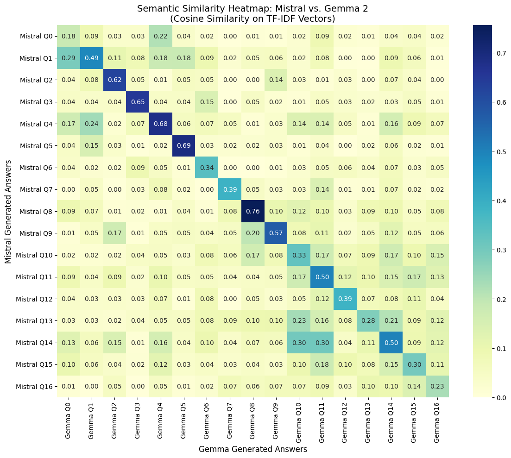
    


- It is a good sign that *mostly* the diagonals show the strongest semantic similarity.
- It indicates that the models are generally agreeing (semantically) for the same question.
- the models are especially in alignment for Question 8 (psych vs pharma treatments for depression), Question 5 (differentiation between bipolar and unipolar depression) and Question 4 (patient presenting with sadness, fatigue, sleep issues > 2 years)


```python

print("---------------------------------")
print("Question 8:", df_gemma.Question[8])

print("GEMMA Answer 8:", df_gemma['GEMMA Answer'][8])
print("-----")
print("Mistral Answer 8:", df_mistral['Mistral Answer'][8])
print("---------------------------------")


print("---------------------------------")
print("Question 5:", df_gemma.Question[5])
print("GEMMA Answer 5:", df_gemma['GEMMA Answer'][5])
print("-----")
print("Mistral Answer 5:", df_mistral['Mistral Answer'][5])
print("---------------------------------")


print("---------------------------------")
print("Question 4:", df_gemma.Question[4])
print("GEMMA Answer 4:", df_gemma['GEMMA Answer'][4])
print("-----")
print("Mistral Answer 4:", df_mistral['Mistral Answer'][4])
print("---------------------------------")

```

    ---------------------------------
    Question 8: How do psychotherapy and pharmacological treatments compare in effectiveness for treating depressive disorders?
    GEMMA Answer 8: <end_of_turn>
    <start_of_turn>model
    According to the "Module Recap" document, psychological interventions showed higher sustained response than antidepressants over the long term for treating depression.  The document also states that antidepressants have more adverse effects. 
    
    The document goes on to say that combined psychological interventions and antidepressants showed the best results across most analyses.  Combined treatment was better than pharmacotherapy alone in reducing depressive symptoms, treatment response, and remission. These effects were sustained at 6–12 months follow-up, favoring combined treatment.
    
    For individuals with severe depression, combined treatment had a better treatment response compared with pharmacotherapy alone.  There were no differences between psychotherapy alone and pharmacotherapy alone, and between combined therapy and psychological interventions alone.
    -----
    Mistral Answer 8: Psychotherapy and pharmacological treatments have different efficacies in treating depressive disorders. Combined treatment, which includes psychological interventions and antidepressants, showed the best results across most analyses in reducing depressive symptoms, treatment response, and remission. These effects were sustained at 6–12 months follow-up, favoring combined treatment.
    
    When comparing psychological interventions alone and pharmacotherapy alone, no significant differences were found. However, for individuals with severe depression, combined treatment had a better treatment response compared with pharmacotherapy alone.
    
    In terms of treatment acceptability, all-cause study dropout was significantly better for combined treatment compared with pharmacotherapy alone, and psychotherapy alone also had higher acceptability rates compared with pharmacotherapy alone. No significant differences were found between combined treatment and psychological interventions regarding treatment acceptability.
    ---------------------------------
    ---------------------------------
    Question 5: How can clinicians differentiate between depressive episodes in bipolar disorder and those in unipolar depression?
    GEMMA Answer 5: <end_of_turn>
    <start_of_turn>model
    Clinicians can differentiate between depressive episodes in bipolar disorder and those in unipolar depression by looking for the presence of hypomanic or manic episodes in the individual's history.  
    
    According to the text "Fundamentals of Psychological Disorders", individuals with bipolar disorder, whether bipolar I or II, will have experienced at least one hypomanic or manic episode in their lifetime.  In contrast, individuals with unipolar depression have never experienced a manic or hypomanic episode. 
    
    While the symptoms of a depressive episode may be similar in both bipolar disorder and major depressive disorder, the key difference lies in the presence of a manic or hypomanic episode in the history of the individual with bipolar disorder.
    -----
    Mistral Answer 5: Clinicians can differentiate between depressive episodes in bipolar disorder and those in unipolar depression by looking for a history of manic or hypomanic episodes. In bipolar disorder, depressive episodes are typically followed by manic or hypomanic episodes, whereas in unipolar depression, there is no history of manic or hypomanic episodes.
    ---------------------------------
    ---------------------------------
    Question 4: A patient reports persistent sadness, fatigue, and sleep disturbances lasting over two years. What is the most likely diagnosis, and what criteria support this conclusion?
    GEMMA Answer 4: <end_of_turn>
    <start_of_turn>model
    The most likely diagnosis for a patient reporting persistent sadness, fatigue, and sleep disturbances lasting over two years is **Persistent Depressive Disorder (PDD)**. 
    
    This conclusion is supported by the following criteria outlined in the Diagnostic and Statistical Manual of Mental Disorders (DSM-5) as described in the document "APA, 2022":
    
    * **Depressed mood for most of the day, for more days than not, for at least two years:** The patient's report of persistent sadness over two years aligns with this criterion.
    * **Two or more additional symptoms:** The patient's experience of fatigue and sleep disturbances (insomnia or hypersomnia) fulfill this requirement. Other possible symptoms mentioned in the text include changes in appetite, low energy, low self-esteem, feelings of hopelessness, and poor concentration or difficulty with decision making.
    
    It's important to note that a formal diagnosis can only be made by a qualified mental health professional after a comprehensive evaluation.
    -----
    Mistral Answer 4: The most likely diagnosis for a patient reporting persistent sadness, fatigue, and sleep disturbances lasting over two years is Persistent Depressive Disorder (PDD). This is based on the criteria that the patient has experienced a depressed mood for most of the day, for more days than not, for at least two years (APA, 2022). Additionally, the patient's symptoms are accompanied by two or more additional symptoms, such as changes in appetite, low self-esteem, feelings of hopelessness, and poor concentration or difficulty with decision making. These symptoms cause clinically significant distress or impairment in important areas of the patient's life.
    ---------------------------------


- the answers with the least semantic similarity correspond to questions 0 (MDD Diagnostic Criteria), 16 (AI-based system improvements) and 13 (Comorbidity)
- for questions 16 and 13, the GEMMA model states that there is not enough information from the resources provided, while Mistral still provides an accurate response, one that is potentially hallucinated.


```python

print("---------------------------------")
print("Question 0:", df_gemma.Question[0])

print("GEMMA Answer 0:", df_gemma['GEMMA Answer'][0])
print("-----")
print("Mistral Answer 0:", df_mistral['Mistral Answer'][0])
print("---------------------------------")


print("---------------------------------")
print("Question 16:", df_gemma.Question[16])
print("GEMMA Answer 16:", df_gemma['GEMMA Answer'][16])
print("-----")
print("Mistral Answer 16:", df_mistral['Mistral Answer'][16])
print("---------------------------------")


print("---------------------------------")
print("Question 13:", df_gemma.Question[13])
print("GEMMA Answer 13:", df_gemma['GEMMA Answer'][13])
print("-----")
print("Mistral Answer 13:", df_mistral['Mistral Answer'][13])
print("---------------------------------")
```

    ---------------------------------
    Question 0: What are the core diagnostic criteria for Major Depressive Disorder, and how many symptoms are required for a formal diagnosis?
    GEMMA Answer 0: <end_of_turn>
    <start_of_turn>model
    The provided text doesn't explicitly state the core diagnostic criteria for Major Depressive Disorder or the number of symptoms required for a diagnosis. 
    
    It does, however, discuss remission criteria for Major Depressive Disorder:
    
    * **Partial Remission:**  Symptoms of a major depressive episode are present but full criteria are not met, or there is a period lasting less than 2 months without any significant symptoms of a major depressive episode following the end of such an episode.
    * **Full Remission:** During the past 2 months, no significant signs or symptoms of the disturbance were present.
    
    The text also outlines severity levels for depressive disorders:
    
    * **Mild:** Few, if any, symptoms in excess of those required to make the diagnosis are present, the intensity of the symptoms is distressing but manageable, and the symptoms result in minor impairment in social or occupational functioning.
    * **Moderate:** The number of symptoms, intensity of symptoms, and/or functional impairment are between those specified for “mild” and “severe.”
    * **Severe:** The number of symptoms is substantially in excess of that required to make the diagnosis, the intensity of the symptoms is seriously distressing and
    
    **
    -----
    Mistral Answer 0: The core diagnostic criteria for Major Depressive Disorder, as outlined in the DSM-5-TR, include at least five of the following symptoms: depressed mood, loss of interest or pleasure, significant weight loss or gain, insomnia or hypersomnia, psychomotor agitation or retardation, fatigue or loss of energy, feelings of worthlessness or excessive or inappropriate guilt, diminished ability to think or concentrate, or recurrent thoughts of death or suicide. For a formal diagnosis, at least five of these symptoms must be present nearly every day for a period of at least two weeks.
    ---------------------------------
    ---------------------------------
    Question 16: How can AI-based systems assist in improving access to psychiatric diagnosis and treatment recommendations?
    GEMMA Answer 16: <end_of_turn>
    <start_of_turn>model
    While the provided text focuses on the benefits and implementation considerations of brief psychological interventions, it doesn't directly address how AI-based systems can assist in psychiatric diagnosis and treatment recommendations.  
    
    To answer your question about AI in psychiatry, we'd need information on:
    
    * **AI algorithms for diagnosis:** How AI can analyze patient data (symptoms, medical history, etc.) to assist in diagnosing mental health conditions.
    * **AI-powered treatment recommendations:** How AI can suggest personalized treatment plans based on a patient's diagnosis, preferences, and other factors.
    * **Accessibility improvements:** How AI can make psychiatric services more accessible through telehealth, chatbots, or other technologies.
    -----
    Mistral Answer 16: AI-based systems can assist in improving access to psychiatric diagnosis and treatment recommendations by automating the process of screening for substance use disorders, providing brief interventions in primary care settings, and aiding in the delivery of interventions in non-specialized health-care settings, specialized mental health care, and social care. These systems can help reduce the stigma of mental health problems, increase accessibility of mental health services, and potentially reduce costs. However, it is important to ensure the availability, acceptability, and country adaptation of these systems to ensure they are beneficial to all individuals, and further research is needed to understand the role of digital interventions for equity, equality, and non-discrimination of people with anxiety disorders. (Source: primary_care_review.txt, mental_health_review.txt)
    ---------------------------------
    ---------------------------------
    Question 13: How does comorbidity affect the accuracy of diagnosis and the effectiveness of treatment planning?
    GEMMA Answer 13: <end_of_turn>
    <start_of_turn>model
    While the text doesn't directly address how comorbidity affects the accuracy of diagnosis or treatment planning, it does highlight the importance of considering comorbidity when reviewing treatment recommendations. 
    
    The text from "depression_guidelines.txt" states that depression is frequently found comorbid with other mental health problems and medical problems. It emphasizes that although comorbidity wasn't directly reviewed in the guidelines, all stakeholders should consider this limitation when applying the recommendations. 
    
    This implies that the presence of comorbid conditions can complicate diagnosis and treatment planning, as a single diagnosis may not fully capture the individual's complex needs. 
    
    Therefore, clinicians need to be aware of the potential for comorbidity and tailor treatment plans accordingly.
    -----
    Mistral Answer 13: Comorbidity, or the presence of multiple mental health or medical problems, can affect the accuracy of diagnosis and the effectiveness of treatment planning in several ways. First, comorbidity is common, and it is not directly reviewed in the recommendations provided. This means that the guidelines may not account for the unique challenges and needs that arise when treating individuals with multiple conditions. Second, the generalizability of treatments to different settings and providers is important to consider. Research studies often require that providers are experienced and trained in the given approach under evaluation, which may differ from typical usual care depending on the setting or place. This means that the effectiveness of a treatment may vary depending on the specific treatment setting or context. Third, monitoring engagement with treatment is crucial for determining whether a treatment works. This involves identifying whether the patient followed directions regarding medication or therapy, and it is influenced by a variety of factors such as demographic characteristics, SES, preferences, values, personality traits, treatment history, trauma history, coping mechanisms, support networks, life circumstances, and resource availability. If a patient does not engage with treatment, it can be difficult to conclude whether any improvement (or lack of) in symptoms occurred because of the treatment or other factors.
    ---------------------------------


### Semantic Precision & Recall (BERTScore)

- computes token-level semantic similarity between generated answers and the retrieved reference text
- gets Precision, Recall, and F1 scores.
- Better than BLEU/ROUGE in clinical NLP because it captures semantic equivalence (rewording of same set of symptoms)


```python
# SEMANTIC PRECISION & RECALL — BERTScore


import pandas as pd
import numpy as np
from bert_score import score as bert_score
import matplotlib.pyplot as plt
import re

df_mistral = pd.read_csv("/content/drive/My Drive/NLP RAG Project/Mistral_Evaluation_Results.csv")
df_llama   = pd.read_csv("/content/drive/My Drive/NLP RAG Project/LLAMA_Evaluation_Results.csv")
df_gemma   = pd.read_csv("/content/drive/My Drive/NLP RAG Project/GEMMA_Evaluation_Results.csv")


```


```python

def clean_gemma(text):
    text = re.sub(r"<[^>]+>", "", str(text))   # remove all <...> tags
    text = re.sub(r"\s+", " ", text).strip()
    return text

df_gemma["GEMMA Answer"] = df_gemma["GEMMA Answer"].apply(clean_gemma)


```


```python

df_all = df_mistral[["Question", "Mistral Answer", "Retrieved Reference"]].copy()
df_all = df_all.merge(
    df_llama[["Question", "LLaMa Answer"]],
    on="Question", how="left"
)
df_all = df_all.merge(
    df_gemma[["Question", "GEMMA Answer"]],
    on="Question", how="left"
)

#Retrieved Reference is the same across all 3 (same RAG retriever)
#ground-truth reference
references     = df_all["Retrieved Reference"].astype(str).tolist()
mistral_preds  = df_all["Mistral Answer"].astype(str).tolist()
llama_preds    = df_all["LLaMa Answer"].astype(str).tolist()
gemma_preds    = df_all["GEMMA Answer"].astype(str).tolist()

print(f"✅ Loaded {len(df_all)} questions across 3 models")

```

    ✅ Loaded 17 questions across 3 models


```python
MAX_WORDS = 150  # safe range: 100–200

def truncate_text(text):
    return " ".join(str(text).split()[:MAX_WORDS])

mistral_preds = [truncate_text(x) for x in mistral_preds]
llama_preds   = [truncate_text(x) for x in llama_preds]
gemma_preds   = [truncate_text(x) for x in gemma_preds]
references    = [truncate_text(x) for x in references]
```


```python
import pandas as pd
import numpy as np
import torch
from bert_score import score as bert_score
import re

DEVICE = "cuda" if torch.cuda.is_available() else "cpu"
print("Using device:", DEVICE)

#cleaning text
def clean_text(x):
    x = str(x)
    x = re.sub(r"<[^>]+>", " ", x)
    x = re.sub(r"\s+", " ", x).strip()
    return x

#truncating
def truncate_text(x, max_words=120):
    x = clean_text(x)
    return " ".join(x.split()[:max_words])

mistral_preds_clean = [truncate_text(x) for x in mistral_preds]
llama_preds_clean   = [truncate_text(x) for x in llama_preds]
gemma_preds_clean   = [truncate_text(x) for x in gemma_preds]
references_clean    = [truncate_text(x) for x in references]

def compute_bertscore(predictions, references, label):
    print(f"\nScoring {label}...")
    P, R, F1 = bert_score(
        predictions,
        references,
        model_type="roberta-large",
        device=DEVICE,
        verbose=True,
        batch_size=4,
        use_fast_tokenizer=False
    )
    return P.numpy(), R.numpy(), F1.numpy()

mistral_P, mistral_R, mistral_F1 = compute_bertscore(mistral_preds_clean, references_clean, "Mistral")
llama_P,   llama_R,   llama_F1   = compute_bertscore(llama_preds_clean,   references_clean, "LLaMA")
gemma_P,   gemma_R,   gemma_F1   = compute_bertscore(gemma_preds_clean,   references_clean, "Gemma")
```

    Using device: cpu
    
    Scoring Mistral...


    config.json:   0%|          | 0.00/482 [00:00<?, ?B/s]


    tokenizer_config.json:   0%|          | 0.00/25.0 [00:00<?, ?B/s]


    vocab.json: 0.00B [00:00, ?B/s]


    merges.txt: 0.00B [00:00, ?B/s]


    tokenizer.json: 0.00B [00:00, ?B/s]


    model.safetensors:   0%|          | 0.00/1.42G [00:00<?, ?B/s]


    Loading weights:   0%|          | 0/389 [00:00<?, ?it/s]


    RobertaModel LOAD REPORT from: roberta-large
    Key                             | Status     | 
    --------------------------------+------------+-
    lm_head.bias                    | UNEXPECTED | 
    lm_head.layer_norm.weight       | UNEXPECTED | 
    lm_head.dense.bias              | UNEXPECTED | 
    lm_head.layer_norm.bias         | UNEXPECTED | 
    lm_head.dense.weight            | UNEXPECTED | 
    roberta.embeddings.position_ids | UNEXPECTED | 
    pooler.dense.weight             | MISSING    | 
    pooler.dense.bias               | MISSING    | 
    
    Notes:
    - UNEXPECTED	:can be ignored when loading from different task/architecture; not ok if you expect identical arch.
    - MISSING	:those params were newly initialized because missing from the checkpoint. Consider training on your downstream task.


    calculating scores...
    computing bert embedding.


      0%|          | 0/9 [00:00<?, ?it/s]


    computing greedy matching.


      0%|          | 0/5 [00:00<?, ?it/s]


    done in 47.17 seconds, 0.36 sentences/sec
    
    Scoring LLaMA...


    Loading weights:   0%|          | 0/389 [00:00<?, ?it/s]


    RobertaModel LOAD REPORT from: roberta-large
    Key                             | Status     | 
    --------------------------------+------------+-
    lm_head.bias                    | UNEXPECTED | 
    lm_head.layer_norm.weight       | UNEXPECTED | 
    lm_head.dense.bias              | UNEXPECTED | 
    lm_head.layer_norm.bias         | UNEXPECTED | 
    lm_head.dense.weight            | UNEXPECTED | 
    roberta.embeddings.position_ids | UNEXPECTED | 
    pooler.dense.weight             | MISSING    | 
    pooler.dense.bias               | MISSING    | 
    
    Notes:
    - UNEXPECTED	:can be ignored when loading from different task/architecture; not ok if you expect identical arch.
    - MISSING	:those params were newly initialized because missing from the checkpoint. Consider training on your downstream task.


    calculating scores...
    computing bert embedding.


      0%|          | 0/9 [00:00<?, ?it/s]


    computing greedy matching.


      0%|          | 0/5 [00:00<?, ?it/s]


    done in 43.10 seconds, 0.39 sentences/sec
    
    Scoring Gemma...


    Loading weights:   0%|          | 0/389 [00:00<?, ?it/s]


    RobertaModel LOAD REPORT from: roberta-large
    Key                             | Status     | 
    --------------------------------+------------+-
    lm_head.bias                    | UNEXPECTED | 
    lm_head.layer_norm.weight       | UNEXPECTED | 
    lm_head.dense.bias              | UNEXPECTED | 
    lm_head.layer_norm.bias         | UNEXPECTED | 
    lm_head.dense.weight            | UNEXPECTED | 
    roberta.embeddings.position_ids | UNEXPECTED | 
    pooler.dense.weight             | MISSING    | 
    pooler.dense.bias               | MISSING    | 
    
    Notes:
    - UNEXPECTED	:can be ignored when loading from different task/architecture; not ok if you expect identical arch.
    - MISSING	:those params were newly initialized because missing from the checkpoint. Consider training on your downstream task.


    calculating scores...
    computing bert embedding.


      0%|          | 0/9 [00:00<?, ?it/s]


    computing greedy matching.


      0%|          | 0/5 [00:00<?, ?it/s]


    done in 43.38 seconds, 0.39 sentences/sec


```python

df_bertscore = pd.DataFrame({
    "Question":          df_all["Question"],
    "Mistral Precision": mistral_P,
    "Mistral Recall":    mistral_R,
    "Mistral F1":        mistral_F1,
    "LLaMA Precision":   llama_P,
    "LLaMA Recall":      llama_R,
    "LLaMA F1":          llama_F1,
    "Gemma Precision":   gemma_P,
    "Gemma Recall":      gemma_R,
    "Gemma F1":          gemma_F1,
})

display(df_bertscore.round(4))

df_bertscore.to_excel(
    "/content/drive/My Drive/NLP RAG Project/BERTScore_Evaluation.xlsx",
    index=False
)
print("Saved BERTScore_Evaluation.xlsx")
```


  <div id="df-07852c21-86a0-4c5c-aac8-bfd785b4b422" class="colab-df-container">
    <div>
<style scoped>
    .dataframe tbody tr th:only-of-type {
        vertical-align: middle;
    }

    .dataframe tbody tr th {
        vertical-align: top;
    }

    .dataframe thead th {
        text-align: right;
    }
</style>
<table border="1" class="dataframe">
  <thead>
    <tr style="text-align: right;">
      <th></th>
      <th>Question</th>
      <th>Mistral Precision</th>
      <th>Mistral Recall</th>
      <th>Mistral F1</th>
      <th>LLaMA Precision</th>
      <th>LLaMA Recall</th>
      <th>LLaMA F1</th>
      <th>Gemma Precision</th>
      <th>Gemma Recall</th>
      <th>Gemma F1</th>
    </tr>
  </thead>
  <tbody>
    <tr>
      <th>0</th>
      <td>What are the core diagnostic criteria for Majo...</td>
      <td>0.8259</td>
      <td>0.8323</td>
      <td>0.8291</td>
      <td>0.8306</td>
      <td>0.8446</td>
      <td>0.8375</td>
      <td>0.8902</td>
      <td>0.8925</td>
      <td>0.8914</td>
    </tr>
    <tr>
      <th>1</th>
      <td>How does Persistent Depressive Disorder differ...</td>
      <td>0.9078</td>
      <td>0.8489</td>
      <td>0.8774</td>
      <td>0.8584</td>
      <td>0.8487</td>
      <td>0.8535</td>
      <td>0.8427</td>
      <td>0.8357</td>
      <td>0.8392</td>
    </tr>
    <tr>
      <th>2</th>
      <td>What key features distinguish Generalized Anxi...</td>
      <td>0.9029</td>
      <td>0.8337</td>
      <td>0.8669</td>
      <td>0.8724</td>
      <td>0.8174</td>
      <td>0.8440</td>
      <td>0.8347</td>
      <td>0.8189</td>
      <td>0.8267</td>
    </tr>
    <tr>
      <th>3</th>
      <td>What are the essential impairments required fo...</td>
      <td>0.8811</td>
      <td>0.8413</td>
      <td>0.8607</td>
      <td>0.8651</td>
      <td>0.8333</td>
      <td>0.8489</td>
      <td>0.8515</td>
      <td>0.8254</td>
      <td>0.8383</td>
    </tr>
    <tr>
      <th>4</th>
      <td>A patient reports persistent sadness, fatigue,...</td>
      <td>0.8511</td>
      <td>0.8213</td>
      <td>0.8360</td>
      <td>0.8330</td>
      <td>0.8362</td>
      <td>0.8346</td>
      <td>0.8147</td>
      <td>0.8300</td>
      <td>0.8223</td>
    </tr>
    <tr>
      <th>5</th>
      <td>How can clinicians differentiate between depre...</td>
      <td>0.8503</td>
      <td>0.8601</td>
      <td>0.8552</td>
      <td>0.8728</td>
      <td>0.8550</td>
      <td>0.8638</td>
      <td>0.8834</td>
      <td>0.8598</td>
      <td>0.8714</td>
    </tr>
    <tr>
      <th>6</th>
      <td>A patient demonstrates impulsivity, lack of em...</td>
      <td>0.8395</td>
      <td>0.8053</td>
      <td>0.8220</td>
      <td>0.8318</td>
      <td>0.8164</td>
      <td>0.8240</td>
      <td>0.8389</td>
      <td>0.8159</td>
      <td>0.8272</td>
    </tr>
    <tr>
      <th>7</th>
      <td>What are the most effective psychological trea...</td>
      <td>0.8658</td>
      <td>0.8662</td>
      <td>0.8660</td>
      <td>0.8986</td>
      <td>0.8728</td>
      <td>0.8855</td>
      <td>0.8914</td>
      <td>0.8742</td>
      <td>0.8827</td>
    </tr>
    <tr>
      <th>8</th>
      <td>How do psychotherapy and pharmacological treat...</td>
      <td>0.8394</td>
      <td>0.8322</td>
      <td>0.8357</td>
      <td>0.8494</td>
      <td>0.8398</td>
      <td>0.8446</td>
      <td>0.8302</td>
      <td>0.8289</td>
      <td>0.8296</td>
    </tr>
    <tr>
      <th>9</th>
      <td>What treatment strategies are recommended for ...</td>
      <td>0.8665</td>
      <td>0.8316</td>
      <td>0.8487</td>
      <td>0.8435</td>
      <td>0.8301</td>
      <td>0.8367</td>
      <td>0.8501</td>
      <td>0.8304</td>
      <td>0.8402</td>
    </tr>
    <tr>
      <th>10</th>
      <td>How should treatment plans be individualized b...</td>
      <td>0.8996</td>
      <td>0.8800</td>
      <td>0.8897</td>
      <td>0.8852</td>
      <td>0.8693</td>
      <td>0.8772</td>
      <td>0.8726</td>
      <td>0.8762</td>
      <td>0.8744</td>
    </tr>
    <tr>
      <th>11</th>
      <td>How do diagnostic frameworks and treatment gui...</td>
      <td>0.8459</td>
      <td>0.8139</td>
      <td>0.8296</td>
      <td>0.8407</td>
      <td>0.7918</td>
      <td>0.8155</td>
      <td>0.8303</td>
      <td>0.7953</td>
      <td>0.8124</td>
    </tr>
    <tr>
      <th>12</th>
      <td>What are the limitations of symptom-based diag...</td>
      <td>0.8449</td>
      <td>0.8173</td>
      <td>0.8309</td>
      <td>0.8248</td>
      <td>0.8145</td>
      <td>0.8196</td>
      <td>0.8139</td>
      <td>0.8097</td>
      <td>0.8118</td>
    </tr>
    <tr>
      <th>13</th>
      <td>How does comorbidity affect the accuracy of di...</td>
      <td>0.8774</td>
      <td>0.8590</td>
      <td>0.8681</td>
      <td>0.8559</td>
      <td>0.8334</td>
      <td>0.8445</td>
      <td>0.8839</td>
      <td>0.8509</td>
      <td>0.8670</td>
    </tr>
    <tr>
      <th>14</th>
      <td>Given a patient presenting with overlapping sy...</td>
      <td>0.8967</td>
      <td>0.8943</td>
      <td>0.8955</td>
      <td>0.8889</td>
      <td>0.8622</td>
      <td>0.8753</td>
      <td>0.8402</td>
      <td>0.8452</td>
      <td>0.8427</td>
    </tr>
    <tr>
      <th>15</th>
      <td>What challenges arise in accurately diagnosing...</td>
      <td>0.9315</td>
      <td>0.9160</td>
      <td>0.9237</td>
      <td>0.8331</td>
      <td>0.8232</td>
      <td>0.8281</td>
      <td>0.8542</td>
      <td>0.8484</td>
      <td>0.8513</td>
    </tr>
    <tr>
      <th>16</th>
      <td>How can AI-based systems assist in improving a...</td>
      <td>0.8911</td>
      <td>0.8801</td>
      <td>0.8855</td>
      <td>0.8857</td>
      <td>0.8785</td>
      <td>0.8821</td>
      <td>0.8318</td>
      <td>0.8426</td>
      <td>0.8371</td>
    </tr>
  </tbody>
</table>
</div>
    <div class="colab-df-buttons">

  <div class="colab-df-container">
    <button class="colab-df-convert" onclick="convertToInteractive('df-07852c21-86a0-4c5c-aac8-bfd785b4b422')"
            title="Convert this dataframe to an interactive table."
            style="display:none;">

  <svg xmlns="http://www.w3.org/2000/svg" height="24px" viewBox="0 -960 960 960">
    <path d="M120-120v-720h720v720H120Zm60-500h600v-160H180v160Zm220 220h160v-160H400v160Zm0 220h160v-160H400v160ZM180-400h160v-160H180v160Zm440 0h160v-160H620v160ZM180-180h160v-160H180v160Zm440 0h160v-160H620v160Z"/>
  </svg>
    </button>

  <style>
    .colab-df-container {
      display:flex;
      gap: 12px;
    }

    .colab-df-convert {
      background-color: #E8F0FE;
      border: none;
      border-radius: 50%;
      cursor: pointer;
      display: none;
      fill: #1967D2;
      height: 32px;
      padding: 0 0 0 0;
      width: 32px;
    }

    .colab-df-convert:hover {
      background-color: #E2EBFA;
      box-shadow: 0px 1px 2px rgba(60, 64, 67, 0.3), 0px 1px 3px 1px rgba(60, 64, 67, 0.15);
      fill: #174EA6;
    }

    .colab-df-buttons div {
      margin-bottom: 4px;
    }

    [theme=dark] .colab-df-convert {
      background-color: #3B4455;
      fill: #D2E3FC;
    }

    [theme=dark] .colab-df-convert:hover {
      background-color: #434B5C;
      box-shadow: 0px 1px 3px 1px rgba(0, 0, 0, 0.15);
      filter: drop-shadow(0px 1px 2px rgba(0, 0, 0, 0.3));
      fill: #FFFFFF;
    }
  </style>

    <script>
      const buttonEl =
        document.querySelector('#df-07852c21-86a0-4c5c-aac8-bfd785b4b422 button.colab-df-convert');
      buttonEl.style.display =
        google.colab.kernel.accessAllowed ? 'block' : 'none';

      async function convertToInteractive(key) {
        const element = document.querySelector('#df-07852c21-86a0-4c5c-aac8-bfd785b4b422');
        const dataTable =
          await google.colab.kernel.invokeFunction('convertToInteractive',
                                                    [key], {});
        if (!dataTable) return;

        const docLinkHtml = 'Like what you see? Visit the ' +
          '<a target="_blank" href=https://colab.research.google.com/notebooks/data_table.ipynb>data table notebook</a>'
          + ' to learn more about interactive tables.';
        element.innerHTML = '';
        dataTable['output_type'] = 'display_data';
        await google.colab.output.renderOutput(dataTable, element);
        const docLink = document.createElement('div');
        docLink.innerHTML = docLinkHtml;
        element.appendChild(docLink);
      }
    </script>
  </div>


    </div>
  </div>


    ✅ Saved BERTScore_Evaluation.xlsx


### Summary Table of roBERTScore

- shows that mistral was the best-performing model in terms of semantic equivalence between answers and retrieval context


```python

summary = pd.DataFrame({
    "Model":     ["Mistral", "LLaMA", "Gemma"],
    "Precision": [mistral_P.mean(), llama_P.mean(), gemma_P.mean()],
    "Recall":    [mistral_R.mean(), llama_R.mean(), gemma_R.mean()],
    "F1":        [mistral_F1.mean(), llama_F1.mean(), gemma_F1.mean()],
}).round(4)

print("\n=== BERTScore Summary (mean across 17 questions) ===")
display(summary)
```

    
    === BERTScore Summary (mean across 17 questions) ===


  <div id="df-d5f0f1f6-911c-4194-ad72-47102e8b8921" class="colab-df-container">
    <div>
<style scoped>
    .dataframe tbody tr th:only-of-type {
        vertical-align: middle;
    }

    .dataframe tbody tr th {
        vertical-align: top;
    }

    .dataframe thead th {
        text-align: right;
    }
</style>
<table border="1" class="dataframe">
  <thead>
    <tr style="text-align: right;">
      <th></th>
      <th>Model</th>
      <th>Precision</th>
      <th>Recall</th>
      <th>F1</th>
    </tr>
  </thead>
  <tbody>
    <tr>
      <th>0</th>
      <td>Mistral</td>
      <td>0.8716</td>
      <td>0.8490</td>
      <td>0.860</td>
    </tr>
    <tr>
      <th>1</th>
      <td>LLaMA</td>
      <td>0.8571</td>
      <td>0.8392</td>
      <td>0.848</td>
    </tr>
    <tr>
      <th>2</th>
      <td>Gemma</td>
      <td>0.8503</td>
      <td>0.8400</td>
      <td>0.845</td>
    </tr>
  </tbody>
</table>
</div>
    <div class="colab-df-buttons">

  <div class="colab-df-container">
    <button class="colab-df-convert" onclick="convertToInteractive('df-d5f0f1f6-911c-4194-ad72-47102e8b8921')"
            title="Convert this dataframe to an interactive table."
            style="display:none;">

  <svg xmlns="http://www.w3.org/2000/svg" height="24px" viewBox="0 -960 960 960">
    <path d="M120-120v-720h720v720H120Zm60-500h600v-160H180v160Zm220 220h160v-160H400v160Zm0 220h160v-160H400v160ZM180-400h160v-160H180v160Zm440 0h160v-160H620v160ZM180-180h160v-160H180v160Zm440 0h160v-160H620v160Z"/>
  </svg>
    </button>

  <style>
    .colab-df-container {
      display:flex;
      gap: 12px;
    }

    .colab-df-convert {
      background-color: #E8F0FE;
      border: none;
      border-radius: 50%;
      cursor: pointer;
      display: none;
      fill: #1967D2;
      height: 32px;
      padding: 0 0 0 0;
      width: 32px;
    }

    .colab-df-convert:hover {
      background-color: #E2EBFA;
      box-shadow: 0px 1px 2px rgba(60, 64, 67, 0.3), 0px 1px 3px 1px rgba(60, 64, 67, 0.15);
      fill: #174EA6;
    }

    .colab-df-buttons div {
      margin-bottom: 4px;
    }

    [theme=dark] .colab-df-convert {
      background-color: #3B4455;
      fill: #D2E3FC;
    }

    [theme=dark] .colab-df-convert:hover {
      background-color: #434B5C;
      box-shadow: 0px 1px 3px 1px rgba(0, 0, 0, 0.15);
      filter: drop-shadow(0px 1px 2px rgba(0, 0, 0, 0.3));
      fill: #FFFFFF;
    }
  </style>

    <script>
      const buttonEl =
        document.querySelector('#df-d5f0f1f6-911c-4194-ad72-47102e8b8921 button.colab-df-convert');
      buttonEl.style.display =
        google.colab.kernel.accessAllowed ? 'block' : 'none';

      async function convertToInteractive(key) {
        const element = document.querySelector('#df-d5f0f1f6-911c-4194-ad72-47102e8b8921');
        const dataTable =
          await google.colab.kernel.invokeFunction('convertToInteractive',
                                                    [key], {});
        if (!dataTable) return;

        const docLinkHtml = 'Like what you see? Visit the ' +
          '<a target="_blank" href=https://colab.research.google.com/notebooks/data_table.ipynb>data table notebook</a>'
          + ' to learn more about interactive tables.';
        element.innerHTML = '';
        dataTable['output_type'] = 'display_data';
        await google.colab.output.renderOutput(dataTable, element);
        const docLink = document.createElement('div');
        docLink.innerHTML = docLinkHtml;
        element.appendChild(docLink);
      }
    </script>
  </div>


  <div id="id_f085d13f-7790-4285-a11c-2e76159db7ee">
    <style>
      .colab-df-generate {
        background-color: #E8F0FE;
        border: none;
        border-radius: 50%;
        cursor: pointer;
        display: none;
        fill: #1967D2;
        height: 32px;
        padding: 0 0 0 0;
        width: 32px;
      }

      .colab-df-generate:hover {
        background-color: #E2EBFA;
        box-shadow: 0px 1px 2px rgba(60, 64, 67, 0.3), 0px 1px 3px 1px rgba(60, 64, 67, 0.15);
        fill: #174EA6;
      }

      [theme=dark] .colab-df-generate {
        background-color: #3B4455;
        fill: #D2E3FC;
      }

      [theme=dark] .colab-df-generate:hover {
        background-color: #434B5C;
        box-shadow: 0px 1px 3px 1px rgba(0, 0, 0, 0.15);
        filter: drop-shadow(0px 1px 2px rgba(0, 0, 0, 0.3));
        fill: #FFFFFF;
      }
    </style>
    <button class="colab-df-generate" onclick="generateWithVariable('summary')"
            title="Generate code using this dataframe."
            style="display:none;">

  <svg xmlns="http://www.w3.org/2000/svg" height="24px"viewBox="0 0 24 24"
       width="24px">
    <path d="M7,19H8.4L18.45,9,17,7.55,7,17.6ZM5,21V16.75L18.45,3.32a2,2,0,0,1,2.83,0l1.4,1.43a1.91,1.91,0,0,1,.58,1.4,1.91,1.91,0,0,1-.58,1.4L9.25,21ZM18.45,9,17,7.55Zm-12,3A5.31,5.31,0,0,0,4.9,8.1,5.31,5.31,0,0,0,1,6.5,5.31,5.31,0,0,0,4.9,4.9,5.31,5.31,0,0,0,6.5,1,5.31,5.31,0,0,0,8.1,4.9,5.31,5.31,0,0,0,12,6.5,5.46,5.46,0,0,0,6.5,12Z"/>
  </svg>
    </button>
    <script>
      (() => {
      const buttonEl =
        document.querySelector('#id_f085d13f-7790-4285-a11c-2e76159db7ee button.colab-df-generate');
      buttonEl.style.display =
        google.colab.kernel.accessAllowed ? 'block' : 'none';

      buttonEl.onclick = () => {
        google.colab.notebook.generateWithVariable('summary');
      }
      })();
    </script>
  </div>

    </div>
  </div>


```python
#bar plot clustered
x      = np.arange(3)
width  = 0.25
labels = ["Precision", "Recall", "F1"]

m_vals = [mistral_P.mean(), mistral_R.mean(), mistral_F1.mean()]
l_vals = [llama_P.mean(),   llama_R.mean(),   llama_F1.mean()]
g_vals = [gemma_P.mean(),   gemma_R.mean(),   gemma_F1.mean()]

fig, ax = plt.subplots(figsize=(9, 5))
b1 = ax.bar(x - width, m_vals, width, label="Mistral", color="#4C72B0")
b2 = ax.bar(x,          l_vals, width, label="LLaMA",  color="#55A868")
b3 = ax.bar(x + width,  g_vals, width, label="Gemma",  color="#C44E52")

ax.set_xlabel("Metric")
ax.set_ylabel("BERTScore")
ax.set_title("Semantic Precision, Recall & F1 (BERTScore)\nRAG-Based Psychiatric Assistant — All Models")
ax.set_xticks(x)
ax.set_xticklabels(labels)
ax.set_ylim(0.5, 1.0)
ax.legend()
ax.bar_label(b1, fmt="%.3f", padding=3, fontsize=8)
ax.bar_label(b2, fmt="%.3f", padding=3, fontsize=8)
ax.bar_label(b3, fmt="%.3f", padding=3, fontsize=8)

plt.tight_layout()
plt.savefig("/content/drive/My Drive/NLP RAG Project/bertscore_bar_chart.png", dpi=150)
plt.show()

```


    
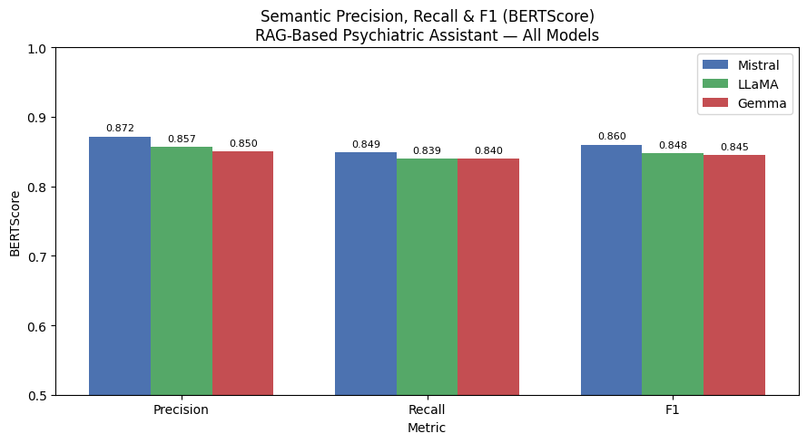
    


```python
#f1 per question (heatmap)
q_labels = [f"Q{i+1}" for i in range(len(df_all))]

fig, ax = plt.subplots(figsize=(14, 3))
im = ax.imshow(
    np.array([mistral_F1, llama_F1, gemma_F1]),
    aspect="auto", cmap="RdYlGn", vmin=0.5, vmax=1.0
)
ax.set_yticks([0, 1, 2])
ax.set_yticklabels(["Mistral", "LLaMA", "Gemma"])
ax.set_xticks(range(len(q_labels)))
ax.set_xticklabels(q_labels, rotation=45)
ax.set_title("BERTScore F1 per Question — All Models")
plt.colorbar(im, ax=ax, label="F1 Score")
plt.tight_layout()
plt.savefig("/content/drive/My Drive/NLP RAG Project/bertscore_heatmap.png", dpi=150)
plt.show()
```


    
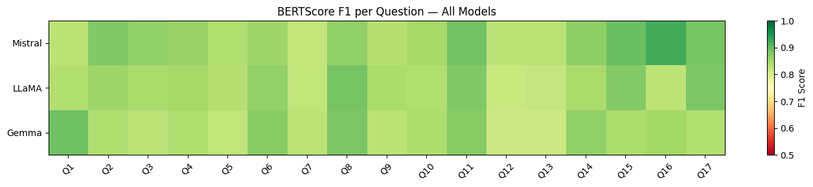
    


- mistral did the best for Question 16 (index 15):     "What challenges arise in accurately diagnosing psychiatric disorders, and how can clinicians address these challenges?",


### Precision@K and Recall@K (K chunks) and MRR
- did the system retrieve content from the correct document?


```python
gold_sources = [
    "DSM 5 TR.pdf",                        # 1
    "DSM 5 TR.pdf",                        # 2
    "DSM 5 TR.pdf",                        # 3
    "personality_disorders_dsm.pdf",       # 4
    "DSM 5 TR.pdf",                        # 5
    "DSM 5 TR.pdf",                        # 6
    "personality_disorders_dsm.pdf",       # 7
    "apa_treatment_depression.pdf",        # 8
    "apa_treatment_depression.pdf",        # 9
    "who_mental_health_gap.pdf",           # 10
    "apa_treatment_depression.pdf",        # 11
    "fundamentals_of_psych_disorders.pdf", # 12
    "fundamentals_of_psych_disorders.pdf", # 13
    "fundamentals_of_psych_disorders.pdf", # 14
    "DSM 5 TR.pdf",                        # 15
    "fundamentals_of_psych_disorders.pdf", # 16
    "fundamentals_of_psych_disorders.pdf"  # 17
]
```

- assigning gold sources from context material based on Questions (mostly DSM 5, except for the question specifically about personality disorders, which refers to a specialised personality disorders pdf)


```python
import pandas as pd

df_gold = pd.DataFrame({
    "Question": questions,
    "Gold Source": gold_sources
})

display(df_gold)
```


  <div id="df-d9920fc4-5a9b-4061-8043-ee914466a11c" class="colab-df-container">
    <div>
<style scoped>
    .dataframe tbody tr th:only-of-type {
        vertical-align: middle;
    }

    .dataframe tbody tr th {
        vertical-align: top;
    }

    .dataframe thead th {
        text-align: right;
    }
</style>
<table border="1" class="dataframe">
  <thead>
    <tr style="text-align: right;">
      <th></th>
      <th>Question</th>
      <th>Gold Source</th>
    </tr>
  </thead>
  <tbody>
    <tr>
      <th>0</th>
      <td>What are the core diagnostic criteria for Majo...</td>
      <td>DSM 5 TR.pdf</td>
    </tr>
    <tr>
      <th>1</th>
      <td>How does Persistent Depressive Disorder differ...</td>
      <td>DSM 5 TR.pdf</td>
    </tr>
    <tr>
      <th>2</th>
      <td>What key features distinguish Generalized Anxi...</td>
      <td>DSM 5 TR.pdf</td>
    </tr>
    <tr>
      <th>3</th>
      <td>What are the essential impairments required fo...</td>
      <td>personality_disorders_dsm.pdf</td>
    </tr>
    <tr>
      <th>4</th>
      <td>A patient reports persistent sadness, fatigue,...</td>
      <td>DSM 5 TR.pdf</td>
    </tr>
    <tr>
      <th>5</th>
      <td>How can clinicians differentiate between depre...</td>
      <td>DSM 5 TR.pdf</td>
    </tr>
    <tr>
      <th>6</th>
      <td>A patient demonstrates impulsivity, lack of em...</td>
      <td>personality_disorders_dsm.pdf</td>
    </tr>
    <tr>
      <th>7</th>
      <td>What are the most effective psychological trea...</td>
      <td>apa_treatment_depression.pdf</td>
    </tr>
    <tr>
      <th>8</th>
      <td>How do psychotherapy and pharmacological treat...</td>
      <td>apa_treatment_depression.pdf</td>
    </tr>
    <tr>
      <th>9</th>
      <td>What treatment strategies are recommended for ...</td>
      <td>who_mental_health_gap.pdf</td>
    </tr>
    <tr>
      <th>10</th>
      <td>How should treatment plans be individualized b...</td>
      <td>apa_treatment_depression.pdf</td>
    </tr>
    <tr>
      <th>11</th>
      <td>How do diagnostic frameworks and treatment gui...</td>
      <td>fundamentals_of_psych_disorders.pdf</td>
    </tr>
    <tr>
      <th>12</th>
      <td>What are the limitations of symptom-based diag...</td>
      <td>fundamentals_of_psych_disorders.pdf</td>
    </tr>
    <tr>
      <th>13</th>
      <td>How does comorbidity affect the accuracy of di...</td>
      <td>fundamentals_of_psych_disorders.pdf</td>
    </tr>
    <tr>
      <th>14</th>
      <td>Given a patient presenting with overlapping sy...</td>
      <td>DSM 5 TR.pdf</td>
    </tr>
    <tr>
      <th>15</th>
      <td>What challenges arise in accurately diagnosing...</td>
      <td>fundamentals_of_psych_disorders.pdf</td>
    </tr>
    <tr>
      <th>16</th>
      <td>How can AI-based systems assist in improving a...</td>
      <td>fundamentals_of_psych_disorders.pdf</td>
    </tr>
  </tbody>
</table>
</div>
    <div class="colab-df-buttons">

  <div class="colab-df-container">
    <button class="colab-df-convert" onclick="convertToInteractive('df-d9920fc4-5a9b-4061-8043-ee914466a11c')"
            title="Convert this dataframe to an interactive table."
            style="display:none;">

  <svg xmlns="http://www.w3.org/2000/svg" height="24px" viewBox="0 -960 960 960">
    <path d="M120-120v-720h720v720H120Zm60-500h600v-160H180v160Zm220 220h160v-160H400v160Zm0 220h160v-160H400v160ZM180-400h160v-160H180v160Zm440 0h160v-160H620v160ZM180-180h160v-160H180v160Zm440 0h160v-160H620v160Z"/>
  </svg>
    </button>

  <style>
    .colab-df-container {
      display:flex;
      gap: 12px;
    }

    .colab-df-convert {
      background-color: #E8F0FE;
      border: none;
      border-radius: 50%;
      cursor: pointer;
      display: none;
      fill: #1967D2;
      height: 32px;
      padding: 0 0 0 0;
      width: 32px;
    }

    .colab-df-convert:hover {
      background-color: #E2EBFA;
      box-shadow: 0px 1px 2px rgba(60, 64, 67, 0.3), 0px 1px 3px 1px rgba(60, 64, 67, 0.15);
      fill: #174EA6;
    }

    .colab-df-buttons div {
      margin-bottom: 4px;
    }

    [theme=dark] .colab-df-convert {
      background-color: #3B4455;
      fill: #D2E3FC;
    }

    [theme=dark] .colab-df-convert:hover {
      background-color: #434B5C;
      box-shadow: 0px 1px 3px 1px rgba(0, 0, 0, 0.15);
      filter: drop-shadow(0px 1px 2px rgba(0, 0, 0, 0.3));
      fill: #FFFFFF;
    }
  </style>

    <script>
      const buttonEl =
        document.querySelector('#df-d9920fc4-5a9b-4061-8043-ee914466a11c button.colab-df-convert');
      buttonEl.style.display =
        google.colab.kernel.accessAllowed ? 'block' : 'none';

      async function convertToInteractive(key) {
        const element = document.querySelector('#df-d9920fc4-5a9b-4061-8043-ee914466a11c');
        const dataTable =
          await google.colab.kernel.invokeFunction('convertToInteractive',
                                                    [key], {});
        if (!dataTable) return;

        const docLinkHtml = 'Like what you see? Visit the ' +
          '<a target="_blank" href=https://colab.research.google.com/notebooks/data_table.ipynb>data table notebook</a>'
          + ' to learn more about interactive tables.';
        element.innerHTML = '';
        dataTable['output_type'] = 'display_data';
        await google.colab.output.renderOutput(dataTable, element);
        const docLink = document.createElement('div');
        docLink.innerHTML = docLinkHtml;
        element.appendChild(docLink);
      }
    </script>
  </div>


  <div id="id_c9c597e1-3f61-4b6d-a0b2-f02b5645835e">
    <style>
      .colab-df-generate {
        background-color: #E8F0FE;
        border: none;
        border-radius: 50%;
        cursor: pointer;
        display: none;
        fill: #1967D2;
        height: 32px;
        padding: 0 0 0 0;
        width: 32px;
      }

      .colab-df-generate:hover {
        background-color: #E2EBFA;
        box-shadow: 0px 1px 2px rgba(60, 64, 67, 0.3), 0px 1px 3px 1px rgba(60, 64, 67, 0.15);
        fill: #174EA6;
      }

      [theme=dark] .colab-df-generate {
        background-color: #3B4455;
        fill: #D2E3FC;
      }

      [theme=dark] .colab-df-generate:hover {
        background-color: #434B5C;
        box-shadow: 0px 1px 3px 1px rgba(0, 0, 0, 0.15);
        filter: drop-shadow(0px 1px 2px rgba(0, 0, 0, 0.3));
        fill: #FFFFFF;
      }
    </style>
    <button class="colab-df-generate" onclick="generateWithVariable('df_gold')"
            title="Generate code using this dataframe."
            style="display:none;">

  <svg xmlns="http://www.w3.org/2000/svg" height="24px"viewBox="0 0 24 24"
       width="24px">
    <path d="M7,19H8.4L18.45,9,17,7.55,7,17.6ZM5,21V16.75L18.45,3.32a2,2,0,0,1,2.83,0l1.4,1.43a1.91,1.91,0,0,1,.58,1.4,1.91,1.91,0,0,1-.58,1.4L9.25,21ZM18.45,9,17,7.55Zm-12,3A5.31,5.31,0,0,0,4.9,8.1,5.31,5.31,0,0,0,1,6.5,5.31,5.31,0,0,0,4.9,4.9,5.31,5.31,0,0,0,6.5,1,5.31,5.31,0,0,0,8.1,4.9,5.31,5.31,0,0,0,12,6.5,5.46,5.46,0,0,0,6.5,12Z"/>
  </svg>
    </button>
    <script>
      (() => {
      const buttonEl =
        document.querySelector('#id_c9c597e1-3f61-4b6d-a0b2-f02b5645835e button.colab-df-generate');
      buttonEl.style.display =
        google.colab.kernel.accessAllowed ? 'block' : 'none';

      buttonEl.onclick = () => {
        google.colab.notebook.generateWithVariable('df_gold');
      }
      })();
    </script>
  </div>

    </div>
  </div>


```python
import numpy as np
import os

def evaluate_retrieval(df_gold, vector_db, k=3):
    precisions = []
    recalls = []

    for _, row in df_gold.iterrows():
        query = row["Question"]
        gold = row["Gold Source"]

        results = vector_db.max_marginal_relevance_search(
            query,
            k=k,
            fetch_k=20
        )

        retrieved_sources = [
            os.path.basename(doc.metadata.get("source", ""))
            for doc in results
        ]

        relevant = sum(1 for s in retrieved_sources if s == gold)

        precision = relevant / k
        recall = 1 if gold in retrieved_sources else 0

        precisions.append(precision)
        recalls.append(recall)

    return np.mean(precisions), np.mean(recalls)
```


```python
for k in [1, 2, 3, 4, 5, 6, 7, 8 , 9, 10, 11, 12, 13, 14, 15, 16, 17]:
    p, r = evaluate_retrieval(df_gold, vector_db, k)
    print(f"k={k}")
    print(f"Precision@{k}: {p:.4f}")
    print(f"Recall@{k}: {r:.4f}\n")
```

    k=1
    Precision@1: 0.5294
    Recall@1: 0.5294
    
    k=2
    Precision@2: 0.4412
    Recall@2: 0.5882
    
    k=3
    Precision@3: 0.4902
    Recall@3: 0.7647
    
    k=4
    Precision@4: 0.5000
    Recall@4: 0.7647
    
    k=5
    Precision@5: 0.5059
    Recall@5: 0.7647
    
    k=6
    Precision@6: 0.5098
    Recall@6: 0.7647
    
    k=7
    Precision@7: 0.5126
    Recall@7: 0.7647
    
    k=8
    Precision@8: 0.5147
    Recall@8: 0.7647
    
    k=9
    Precision@9: 0.5163
    Recall@9: 0.7647
    
    k=10
    Precision@10: 0.5059
    Recall@10: 0.7647
    
    k=11
    Precision@11: 0.4973
    Recall@11: 0.7647
    
    k=12
    Precision@12: 0.4902
    Recall@12: 0.7647
    
    k=13
    Precision@13: 0.4842
    Recall@13: 0.7647
    
    k=14
    Precision@14: 0.4790
    Recall@14: 0.7647
    
    k=15
    Precision@15: 0.4706
    Recall@15: 0.7647
    
    k=16
    Precision@16: 0.4743
    Recall@16: 0.7647
    
    k=17
    Precision@17: 0.4775
    Recall@17: 0.7647
    


-  for 13 out of 17 questions, the correct source document was retrieved somewhere in the top 3 chunks and retrieving more chunks beyond that doesn't really make a difference
- precision declines as k increases as the more chunks you retrieve, the more noise introduced. k=8–9 where precision and recall are most balanced is a good middle ground.


```python
ks = [1, 3, 5, 7, 10, 12]

precisions = []
recalls = []

for k in ks:
    p, r = evaluate_retrieval(df_gold, vector_db, k)
    precisions.append(p)
    recalls.append(r)
```


```python
plt.figure(figsize=(7,5))

plt.plot(ks, precisions, marker='o', linewidth=2, label="Precision@k")
plt.plot(ks, recalls, marker='o', linewidth=2, label="Recall@k")

plt.xlabel("Number of Retrieved Documents (k)")
plt.ylabel("Score")
plt.title("Retrieval Performance: Precision@k vs Recall@k")

plt.ylim(0, 1)
plt.legend()
plt.grid()

plt.show()
```


    
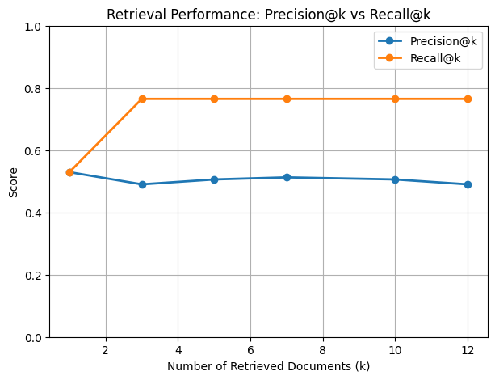
    


```python
f1_scores = [
    2*(p*r)/(p+r) if (p+r) > 0 else 0
    for p, r in zip(precisions, recalls)
]

plt.plot(ks, f1_scores, marker='o', linestyle='--', label="F1@k")
```


    [<matplotlib.lines.Line2D at 0x7b229e6f7e30>]


    
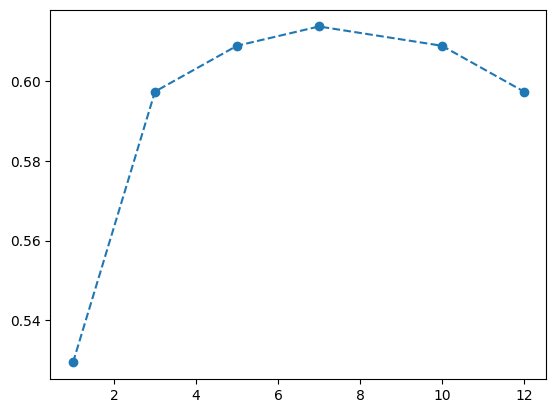
    


```python
def compute_mrr(df_gold, vector_db, k=5):
    import numpy as np
    import os

    reciprocal_ranks = []

    for _, row in df_gold.iterrows():
        query = row["Question"]
        gold = row["Gold Source"]

        results = vector_db.max_marginal_relevance_search(
            query,
            k=k,
            fetch_k=20
        )

        retrieved_sources = [
            os.path.basename(doc.metadata.get("source", ""))
            for doc in results
        ]

        rank = 0
        for i, s in enumerate(retrieved_sources):
            if s == gold:
                rank = i + 1
                break

        if rank > 0:
            reciprocal_ranks.append(1 / rank)
        else:
            reciprocal_ranks.append(0)

    return np.mean(reciprocal_ranks)
```


```python
mrr = compute_mrr(df_gold, vector_db, k=5)
print(f"MRR: {mrr:.4f}")
```

    MRR: 0.5794


```python
ks = [1, 3, 5, 7, 10]
mrr_scores = []

for k in ks:
    mrr = compute_mrr(df_gold, vector_db, k)
    mrr_scores.append(mrr)

import matplotlib.pyplot as plt

plt.figure()
plt.plot(ks, mrr_scores, marker='o', label="MRR")

plt.xlabel("k")
plt.ylabel("MRR")
plt.title("MRR vs k")

plt.ylim(0, 1)
plt.grid()
plt.legend()

plt.show()
```


    
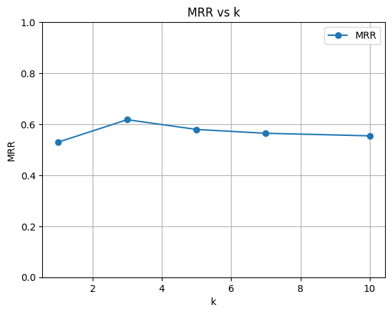
    


- k=3 actually captures the majority of what the retriever can offer
- improving generation quality likely requires either better chunking, a larger k for harder questions, or expanding the document base


```python

```
